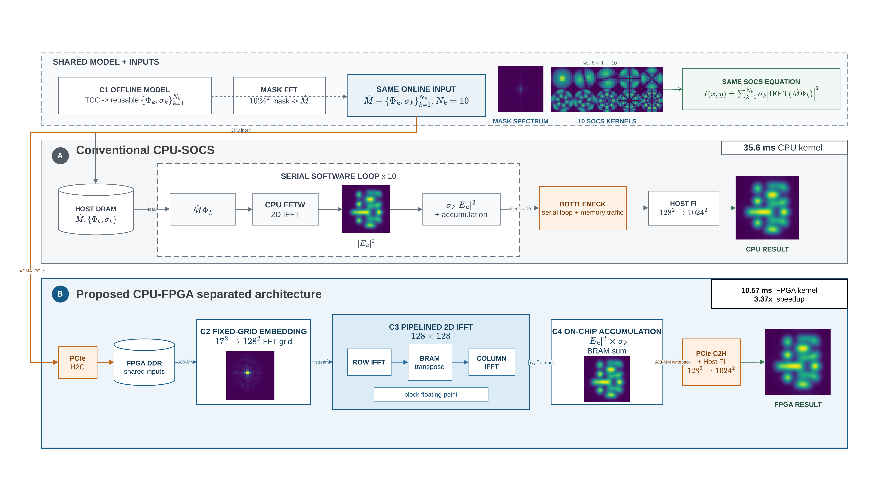

## 亮点

- 提出一种面向计算光刻 TCC-SOCS 在线空中像重构的 CPU-FPGA 协同加速框架，将低频离线光学预处理与高频在线重构解耦，在保持模型精度和配置灵活性的同时降低在线计算延迟并提升能效。
- 将 $17 \times 17$ SOCS 本征核嵌入固定 $128 \times 128$ FFT 网格，并设计面积优化二维复数 IFFT 数据通路，使不同有效核尺寸可复用同一在线重构流水线。
- 结合块浮点动态范围补偿、多路独立 AXI-MM 接口和 BRAM 缓冲，降低二维 IFFT 与多核累加过程中的资源占用和存储访问竞争。
- 完成基于 Xilinx XDMA 的 Host-FPGA PCIe 板上验证，并在 xcku5p 上实现 10.57 ms 的 10 核在线重构内核延迟，相较 C++ SOCS 基准加速 3.37 倍。

# 面向 TCC-SOCS 空中像计算的低延迟高能效 FPGA/HLS 加速架构

## 摘要

TCC-SOCS 在线空中像重构是计算光刻（OPC/SMO/ILT）流程中的高频计算瓶颈，传统 CPU 平台难以在低功耗场景下同时满足延迟与能效需求。为此，本文提出一种 CPU-FPGA 协同分离式加速架构：CPU 端负责离线 TCC 构建与 SOCS 本征核提取，FPGA 端部署在线重构中的频域嵌入、二维 IFFT 和加权累加等高频计算。通过将 17×17 SOCS 本征核嵌入固定 128×128 FFT 网格，并结合块浮点补偿与多路 AXI-MM 优化，在资源受限 FPGA 上实现了面积高效的数据通路。实验结果表明，在 Xilinx Kintex UltraScale+ xcku5p FPGA 上，10 核在线重构延迟为 10.57 ms，相较相同算子的优化 C++ SOCS 基准实现 3.37 倍加速，延迟降低 70.3%；基于当前功耗估计，单幅能耗由 2.848 J 降至 0.0423 J，估算内核能效提升约 67.4 倍。板上输出相对同配置 SOCS software Golden 的 RMSE 为 $2.93\times10^{-8}$，远低于 10 核 SOCS 相对 MATLAB 完整 TCC 的模型截断误差。结果验证了该架构在低功耗计算光刻部署中的有效性。

**关键词：**计算光刻；TCC-SOCS；CPU-FPGA 协同；FPGA 加速；高能效计算

## 1. 引言

计算光刻已成为先进半导体制造中连接光学成像、工艺窗口和版图优化的关键技术。随着工艺节点持续缩小，单纯依靠投影光学系统提升分辨率愈发困难，光学邻近效应校正（OPC）、源掩模协同优化（SMO）和反向光刻技术（ILT）等方法被广泛用于补偿邻近效应、优化照明与掩模形状并扩大可制造窗口 [1]-[11]。这些方法通常以模型反馈或反问题优化的形式工作，需要在大量版图窗口、多种工艺条件和多轮迭代中高频调用空中像计算 [2], [3], [5], [8]。当工艺窗口缩小、掩模复杂度提高且优化变量从边缘移动扩展到像素化或曲线图形时，空中像计算的延迟、吞吐和能耗逐渐成为计算光刻工程部署中的核心瓶颈。

部分相干光刻成像通常以 Hopkins 理论为基础，其传输交叉系数（TCC）可将照明光源、投影光瞳、像差、薄膜效应以及掩模衍射谱（mask spectrum / diffracted-order map）耦合统一表示为频域算子 [12]-[18]。在光学参数固定时，TCC 可离线预计算并在不同掩模图形间复用；然而，直接 TCC 成像涉及频率对之间的密集耦合，计算和存储开销较高。Sum of coherent systems（SOCS）方法通过对 TCC 进行特征分解或低秩近似，将部分相干成像转化为多个相干本征核的加权求和，从而在保持物理模型解释性的同时降低在线计算复杂度 [12], [13], [16], [19]。因此，TCC-SOCS 已成为空中像计算中兼顾准确性和效率的重要技术路线。

SOCS 将直接 TCC 中的密集频率耦合转换为有限数量相干系统的加权求和，离线分解之后的在线重构阶段仍是高频计算热点。对于每个 SOCS 本征核，在线重构都需要执行掩模衍射谱与本征核相乘、2D IFFT、幅度平方运算、特征值加权以及多核强度累加；这些操作会随本征核数量、掩模窗口数量和 OPC/SMO/ILT 迭代次数重复放大 [19]-[23]。在批量窗口评估、工艺窗口扫描或迭代式掩模优化中，SOCS 本征核、权重和控制配置可在同一光学条件下跨大量窗口复用，单次在线重构延迟和能耗的降低会在批处理吞吐中累积放大。因此，低功耗、确定性在线算子的工程价值不仅体现在单帧加速，也体现在批量掩模窗口流水线处理、边缘式线宽验证和系统级能效预算上。

已有工作从数值近似、对称性利用、CPU/GPU 加速和学习型模型等方向提升光刻仿真或掩模优化效率 [20], [22]-[30]。CPU 平台具有较高灵活性，但在规则频域运算下能效有限；GPU 在大批量吞吐场景中优势明显，但其数百瓦级系统功耗、主机侧调度开销和非确定性中断延迟会限制其在低功耗线宽验证、分布式边缘计算节点或紧凑硬件集成场景中的适用性。FPGA 为 TCC-SOCS 在线重构提供了 CPU/GPU 之外的补充方案。复数乘法、二维 IFFT、幅度平方运算和累加均具有规则数据通路和清晰依赖关系，适合映射为确定性流水线；片上 BRAM 可缓存中间矩阵以减少 DDR 往返访问，多 AXI-MM 接口也可缓解掩模衍射谱、SOCS 本征核、权重和输出缓冲之间的存储访问竞争。

已有研究验证了 FPGA 在光刻空中像仿真和二维 FFT 加速中的潜力，并指出外部存储访问、行列转置、并行度和能效之间的权衡对 FFT 类硬件加速器至关重要 [31]-[38]。然而，现有计算光刻加速工作更多关注算法近似、CPU/GPU 实现、学习型 OPC/ILT 或非 TCC-SOCS 的 FPGA 光刻仿真；面向 TCC-SOCS 在线重构的专用 FPGA/HLS 数据通路、Host-FPGA XDMA 数据流、真实硬件控制路径和端到端误差验证仍缺少统一呈现。换言之，相关研究尚未充分回答如何在有限 FPGA 资源下同时平衡 TCC-SOCS 在线重构的延迟、带宽、精度、资源和系统集成开销。

本文聚焦于离线 TCC 构建和 SOCS 本征核提取之后的在线重构阶段，而非加速完整 TCC 生成、特征分解或完整 OPC/SMO 优化系统。围绕这一在线阶段，本文提出一种 CPU-FPGA 协同架构：CPU 负责离线 TCC 构建、特征分解、SOCS 本征核生成和主机侧傅里叶插值，FPGA 负责在线频域嵌入、$128 \times 128$ 二维 IFFT、加权累加、FFTshift 和结果写回；同时通过 PCIe XDMA 完成 Host-FPGA 数据搬运、控制配置和结果回读的全平台集成。本文的主要贡献体现在四个方面：首先，建立面向 TCC-SOCS 在线重构的 CPU-FPGA 协同计算框架，明确解耦离线光学预处理、在线 FPGA 重构与主机侧后处理；其次，设计从 $17 \times 17$ SOCS 本征核到 $128 \times 128$ FFT 网格的频域嵌入、二维 IFFT、强度累加、FFTshift 和结果写回流水线；再次，提出面向 DUV 截止频率和固定 FFT 网格的面积优化二维复数 IFFT 处理器，并结合块浮点动态范围补偿、冲突规避转置存储、LUT 映射乘法、BRAM 缓冲和多路独立 AXI-MM 接口降低资源占用与存储访问竞争；最后，完成基于 PCIe XDMA 的 Host-FPGA 全平台验证，覆盖输入数据写入、AXI-Lite 控制配置、FPGA 计算、$128 \times 128$ 结果回读和 $1024 \times 1024$ 主机侧傅里叶插值。

在此基础上，本文采用固定 10 核配置，从 MATLAB 模型精度、CPU-FPGA 同算子性能和估算内核能效三个方面评估所提出架构。10 核 SOCS 相对 MATLAB 完整 TCC 的 RMSE 为 $5.472\times10^{-3}$；FPGA 板上输出相对同配置 SOCS software Golden 的 RMSE 为 $2.93\times10^{-8}$，表明硬件实现误差远小于模型截断误差。在线重构内核在 250 MHz 下延迟为 10.57 ms，相较 C++ SOCS 基准加速 3.37 倍，延迟降低 70.3%；基于约 4 W FPGA 内核功耗和约 80 W CPU 功耗的估计，单幅能耗降低约 98.5%，估算内核能效提升约 67.4 倍。最终架构占用 17% LUT、9% FF、2% DSP 和 42% BRAM。本文其余部分组织如下：第 2 节介绍 TCC-SOCS 模型与所提出架构，第 3 节给出实验结果，第 4 节总结全文。

## 2. 原理与方法

### 2.1 TCC-SOCS 成像模型与问题定义

对于部分相干光刻成像，Hopkins 公式可将空中像强度表示为掩模衍射谱的双线性形式。TCC 是由光源和投影光学系统决定的频域核：

$$
TCC(f',g';f'',g'') =
\iint S(f_s,g_s)P(f'+f_s,g'+g_s)P^*(f''+f_s,g''+g_s)df_sdg_s.
\tag{1}
$$

其中：$(f',g')$ 和 $(f'',g'')$ 为参与 TCC 双线性耦合的两组掩模频率坐标，$(f_s,g_s)$ 为光源频率坐标；$S(f_s,g_s)$ 为非负光源分布，$P(f,g)$ 为包含投影光瞳和像差信息的复数光瞳函数，$P^*(f,g)$ 表示其复共轭。在光学参数固定时，TCC 可被预计算并在不同掩模图形间复用。对应的空中像强度可写为：

$$
I(x,y)=
\iiiint TCC(f',g';f'',g'')M(f',g')M^*(f'',g'')
e^{j2\pi[(f'-f'')x+(g'-g'')y]}df'dg'df''dg''.
\tag{2}
$$

其中：$(x,y)$ 为像平面空间坐标，$M(f,g)$ 为掩模衍射谱，$M^*(f,g)$ 表示其复共轭，$j=\sqrt{-1}$。该直接形式精度较高，但由于涉及频率对之间的密集耦合，计算代价较大。

TCC 矩阵具有 Hermitian 性质，并且通常可由低秩分解近似表示：

$$
TCC \approx \sum_{k=1}^{N_k}\sigma_k\Phi_k\Phi_k^*.
\tag{3}
$$

其中：$\sigma_k$ 为第 $k$ 个特征值权重，$\Phi_k$ 为对应的频域相干本征核，$\Phi_k^*$ 为其共轭转置，$N_k$ 为保留的 SOCS 本征核数量。将该分解代入 Hopkins 方程可得：

$$
I(x,y) \approx
\sum_{k=1}^{N_k}\sigma_k
\left|\mathcal{F}^{-1}\{M(f,g)\Phi_k(f,g)\}\right|^2.
\tag{4}
$$

其中：$\mathcal{F}^{-1}\{\cdot\}$ 表示二维逆傅里叶变换，$\Phi_k(f,g)$ 为第 $k$ 个 SOCS 频域本征核。因此，每个本征核对应的在线计算包括频域乘法、IFFT、幅度平方运算和加权累加。这里的 $\sigma_k$ 仅表示第 $k$ 个本征核的特征值权重，与光学配置中的外部相干因子 $\sigma_{out}$ 不同。

在离散实现中，TCC 的有效频域范围由光瞳截止频率决定：

$$
N_x=N_y=\left\lfloor \frac{L_x\cdot NA\cdot(1+\sigma_{out})}{\lambda}\right\rfloor .
\tag{5}
$$

其中：$N_x$ 和 $N_y$ 分别为两个频率维度上的单侧离散截止索引，$L_x$ 和 $L_y$ 为对应方向的掩模离散尺寸，$NA$ 为投影物镜数值孔径，$\lambda$ 为曝光波长，$\sigma_{out}$ 为归一化外光源半径。对应的二维本征核尺寸为 $(2N_x+1)\times(2N_y+1)$，离散 TCC 矩阵规模为 $N_f\times N_f$，其中 $N_f=(2N_x+1)(2N_y+1)$。在默认 $L_x=L_y=1024$、$NA=0.8$、$\lambda=193$ nm、$\sigma_{out}=0.9$ 的 DUV 配置下，$N_x=N_y=8$，因此本征核尺寸为 $17 \times 17$，$N_f=289$。这一定量映射确定了后续 FPGA 频域嵌入模块的输入窗口大小。

本文中，离线阶段由 CPU 计算 SOCS 本征核及其特征值权重。FPGA 负责如下在线映射：

$$
\hat{I}=f_{\mathrm{FPGA}}(M,\{\Phi_k,\sigma_k\}_{k=1}^{N_k}).
\tag{6}
$$

其中：$f_{\mathrm{FPGA}}(\cdot)$ 表示 FPGA 在线重构映射，$\hat{I}$ 为重构得到的空中像。优化目标是在相对软件 SOCS 参考结果保持较小硬件实现误差的前提下，降低在线计算延迟和能耗。

### 2.2 CPU-FPGA 协同框架与在线流水线

本文所提出框架将光学系统预处理与在线重构分离。CPU 负责配置解析、光源生成、掩模 FFT、TCC 构建、特征分解和数据格式化。生成的掩模衍射谱、SOCS 本征核和特征值权重通过 PCIe XDMA 写入 FPGA 侧 DDR。FPGA 通过 AXI-MM 接口读取这些数据并执行在线重构，随后将 $128 \times 128$ 中间空中像写回 DDR；主机通过 PCIe 回读该结果，并执行傅里叶插值恢复 $1024 \times 1024$ 空中像。

这种划分方式源于两个阶段不同的执行特征。TCC 构建和特征分解需要高精度矩阵运算，但仅在光学参数变化时执行；相比之下，在线 SOCS 重构会针对不同掩模窗口重复执行，并且主要由规则的 FFT 和累加操作构成。因此，将在线阶段迁移到 FPGA 可将高频计算热点映射为确定性流水线，同时保留 CPU 在离线预处理方面的灵活性。

表 1 总结了该协同框架中的任务边界。源、光瞳和像差等光学系统信息被封装在 SOCS 本征核与特征值中，而 FPGA 在线阶段只处理掩模衍射谱、本征核和权重。

**表 1** CPU-FPGA 协同框架中的任务划分

| 执行侧   | 主要任务                                                                         | 计算特征                           |
| -------- | -------------------------------------------------------------------------------- | ---------------------------------- |
| Host CPU | 参数解析、光源生成、掩模 FFT、TCC 构建、特征分解、本征核导出、傅里叶插值后处理   | 高精度矩阵运算，光学参数变化时执行 |
| PCIe/XDMA | 掩模衍射谱、本征核、权重写入 DDR；AXI-Lite 控制配置；$128 \times 128$ 结果回读           | 主机与 FPGA 之间的数据搬运和控制   |
| FPGA     | 频域嵌入、二维 IFFT、强度累加、FFTshift、结果写回                                | 规则数据流，针对掩模窗口高频执行   |

**图 1** TCC-SOCS 计算流程。离线光学系统处理生成 SOCS 本征核和特征值权重，在线重构阶段针对掩模窗口计算空中像。

在相同离线光学模型和在线输入条件下，传统 CPU-SOCS 实现与本文所提 CPU-FPGA 分离架构的计算路径如图 2 所示。两种实现共享离线生成的 SOCS 本征核与特征值权重，并采用相同的掩模衍射谱和 10 核 SOCS 成像方程，从而保证架构对比不受算法配置差异影响。传统实现从主机内存读取数据，并在 CPU 上串行执行 10 次频域复乘、FFTW 二维 IFFT 和强度累加，其主要瓶颈来自重复的软件循环和内存访问。本文架构则通过 PCIe 将在线输入写入 FPGA 侧 DDR，并将高频计算映射为固定网格嵌入、流水二维 IFFT 和片上强度累加三个硬件阶段；其中，$17 \times 17$ 有效频域数据被嵌入 $128 \times 128$ FFT 网格，行列 IFFT 之间采用 BRAM 转置缓冲，核间累加结果保留在片上存储中。计算完成后，$128 \times 128$ 结果经 PCIe 回读，并由主机执行傅里叶插值。图中 35.6 ms 和 10.57 ms 分别表示相同 10 核在线 SOCS 算子的 CPU 与 FPGA 内核延迟，对应 3.37 倍内核加速；该口径不包含 PCIe 传输和主机侧傅里叶插值。

**图 2** 相同 SOCS 模型与在线输入下的架构对比。（a）传统 CPU-SOCS 串行软件计算路径；（b）所提 CPU-FPGA 分离架构及其固定网格嵌入、流水二维 IFFT 和片上累加数据通路。图中延迟与加速比均采用 kernel-only 口径。

**Host-FPGA PCIe 板上验证流程。** 板上系统使用 Xilinx XDMA 字符设备完成主机与 FPGA 之间的数据传输。主机将 $1024 \times 1024$ 掩模衍射谱实部和虚部、10 个 $17 \times 17$ SOCS 本征核实部和虚部以及 10 个特征值权重写入指定 DDR 地址；随后通过 AXI-Lite 寄存器写入 $N_k$、$N_x$、$N_y$、$L_x$、$L_y$ 和各缓冲区地址，并置位启动信号启动 HLS IP。计算完成后，主机回读 $128 \times 128$ 缩放空中像 $I_{128\times128}$，再执行傅里叶插值得到 $1024 \times 1024$ 空中像。该流程覆盖了数据写入、控制配置、计算启动、结果回读、主机后处理和参考结果对比，因而可用于验证系统级可部署性。

**表 2** PCIe/XDMA 全平台数据布局

| 数据对象                         | 方向 | 地址         | 数据量                 | 数据类型 | 说明                           |
| -------------------------------- | ---- | ------------ | ---------------------- | -------- | ------------------------------ |
| 掩模衍射谱实部 $M_{\mathrm{Re}}$ | H2C  | `0x40000000` | 4,194,304 B            | IEEE-754 单精度浮点  | $1024 \times 1024$ 实部               |
| 掩模衍射谱虚部 $M_{\mathrm{Im}}$ | H2C  | `0x40400000` | 4,194,304 B            | IEEE-754 单精度浮点  | $1024 \times 1024$ 虚部               |
| 特征值权重 $\sigma_k$            | H2C  | `0x40800000` | 40 B                   | IEEE-754 单精度浮点  | 10 个 SOCS 权重                |
| 本征核实部 $\Phi_{\mathrm{Re}}$  | H2C  | `0x40880000` | 11,560 B               | IEEE-754 单精度浮点  | $10 \times 17 \times 17$ 实部              |
| 本征核虚部 $\Phi_{\mathrm{Im}}$  | H2C  | `0x40900000` | 11,560 B               | IEEE-754 单精度浮点  | $10 \times 17 \times 17$ 虚部              |
| 中间累加图像 $I_{\mathrm{acc}}$  | H2C  | `0x40980000` | 65,536 B 清零          | IEEE-754 单精度浮点  | $128 \times 128$ 累加缓冲区           |
| 输出图像 $I_{128\times128}$      | H2C  | `0x40990000` | 65,536 B 清零          | IEEE-754 单精度浮点  | $128 \times 128$ 输出缓冲区           |
| FPGA 输出 $I_{128\times128}$     | C2H  | `0x40990000` | 65,536 B               | IEEE-754 单精度浮点  | 回读后由主机 FI 到 $1024 \times 1024$ |

**FPGA 在线重构流水线。** FPGA 流水线包含五个阶段：

1. **频域嵌入：**将 SOCS 本征核与对应的掩模衍射谱中心窗口相乘，并将结果嵌入固定的 $128 \times 128$ FFT 网格。
2. **二维 IFFT：**基于块浮点二维复数 IFFT 处理器依次执行行向 FFT、冲突规避矩阵转置和列向 FFT。
3. **加权累加：**计算 $|E_k|^2$，并将 $\sigma_k|E_k|^2$ 累加至临时图像缓冲区。
4. **FFTshift：**通过象限交换将零频分量移动至图像中心。
5. **输出写回：**通过 AXI-MM burst 访问将最终 $128 \times 128$ 图像写回 DDR。

从数据依赖关系看，在线阶段只依赖掩模衍射谱、SOCS 本征核和特征值权重，光源、光瞳和像差等光学信息已在离线阶段被压缩进 $\Phi_k$ 与 $\sigma_k$。对于第 $k$ 个本征核，FPGA 首先在有效频域窗口内完成掩模衍射谱与本征核的逐点复乘，并将结果中心嵌入到 $128 \times 128$ 频率网格中：

$$
F_k(c_x+u,c_y+v)=M(c_x+u,c_y+v)\Phi_k(u,v),
\quad |u|\leq N_x,\ |v|\leq N_y .
\tag{7}
$$

随后，二维 IFFT 得到相干场 $E_k$，其强度 $|E_k|^2$ 按特征值权重 $\sigma_k$ 累加到输出缓冲区。所有保留本征核处理完成后，硬件对累加图像执行 FFTshift 并写回外部存储。因此，FPGA 在线阶段可表示为

$$
\hat{I}=\mathrm{FFTshift}\left(\sum_{k=1}^{N_k}\sigma_k
\left|\mathcal{F}^{-1}\{F_k\}\right|^2\right).
\tag{8}
$$

对于默认 10 核配置，上述五阶段路径针对每个本征核顺序执行。该核间时分复用策略在多个本征核之间复用同一套二维 IFFT 引擎，从而避免过高的 BRAM 消耗。全核并行虽然可提供更高吞吐量，但每个并行核需要独立的 $128 \times 128$ 二维 IFFT 实例及转置缓冲区；按当前 HLS FFT IP 的资源模型估计，10 核全并行会需要约 3000 个 BRAM_18K，约为 xcku5p 可用 960 个 BRAM_18K 的 3.1 倍。因此，本文采用核间时分复用与核内流水相结合的折中设计。

主机通过 AXI-Lite 接口配置核数量 $N_k$、有效频域范围 $N_x,N_y$、掩模尺寸 $L_x,L_y$ 以及各 AXI-MM 指针地址。在固定 $128 \times 128$ IFFT 网格下，不同有效核尺寸可通过零填充和中心嵌入复用同一硬件配置，从而避免针对不同光学配置反复综合。

### 2.3 关键硬件模块与存储架构

本节围绕频域嵌入、二维 IFFT 和存储访问三个关键环节概括硬件实现。对于默认配置，有效本征核尺寸为 $17 \times 17$，对应 $N_x=N_y=8$，每个本征核执行 289 次复数乘法。嵌入模块将掩模衍射谱中心窗口与本征核逐点相乘，并将结果中心映射到固定的 $128 \times 128$ 频率网格，其余位置补零。复数乘法定义为：

$$
(a+jb)(c+jd)=(ac-bd)+j(ad+bc).
\tag{9}
$$

该循环采用 `PIPELINE II=1`，运行时参数 $N_x$ 和 $N_y$ 定义实际有效窗口，$17 \times 17$ 最大窗口作为综合边界。嵌入位置以掩模衍射谱中心 $(L_x/2,L_y/2)$ 为基准，从而保持 FPGA 输出与 CPU 参考结果的频率排列和空间相位一致。

控制接口接收 $N_k$、$N_x$、$N_y$、$L_x$ 和 $L_y$ 等运行时参数；掩模衍射谱、本征核、权重、中间图像和输出图像分别映射到独立 AXI-MM 访问通道。初始化、频域嵌入、强度累加和结果写回均采用流水化实现，二维中间矩阵和累加缓冲区绑定到双端口 BRAM，以减少外部 DDR 往返访问。

**二维 IFFT 引擎。** 二维 IFFT 是主要计算阶段。本文将固定 $128 \times 128$ 变换分解为逐行和逐列两个 128 点一维 IFFT：行变换结果写入实部/虚部分离的片上转置缓冲区，列变换再按连续列向访问读取。双端口 BRAM 和冲突规避的地址组织保证行写入与列读取满足并行访问约束，避免为转置操作引入额外 DDR 往返。

底层一维 FFT 配置为 128 点、自然序输出、块浮点缩放和 LUT 映射乘法。输入与输出采用 `ap_fixed<32,1>`，即 32 位二进制补码、1 位整数宽度和 31 位小数精度，量化步长约为 $2^{-31}$。当输入动态范围存在溢出风险时，FFT IP 记录块浮点缩放指数；二维行列变换的指数累加后，在定点到浮点转换阶段统一补偿：

$$
E_{\mathrm{float}}=E_{\mathrm{fixed}}\cdot 2^{\mathrm{blk\_exp}}.
\tag{10}
$$

与固定逐级右移相比，该策略减少了缩放误差的累积，并通过 LUT 映射蝶形乘法降低 DSP 使用量。

因此，本文的面积优化重点不是牺牲变换精度，而是在固定变换长度下复用单套二维 IFFT 数据通路，并将有限的 BRAM 优先分配给转置和累加缓冲。

**存储架构。** 顶层 HLS IP 使用 7 个独立 AXI-MM master 接口：

| 通道 | 数据通道       | 数据            |      深度 | 访问方式 |
| ---- | -------------- | --------------- | --------: | -------- |
| 0    | 掩模衍射谱实部 | 掩模衍射谱实部  | 1,048,576 | 读       |
| 1    | 掩模衍射谱虚部 | 掩模衍射谱虚部  | 1,048,576 | 读       |
| 2    | 特征值权重     | SOCS 特征值权重 |        32 | 读       |
| 3    | 本征核实部     | 本征核实部      |    76,832 | 读       |
| 4    | 本征核虚部     | 本征核虚部      |    76,832 | 读       |
| 5    | 中间图像缓冲区 | 中间图像        |    16,384 | 写       |
| 6    | 最终图像缓冲区 | 最终图像        |    16,384 | 写       |

主要片上缓冲区被绑定至 BRAM，以减少 FFT 与累加过程中的重复 DDR 访问。该存储设计将大规模流式输入、小规模标量参数和输出缓冲区分离，从而降低总线拥塞并提升 burst 访问效率。

为便于复现，表 3 给出了关键 HLS 与接口配置。外部 DDR 数据统一采用 IEEE-754 单精度浮点，FFT IP 内部采用 `ap_fixed<32,1>` 复数定点格式；其定点量化语义为 1 位整数宽度和 31 位小数精度的 32 位二进制补码表示。块浮点模式通过 `blk_exp` 记录总缩放量，并按式 (10) 补偿回浮点结果。

**表 3** 关键 HLS/IP 实现配置

| 类别 | 配置 |
| ---- | ---- |
| 顶层模块 | TCC-SOCS online reconstruction HLS kernel |
| FFT IP | 128 点固定长度，$\log_2 N=7$，单通道，pipelined streaming I/O，自然序输出 |
| FFT 数值格式 | 输入/输出 `ap_fixed<32,1>`，32 位二进制补码定点，1 位整数宽度、31 位小数精度；phase factor width 为 24，块浮点缩放，截断舍入 |
| FFT 存储与乘法 | 数据、旋转因子和重排序存储均使用 BRAM；复数乘法和蝶形运算映射到 LUT |
| 主要循环优化 | 频域清零、嵌入、强度累加、FFTshift、格式转换和 DDR 写回循环均采用 `PIPELINE II=1` |
| 核循环约束 | SOCS 核循环使用 10 核默认综合边界，并支持运行时核数配置 |
| 片上缓冲 | 输入/输出复数缓冲、累加图像缓冲、缩放图像缓冲和 FFT 中间转置缓冲绑定至双端口 BRAM |
| AXI-MM 读通道 | 掩模衍射谱实部/虚部读突发长度 64、outstanding 8；本征核实部/虚部读突发长度 32、outstanding 4 |
| AXI-MM 写通道 | 中间累加图像和输出图像写突发长度 64、outstanding 4 |
| AXI-Lite 控制 | $N_k$、$N_x$、$N_y$、$L_x$、$L_y$ 和各 AXI-MM 指针地址由主机配置 |

## 3. 仿真与实验

### 3.1 实验配置与评价口径

实验固定采用一套代表性 DUV 配置，以避免不同参数组合干扰平台对比。目标 FPGA 为 Xilinx Kintex UltraScale+ xcku5p-ffvb676-2-e，设计使用 Vitis HLS 2025.2 和 Vivado 2025.2 实现，工作频率统一按 250 MHz 计算。软件性能基准运行于 Intel Xeon Platinum 8163 服务器，C++ 程序采用 C++17、单精度浮点和 `-O2` 优化，并链接 FFTW 3.x、LAPACK、BLAS 和 OpenMP 运行库。实验配置见表 4。

**表 4** 固定实验配置与比较口径

| 类别 | 固定配置 |
| ---- | -------- |
| 光学与输入 | $L_x=L_y=1024$，$NA=0.8$，$\lambda=193$ nm，Annular 光源，$\sigma_{in}=0.6$，$\sigma_{out}=0.9$ |
| SOCS 配置 | 10 个 $17\times17$ 本征核，固定 $128\times128$ FFT 网格 |
| FPGA | xcku5p-ffvb676-2-e，Vitis HLS/Vivado 2025.2，250 MHz |
| CPU 基准 | Intel Xeon Platinum 8163 @ 2.50 GHz，GCC 13.3.0，C++17，单精度，`-O2` |
| 精度基准 | MATLAB 完整 TCC 与 10 核 SOCS 高精度结果 |
| 性能基准 | C++ 10 核 SOCS 在线重构，与 FPGA 执行相同输入和相同成像方程 |

本文将精度与性能采用不同但相互独立的参考口径。MATLAB 用于判断 10 核 SOCS 相对完整 TCC 的模型误差；同配置 SOCS software Golden 用于隔离 FPGA 定点量化、块浮点缩放和数据格式转换产生的硬件实现误差。加速比仅比较 C++ 与 FPGA 的相同 10 核在线 SOCS 算子，不包含离线 TCC 构建、特征分解、PCIe 传输和主机侧傅里叶插值。

### 3.2 与 MATLAB 的精度验证

给定待验证图像 $X$ 和参考图像 $Y$，本文使用均方根误差衡量整体偏差：

$$
\mathrm{RMSE}(X,Y)=\sqrt{\frac{1}{N}\sum_{i=1}^{N}(X_i-Y_i)^2}.
\qquad\text{(11)}
$$

表 5 将模型截断误差与硬件实现误差分开报告。MATLAB 10 核 SOCS 与完整 TCC 直接成像之间的 RMSE 为 $5.472\times10^{-3}$，PSNR 为 36.95 dB，二值图形一致率为 98.77%。该结果给出了固定 10 核模型相对高精度物理参考的误差边界。FPGA 板上 $128\times128$ 输出与同配置 SOCS software Golden 的 RMSE 为 $2.93\times10^{-8}$；结果经主机傅里叶插值恢复为 $1024\times1024$ 后，RMSE 为 $2.95\times10^{-8}$，PSNR 为 142.20 dB。

**表 5** 固定 10 核配置下的精度验证结果

| 验证对象 | 参考对象 | RMSE | MaxAE | PSNR |
| -------- | -------- | ---: | ----: | ---: |
| MATLAB 10 核 SOCS | MATLAB 完整 TCC | $5.472\times10^{-3}$ | $9.821\times10^{-3}$ | 36.95 dB |
| FPGA 板上 $128\times128$ 输出 | 同配置 SOCS software Golden | $2.93\times10^{-8}$ | $3.58\times10^{-7}$ | 142.26 dB |
| FPGA+Host FI $1024\times1024$ 输出 | 同配置 SOCS software Golden | $2.95\times10^{-8}$ | $4.17\times10^{-7}$ | 142.20 dB |

FPGA 输出的实现误差比 10 核 SOCS 的模型截断误差低约五个数量级，说明最终空中像相对 MATLAB 完整 TCC 的偏差主要由低秩截断决定，而不是由 FPGA 数据通路引入。C/RTL 联合仿真的 RMSE 为 $8.324\times10^{-7}$，同样低于 $10^{-5}$ 的实现误差阈值。图 3 给出固定配置下的参考图像、FPGA 输出及误差分布，二者的主要成像结构保持一致。

**图 3** 固定 10 核配置下的参考空中像、FPGA 输出与误差分布。图中完整 TCC 结果用于展示模型截断误差；硬件实现误差按表 5 中的同配置 SOCS software Golden 计算。

### 3.3 加速比与能效比分析

#### 3.3.1 FPGA 内核延迟

在 250 MHz 下，HLS 综合报告的顶层延迟为 2,643,645 个周期，对应 10.57 ms；C/RTL 联合仿真报告为 2,651,856 个周期，对应 10.61 ms。两者相差约 0.3%，说明综合估计能够代表生成 RTL 的执行周期。表 6 给出 FPGA 内核的阶段分解。

**表 6** 10 核 SOCS 在线重构内核延迟分解。该表为 250 MHz 下的 kernel-only latency，不包含 PCIe 传输和主机 FI。

| 阶段             |        周期数 | 250 MHz 下时间 |     占比 |
| ---------------- | ------------: | -------------: | -------: |
| 频域嵌入，10 核  |       167,450 |        0.67 ms |     6.3% |
| 二维 IFFT，10 核 |     2,262,250 |        9.05 ms |    85.6% |
| 累加，10 核      |       164,250 |        0.66 ms |     6.2% |
| FFTshift         |        16,389 |       0.066 ms |     0.6% |
| DDR 输出         |        16,389 |       0.066 ms |     0.6% |
| **总计**         | **2,643,645** |   **10.57 ms** | **100%** |

二维 IFFT 占总延迟的 85.6%，是当前在线重构的主要性能瓶颈；频域嵌入和强度累加分别仅占 6.3% 和 6.2%。因此，固定网格复用、片上转置和 IFFT 数据通路优化直接决定整体延迟。

**图 4** 所提出 FPGA 在线重构内核的延迟分解。

#### 3.3.2 CPU-FPGA 加速比

表 7 仅比较相同输入和相同 10 核 SOCS 方程下的在线重构阶段。C++ CPU 实测延迟为 35.6 ms，FPGA 内核延迟为 10.57 ms，因而实现 3.37 倍加速，单次延迟降低 70.3%。对应吞吐量由 28.09 images/s 提升至 94.6 images/s。该比较不使用 MATLAB 运行时间或完整 TCC 直接成像时间，避免算法范围和实现精度不同造成不公平结论。

**表 7** 相同 10 核 SOCS 在线重构算子的 CPU-FPGA 性能对比

| 平台 | 延迟 | 吞吐量 | 相对加速比 | 延迟降低率 |
| ---- | ---: | -----: | ---------: | ---------: |
| C++ CPU SOCS | 35.6 ms | 28.09 images/s | $1.00\times$ | - |
| FPGA SOCS 内核 | 10.57 ms | 94.6 images/s | $3.37\times$ | 70.3% |

这一加速收益来自执行结构而不是成像模型变化。CPU 通过软件循环依次执行复数乘法、二维 IFFT 和强度累加；FPGA 则复用固定尺寸 IFFT 引擎，并通过流水化循环、BRAM 中间缓冲和独立 AXI-MM 通道降低控制与访存开销。对于 OPC/SMO/ILT 中反复调用的窗口级空中像计算，单次 24.99 ms 的延迟节省可随调用次数累积。

#### 3.3.3 单幅能耗与能效

为比较单位任务的能耗，本文按 $E=P\times T$ 计算每幅空中像的能量消耗。当前 CPU 功耗采用约 80 W 的服务器运行功耗估计，FPGA 采用约 4 W 的 online reconstruction kernel 后综合功耗估计。因此：

$$
E_{\mathrm{CPU}}=80\times35.6\ \mathrm{ms}=2.848\ \mathrm{J/image},
\qquad\text{(12)}
$$

$$
E_{\mathrm{FPGA}}=4\times10.57\ \mathrm{ms}=0.0423\ \mathrm{J/image}.
\qquad\text{(13)}
$$

表 8 表明，在这一估算口径下，FPGA 单幅能耗降低约 98.5%，能效由 0.351 images/J 提升至 23.7 images/J，对应约 67.4 倍的 kernel-level 能效提升。

**表 8** FPGA 与 C++ CPU SOCS 的估算内核能效对比

| 平台 | 延迟 | 估算功耗 | 单幅能耗 | 能效 |
| ---- | ---: | -------: | -------: | ---: |
| C++ CPU SOCS | 35.6 ms | 约 80 W | 2.848 J/image | 0.351 images/J |
| FPGA SOCS 内核 | 10.57 ms | 约 4 W | 0.0423 J/image | 23.7 images/J |

上述 67.4 倍仅表示基于当前功耗估计的 FPGA kernel-level energy efficiency，不代表 Host CPU、PCIe、DDR 和主机侧 FI 在内的全平台实测能效。投稿前仍需使用带活动信息的 Vivado Power Analyzer 报告或板上传感器校准 FPGA 功耗，并使用 RAPL、BMC 或外部功率计测量 CPU 基准功耗。

#### 3.3.4 资源与系统边界

最终设计的资源利用率见表 9。DSP 使用率仅为 2%，说明 LUT 映射 FFT 乘法有效避免了 DSP 成为实现瓶颈；BRAM 使用率为 42%，主要用于二维 IFFT 转置与多核累加缓冲。该资源分布使设计能够部署在中等规模 xcku5p 器件上，并为低功耗运行提供硬件基础。

**表 9** xcku5p 上的 FPGA 资源利用率

| 资源     | 使用量 |  可用量 | 利用率 |
| -------- | -----: | ------: | -----: |
| LUT      | 36,931 | 216,960 |    17% |
| FF       | 38,703 | 433,920 |     9% |
| DSP      |     34 |   1,824 |     2% |
| BRAM_18K |    399 |     960 |    42% |

**图 5** 所提出 FPGA/HLS 架构的性能、估算内核能效与资源总结。

本文还完成了 PCIe XDMA 板上数据写入、AXI-Lite 控制、结果回读和 Host FI 验证。该单窗口系统路径包含主机系统调用、DMA、轮询和后处理，其计时口径不同于表 7 的纯计算阶段，因此不参与 3.37 倍内核加速和 67.4 倍估算内核能效的计算。GPU 更适合追求大批量绝对吞吐的计算光刻任务；本文不以非同源公开数据进行定量优劣比较，而将所提出架构定位为低功耗、确定性延迟的在线重构内核。

综上，固定配置下的实验形成了完整证据链：MATLAB 对比给出 10 核 SOCS 的模型精度边界，板上验证表明 FPGA 实现误差远小于该边界，同算子 CPU 对比则证明 FPGA 能够在保持成像结果的同时降低在线延迟和估算单幅能耗。该结论仅适用于 TCC-SOCS online reconstruction kernel，不外推为完整 OPC/SMO 工具链或 Host-FPGA 全系统的能效结论。

## 4. 结论

本文提出一种面向 TCC-SOCS 空中像重构的低延迟高能效 FPGA/HLS 架构。该方法的核心思想是将光学系统相关的 TCC 构建与 SOCS 本征核提取保留在 CPU 端，将 OPC/SMO 等流程中的高频在线重构阶段映射为 FPGA 上的专用数据通路，并通过 PCIe XDMA 将输入写入、AXI-Lite 控制、结果回读和主机侧傅里叶插值串接成完整执行路径。通过这种划分，复杂光学模型被压缩为可复用的本征核和权重，而 FPGA 只需执行频域嵌入、二维 IFFT、加权累加、FFTshift 和结果写回等规则计算，从而把 TCC-SOCS 的在线热点转化为可流水化、可部署的硬件任务。

固定配置实验从精度、延迟和能耗三个方面验证了该划分方式。10 核 SOCS 相对 MATLAB 完整 TCC 的 RMSE 为 $5.472\times10^{-3}$，而 FPGA 板上输出和 Host FI 结果相对同配置 SOCS software Golden 的 RMSE 分别为 $2.93\times10^{-8}$ 和 $2.95\times10^{-8}$，说明硬件实现误差远小于模型截断误差。通过块浮点 FFT 缩放、LUT 映射 FFT 乘法、多端口 AXI-MM 访问和 BRAM 缓冲，设计在 xcku5p FPGA 上以 250 MHz 实现 10 核在线重构内核延迟 10.57 ms；相较相同算子的 C++ CPU SOCS 基准，延迟降低 70.3%，实现 3.37 倍加速。基于当前约 4 W FPGA 内核功耗和约 80 W CPU 功耗估计，单幅能耗由 2.848 J 降至 0.0423 J，估算内核能效提升约 67.4 倍。最终架构占用 17% LUT、9% FF、2% DSP 和 42% BRAM。对于计算光刻中大量重复的小窗口空中像评估而言，这一结果表明 FPGA 适合承担低功耗、确定性延迟的 TCC-SOCS 在线重构内核。

本文当前验证对象是 TCC-SOCS online reconstruction kernel 及其 PCIe on-board profile path，尚未声称对完整 OPC/SMO 工具链进行端到端加速。面向后续部署，可在更大 BRAM 容量器件上提升 SOCS 核间并行度，支持自适应 FFT 网格尺寸，将傅里叶插值和后处理集成至 FPGA 流水线，优化 PCIe 批量传输与中断控制，并扩展至 Dipole、Quasar、High-NA EUV 及更大规模工业掩模图形。由此，所提出架构可从在线重构内核验证进一步发展为面向实际计算光刻流程的高能效 CPU-FPGA 协同加速系统。

## 参考文献

1. Granik Y. Fast pixel-based mask optimization for inverse lithography[J]. Journal of Micro/Nanolithography, MEMS and MOEMS, 2006, 5(4): 043002-043002-13.
2. Cobb N B, Zakhor A, Miloslavsky E A. Mathematical and CAD framework for proximity correction[C]//Optical Microlithography IX. SPIE, 1996, 2726: 208-222.
3. Jia N, Lam E Y. Pixelated source mask optimization for process robustness in optical lithography[J]. Optics express, 2011, 19(20): 19384-19398.
4. Li Z, Dong L, Ma X, et al. Fast source mask co-optimization method for high-NA EUV lithography[J]. Opto-Electronic Advances, 2025, 7(4): 230235-1-230235-11.
5. Shen Y, Wong N, Lam E Y. Level-set-based inverse lithography for photomask synthesis[J]. Optics Express, 2009, 17(26): 23690-23701.
6. Abrams D S, Pang L. Fast inverse lithography technology[C]//Optical Microlithography XIX. SPIE, 2006, 6154: 534-542.
7. Pang L, Liu Y, Abrams D. Inverse lithography technology (ILT): What is the impact to the photomask industry?[C]//Photomask and Next-Generation Lithography Mask Technology XIII. SPIE, 2006, 6283: 233-243.
8. Gao J R, Xu X, Yu B, et al. MOSAIC: Mask optimizing solution with process window aware inverse correction[C]//Proceedings of the 51st Annual Design Automation Conference. 2014: 1-6.
9. Kim B G, Suh S S, Kim B S, et al. Trade-off between inverse lithography mask complexity and lithographic performance[C]//Photomask and Next-Generation Lithography Mask Technology XVI. SPIE, 2009, 7379: 458-468.
10. Pang L, Liu Y, Abrams D. Inverse lithography technology (ILT): a natural solution for model-based SRAF at 45-nm and 32-nm[C]//Photomask and Next-Generation Lithography Mask Technology XIV. SPIE, 2007, 6607: 888-897.
11. Hung C Y, Zhang B, Guo E, et al. Pushing the lithography limit: Applying inverse lithography technology (ILT) at the 65nm generation[C]//Optical Microlithography XIX. SPIE, 2006, 6154: 562-571.
12. Ma X, Arce G. Binary mask optimization for inverse lithography with partially coherent illumination[J]. Journal of the optical society of America A, 2008, 25(12): 2960-2970.
13. Maa X, Arceb G R. PSM design for inverse lithography with partially coherent illumination[J]. Optics express, 2008, 16(24): 20126-20141.
14. Yeung M S, Lee D, Lee R S, et al. Extension of the Hopkins theory of partially coherent imaging to include thin-film interference effects[C]//Optical/Laser Microlithography. SPIE, 1993, 1927: 452-463.
15. Adam K, Granik Y, Torres A, et al. Improved modeling performance with an adapted vectorial formulation of the Hopkins imaging equation[C]//Optical Microlithography XVI. SPIE, 2003, 5040: 78-91.
16. Gong P, Liu S, Lv W, et al. Fast aerial image simulations for partially coherent systems by transmission cross coefficient decomposition with analytical kernels[J]. Journal of Vacuum Science & Technology B, 2012, 30(6).
17. Köhle R. Fast TCC algorithm for the model building of high NA lithography simulation[C]//Optical Microlithography XVIII. SPIE, 2005, 5754: 918-929.
18. Wu X, Liu S, Liu W, et al. Comparison of three TCC calculation algorithms for partially coherent imaging simulation[C]//Sixth International Symposium on Precision Engineering Measurements and Instrumentation. SPIE, 2010, 7544: 241-250.
19. Yu P, Pan D Z. ELIAS: an accurate and extensible lithography aerial image simulator with improved numerical algorithms[J]. IEEE transactions on semiconductor manufacturing, 2009, 22(2): 276-289.
20. Yu P, Qiu W, Pan D Z. Fast lithography image simulation by exploiting symmetries in lithography systems[J]. IEEE transactions on semiconductor manufacturing, 2008, 21(4): 638-645.
21. Bernard D A, Li J, Rey J C, et al. Efficient computational techniques for aerial imaging simulation[C]//Optical Microlithography IX. SPIE, 1996, 2726: 273-287.
22. Rodrigues R, Sreedhar A, Kundu S. Optical lithography simulation using wavelet transform[C]//2009 IEEE International Conference on Computer Design. IEEE, 2009: 427-432.
23. Zheng X, Ma X, Zhao Q, et al. Model-informed deep learning for computational lithography with partially coherent illumination[J]. Optics Express, 2020, 28(26): 39475-39491.
24. Torunoglu I, Karakas A, Elsen E, et al. OPC on a single desktop: a GPU-based OPC and verification tool for fabs and designers[C]//Design for Manufacturability through Design-Process Integration IV. SPIE, 2010, 7641.
25. Yu Z, Chen G, Ma Y, et al. A GPU-Enabled Level-Set Method for Mask Optimization[J]. IEEE Transactions on Computer-Aided Design of Integrated Circuits and Systems, 2023, 42(2): 594-605.
26. Yang H, Li S, Deng Z, et al. GAN-OPC: Mask Optimization With Lithography-Guided Generative Adversarial Nets[J]. IEEE Transactions on Computer-Aided Design of Integrated Circuits and Systems, 2020, 39(10): 2822-2834.
27. Ye W, Alawieh M B, Lin Y, et al. LithoGAN[C]//Proceedings of the 56th Annual Design Automation Conference 2019. ACM, 2019: 1-6.
28. Jiang B, Liu L, Ma Y, et al. Neural-ILT 2.0: Migrating ILT to Domain-Specific and Multitask-Enabled Neural Network[J]. IEEE Transactions on Computer-Aided Design of Integrated Circuits and Systems, 2022, 41(8): 2671-2684.
29. Chen G, Chen W, Sun Q, et al. DAMO: Deep Agile Mask Optimization for Full-Chip Scale[J]. IEEE Transactions on Computer-Aided Design of Integrated Circuits and Systems, 2022, 41(9): 3118-3131.
30. Yang H, Li Z, Sastry K, et al. Generic lithography modeling with dual-band optics-inspired neural networks[C]//Proceedings of the 59th ACM/IEEE Design Automation Conference. ACM, 2022: 973-978.
31. Cong J, Zou Y. FPGA-Based Hardware Acceleration of Lithographic Aerial Image Simulation[J]. ACM Transactions on Reconfigurable Technology and Systems, 2009, 2(3): 1-29.
32. Cong J, Zou Y. Lithographic aerial image simulation with FPGA-based hardwareacceleration[C]//Proceedings of the 16th international ACM/SIGDA symposium on Field programmable gate arrays. ACM, 2008: 67-76.
33. Akin B, Milder P A, Franchetti F, et al. Memory Bandwidth Efficient Two-Dimensional Fast Fourier Transform Algorithm and Implementation for Large Problem Sizes[C]//2012 IEEE 20th International Symposium on Field-Programmable Custom Computing Machines. IEEE, 2012.
34. Akin B, Franchetti F, Hoe J C. Understanding the design space of DRAM-optimized hardware FFT accelerators[C]//2014 IEEE 25th International Conference on Application-Specific Systems, Architectures and Processors. IEEE, 2014: 248-255.
35. Chen R, Prasanna V K. Energy optimizations for FPGA-based 2-D FFT architecture[C]//2014 IEEE High Performance Extreme Computing Conference (HPEC). IEEE, 2014: 1-6.
36. Chen R, Le H, Prasanna V K. Energy efficient parameterized FFT architecture[C]//2013 23rd International Conference on Field programmable Logic and Applications. IEEE, 2013: 1-7.
37. Seonil Choi, Govindu G, Ju-Wook Jang, et al. Energy-efficient and parameterized designs for fast Fourier transform on FPGAs[C]//2003 IEEE International Conference on Acoustics, Speech, and Signal Processing, 2003. Proceedings. (ICASSP '03). IEEE, 2003, 2: II-521-4.
38. Tang S N, Liao C H, Chang T Y. An Area- and Energy-Efficient Multimode FFT Processor for WPAN/WLAN/WMAN Systems[J]. IEEE Journal of Solid-State Circuits, 2012, 47(6): 1419-1435.
