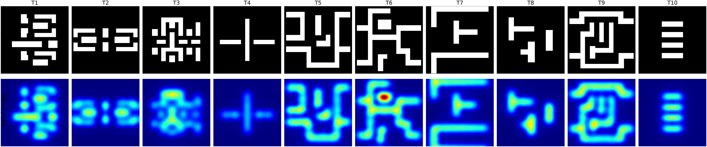

# A Low-Latency and Energy-Efficient FPGA Architecture for Partially Coherent Lithographic Aerial Image Computation

## Highlights

- A CPU-FPGA collaborative acceleration framework is proposed for online TCC-SOCS aerial image reconstruction in computational lithography. It decouples offline preprocessing performed when optical parameters change from online reconstruction repeatedly invoked for mask windows, reducing online latency and improving energy efficiency while preserving model accuracy and configurability.
- The $17 \times 17$ SOCS eigenkernels are embedded into a fixed $128 \times 128$ FFT grid, and an area-optimized two-dimensional complex IFFT datapath is designed so that the same online reconstruction pipeline can accommodate different effective kernel sizes.
- Block-floating-point dynamic-range compensation, multiple independent AXI-MM interfaces, and BRAM buffering are combined to reduce resource consumption and memory-access contention during two-dimensional IFFT and multi-kernel accumulation.
- Host-FPGA PCIe on-board validation is completed using Xilinx XDMA. On the xcku5p, the 10-kernel online reconstruction kernel achieves a latency of 10.57 ms and a $3.37\times$ speedup over the C++ SOCS baseline.

## Abstract

Online aerial image reconstruction based on the transmission cross coefficient (TCC) and the sum of coherent systems (SOCS) is a frequently invoked computational bottleneck in computational lithography workflows such as optical proximity correction, source-mask optimization, and inverse lithography technology, where conventional CPU platforms struggle to balance latency and energy efficiency under power constraints. To address this problem, this paper proposes a decoupled CPU-FPGA collaborative acceleration architecture: the CPU performs offline TCC construction and SOCS eigenkernel extraction, while the FPGA executes online frequency-domain embedding, two-dimensional IFFT, and weighted accumulation through an area-efficient datapath combining a fixed FFT grid, block-floating-point compensation, multiple AXI-MM interfaces, and BRAM buffering. Compared with an optimized C++ SOCS baseline implementing the same online reconstruction operator, the proposed FPGA kernel achieves a $3.37\times$ speedup and, based on current power estimates, an approximately $67.4\times$ improvement in kernel-only energy efficiency, demonstrating its effectiveness for low-power online reconstruction in computational lithography.

**Keywords:** computational lithography; TCC-SOCS; CPU-FPGA collaboration; FPGA acceleration; energy-efficient computing

## 1. Introduction

Computational lithography has become a key technology connecting optical imaging, process-window analysis, and layout optimization in advanced semiconductor manufacturing. As process nodes continue to shrink, improving resolution solely through projection optics has become increasingly difficult. Optical proximity correction (OPC), source-mask optimization (SMO), and inverse lithography technology (ILT) are therefore widely used to compensate for proximity effects, optimize illumination and mask geometries, and enlarge manufacturable process windows [1]-[11]. These techniques generally operate through model feedback or inverse-problem optimization and require frequent aerial image computation over numerous layout windows, process conditions, and optimization iterations [2], [3], [5], [8]. As process windows narrow, mask complexity increases, and optimization variables evolve from edge displacements to pixelated or curvilinear patterns, the latency, throughput, and energy consumption of aerial image computation have become major bottlenecks in the practical deployment of computational lithography.

Partially coherent lithographic imaging is commonly formulated using Hopkins theory. Its transmission cross coefficient (TCC) represents the illumination source, projection pupil, aberrations, thin-film effects, and mask spectrum/diffracted-order map within a unified frequency-domain operator [12]-[18]. When the optical parameters remain fixed, the TCC can be precomputed offline and reused across different mask patterns. Direct TCC imaging, however, involves dense coupling between frequency pairs and consequently incurs substantial computational and storage costs. The sum of coherent systems (SOCS) method applies eigendecomposition or low-rank approximation to the TCC, converting partially coherent imaging into a weighted sum of coherent eigenkernels. It thereby reduces online computational complexity while retaining the physical interpretability of the imaging model [12], [13], [16], [19]. TCC-SOCS has consequently become an important approach for balancing accuracy and efficiency in aerial image computation.

Although SOCS transforms the dense frequency coupling of direct TCC imaging into a weighted sum of a finite number of coherent systems, online reconstruction remains a frequently executed computational hotspot after the offline decomposition. For each SOCS eigenkernel, online reconstruction requires multiplication of the mask spectrum by the eigenkernel, a 2D IFFT, magnitude-squared evaluation, eigenvalue weighting, and multi-kernel intensity accumulation. These operations are repeated in proportion to the number of eigenkernels, mask windows, and OPC/SMO/ILT iterations [19]-[23]. In batch window evaluation, process-window scanning, or iterative mask optimization, the SOCS eigenkernels, weights, and control configuration can be reused across a large number of windows under the same optical condition. Reductions in the latency and energy consumption of a single online reconstruction therefore accumulate into substantial improvements in batch throughput. The engineering value of a low-power, deterministic online operator extends beyond single-frame acceleration to pipelined processing of mask-window batches, edge-oriented critical-dimension verification, and system-level energy budgeting.

Previous studies have improved the efficiency of lithography simulation or mask optimization through numerical approximation, symmetry exploitation, CPU/GPU acceleration, and learning-based models [20], [22]-[30]. CPUs offer high flexibility but limited energy efficiency for regular frequency-domain operations. GPUs provide high throughput for large batches, but their system power consumption of several hundred watts, host-side scheduling overhead, and nondeterministic interrupt latency can restrict their applicability in low-power critical-dimension verification, distributed edge-computing nodes, and compact hardware integration. FPGAs provide a complementary alternative to CPUs and GPUs for online TCC-SOCS reconstruction. Complex multiplication, two-dimensional IFFT, magnitude-squared evaluation, and accumulation all exhibit regular datapaths and explicit dependencies suitable for deterministic pipelines. On-chip BRAM can cache intermediate matrices to reduce round trips to DDR, while multiple AXI-MM interfaces can mitigate memory-access contention among the mask spectrum, SOCS eigenkernels, weights, and output buffers.

Existing studies have demonstrated the potential of FPGAs for lithographic aerial image simulation and two-dimensional FFT acceleration, and have identified the trade-offs among external-memory access, row-column transposition, parallelism, and energy efficiency as critical to FFT-based hardware accelerators [31]-[38]. Nevertheless, prior computational lithography acceleration studies have focused primarily on algorithmic approximation, CPU/GPU implementations, learning-based OPC/ILT, or FPGA lithography simulation outside the TCC-SOCS formulation. A unified treatment of a dedicated FPGA/HLS datapath for online TCC-SOCS reconstruction, the Host-FPGA XDMA dataflow, the physical hardware control path, and end-to-end error validation remains lacking. In other words, existing work has not fully established how latency, bandwidth, accuracy, resource consumption, and system-integration overhead can be balanced simultaneously for online TCC-SOCS reconstruction under limited FPGA resources.

This work focuses on the online reconstruction stage after offline TCC construction and SOCS eigenkernel extraction, rather than accelerating complete TCC generation, eigendecomposition, or an entire OPC/SMO optimization system. For this online stage, a CPU-FPGA collaborative architecture is proposed. The CPU performs offline TCC construction, eigendecomposition, SOCS eigenkernel generation, and host-side Fourier interpolation (FI). The FPGA performs online frequency-domain embedding, $128 \times 128$ two-dimensional IFFT, weighted accumulation, FFTshift, and result write-back. PCIe XDMA is used to integrate Host-FPGA data transfer, control configuration, and result read-back across the complete platform. The principal contributions are fourfold. First, a CPU-FPGA collaborative framework for online TCC-SOCS reconstruction is established, explicitly decoupling offline optical preprocessing, online FPGA reconstruction, and host-side post-processing. Second, a pipeline is designed for frequency-domain embedding of $17 \times 17$ SOCS eigenkernels into a $128 \times 128$ FFT grid, two-dimensional IFFT, intensity accumulation, FFTshift, and result write-back. Third, an area-optimized two-dimensional complex IFFT processor is developed for the DUV cutoff frequency and fixed FFT grid. It combines block-floating-point dynamic-range compensation, conflict-free transpose storage, LUT-mapped multiplication, BRAM buffering, and multiple independent AXI-MM interfaces to reduce resource consumption and memory-access contention. Finally, complete Host-FPGA validation based on PCIe XDMA is demonstrated, covering input-data writes, AXI-Lite control configuration, FPGA computation, read-back of the $128 \times 128$ result, and host-side Fourier interpolation to $1024 \times 1024$.

The proposed architecture is evaluated under a fixed 10-kernel configuration in terms of MATLAB model accuracy, CPU-FPGA performance for the same operator, and estimated kernel-only energy efficiency. The RMSE of the 10-kernel SOCS result relative to the full MATLAB TCC result is $5.472\times10^{-3}$. The on-board FPGA output has an RMSE of $2.93\times10^{-8}$ relative to the SOCS software Golden result under the same configuration, demonstrating that the hardware implementation error is substantially smaller than the model truncation error. At 250 MHz, the online reconstruction kernel has a latency of 10.57 ms, achieving a $3.37\times$ speedup and a 70.3% latency reduction over the C++ SOCS baseline. Based on estimated FPGA kernel and CPU power consumptions of approximately 4 W and 80 W, respectively, the energy consumption per image is reduced by approximately 98.5%, corresponding to an estimated $67.4\times$ improvement in kernel-only energy efficiency. The final architecture utilizes 17% of the LUTs, 9% of the FFs, 2% of the DSPs, and 42% of the BRAM. The remainder of this paper is organized as follows. Section 2 presents the TCC-SOCS model and proposed architecture, Section 3 reports the experimental results, and Section 4 concludes the paper.

## 2. Principles and Methods

### 2.1 TCC-SOCS Imaging Model and Problem Definition

For partially coherent lithographic imaging, the Hopkins formulation expresses the aerial image intensity as a bilinear form of the mask spectrum. The TCC is a frequency-domain kernel determined by the illumination source and projection optics:

$$
TCC(f',g';f'',g'') =
\iint S(f_s,g_s)P(f'+f_s,g'+g_s)P^*(f''+f_s,g''+g_s)df_sdg_s.
\tag{1}
$$

Here, $(f',g')$ and $(f'',g'')$ are the two sets of mask-frequency coordinates involved in the TCC bilinear coupling, and $(f_s,g_s)$ denotes the source-frequency coordinates. $S(f_s,g_s)$ is the non-negative source distribution, $P(f,g)$ is the complex pupil function incorporating the projection pupil and aberrations, and $P^*(f,g)$ denotes its complex conjugate. When the optical parameters are fixed, the TCC can be precomputed and reused across different mask patterns. The corresponding aerial image intensity is

$$
I(x,y)=
\iiiint TCC(f',g';f'',g'')M(f',g')M^*(f'',g'')
e^{j2\pi[(f'-f'')x+(g'-g'')y]}df'dg'df''dg''.
\tag{2}
$$

Here, $(x,y)$ denotes the spatial coordinates in the image plane, $M(f,g)$ is the mask spectrum, $M^*(f,g)$ is its complex conjugate, and $j=\sqrt{-1}$. Although this direct formulation provides high accuracy, its dense coupling between frequency pairs entails a high computational cost.

The TCC matrix is Hermitian and can generally be approximated by a low-rank decomposition:

$$
TCC \approx \sum_{k=1}^{N_k}\sigma_k\Phi_k\Phi_k^*.
\tag{3}
$$

Here, $\sigma_k$ is the eigenvalue weight of the $k$th component, $\Phi_k$ is the corresponding coherent eigenkernel in the frequency domain, $\Phi_k^*$ is its conjugate transpose, and $N_k$ is the number of retained SOCS eigenkernels. Substitution of this decomposition into the Hopkins equation gives

$$
I(x,y) \approx
\sum_{k=1}^{N_k}\sigma_k
\left|\mathcal{F}^{-1}\{M(f,g)\Phi_k(f,g)\}\right|^2.
\tag{4}
$$

Here, $\mathcal{F}^{-1}\{\cdot\}$ denotes the two-dimensional inverse Fourier transform, and $\Phi_k(f,g)$ is the $k$th SOCS eigenkernel in the frequency domain. The online computation for each eigenkernel therefore comprises frequency-domain multiplication, IFFT, magnitude-squared evaluation, and weighted accumulation. The symbol $\sigma_k$ denotes only the eigenvalue weight of the $k$th eigenkernel and is distinct from the outer coherence factor $\sigma_{out}$ in the optical configuration.

In a discrete implementation, the effective frequency-domain extent of the TCC is determined by the pupil cutoff frequency:

$$
N_x=N_y=\left\lfloor \frac{L_x\cdot NA\cdot(1+\sigma_{out})}{\lambda}\right\rfloor .
\tag{5}
$$

Here, $N_x$ and $N_y$ are the one-sided discrete cutoff indices along the two frequency dimensions, $L_x$ and $L_y$ are the corresponding mask discretization sizes, $NA$ is the numerical aperture of the projection objective, $\lambda$ is the exposure wavelength, and $\sigma_{out}$ is the normalized outer source radius. The resulting two-dimensional eigenkernel size is $(2N_x+1)\times(2N_y+1)$, and the discrete TCC matrix has dimensions $N_f\times N_f$, where $N_f=(2N_x+1)(2N_y+1)$. Under the default DUV configuration of $L_x=L_y=1024$, $NA=0.8$, $\lambda=193$ nm, and $\sigma_{out}=0.9$, $N_x=N_y=8$. The eigenkernel size is therefore $17 \times 17$, with $N_f=289$. This quantitative mapping determines the input-window dimensions of the subsequent FPGA frequency-domain embedding module.

In this work, the CPU computes the SOCS eigenkernels and their eigenvalue weights during the offline stage. The FPGA performs the following online mapping:

$$
\hat{I}=f_{\mathrm{FPGA}}(M,\{\Phi_k,\sigma_k\}_{k=1}^{N_k}).
\tag{6}
$$

Here, $f_{\mathrm{FPGA}}(\cdot)$ denotes the FPGA online reconstruction mapping, and $\hat{I}$ is the reconstructed aerial image. The optimization objective is to reduce online computational latency and energy consumption while maintaining a small hardware implementation error relative to the software SOCS reference.

### 2.2 CPU-FPGA Collaborative Framework and Online Pipeline

The proposed framework separates optical-system preprocessing from online reconstruction. The CPU performs configuration parsing, source generation, mask FFT, TCC construction, eigendecomposition, and data formatting. The generated mask spectrum, SOCS eigenkernels, and eigenvalue weights are written to the FPGA-side DDR through PCIe XDMA. The FPGA reads these data through AXI-MM interfaces and performs online reconstruction before writing the intermediate $128 \times 128$ aerial image back to DDR. The host reads the result through PCIe and applies Fourier interpolation (FI) to recover the $1024 \times 1024$ aerial image.

This partitioning follows from the distinct execution characteristics of the two stages. TCC construction and eigendecomposition require high-precision matrix operations but are performed only when the optical parameters change. In contrast, online SOCS reconstruction is repeated for different mask windows and consists mainly of regular FFT and accumulation operations. Migrating the online stage to the FPGA maps the frequently executed hotspot to a deterministic pipeline while retaining CPU flexibility for offline preprocessing.

Table 1 summarizes the task boundaries in the collaborative framework. Optical-system information, including the source, pupil, and aberrations, is encapsulated in the SOCS eigenkernels and eigenvalues, whereas the online FPGA stage processes only the mask spectrum, eigenkernels, and weights.

**Table 1** Task partitioning in the CPU-FPGA collaborative framework

| Execution side | Main tasks | Computational characteristics |
| -------- | -------------------------------------------------------------------------------- | ---------------------------------- |
| Host CPU | Configuration parsing, source generation, mask FFT, TCC construction, eigendecomposition, eigenkernel export, and Fourier interpolation post-processing | High-precision matrix operations, executed when optical parameters change |
| PCIe/XDMA | Writing the mask spectrum, eigenkernels, and weights to DDR; AXI-Lite control configuration; read-back of the $128 \times 128$ result | Data transfer and control between the host and FPGA |
| FPGA | Frequency-domain embedding, two-dimensional IFFT, intensity accumulation, FFTshift, and result write-back | Regular dataflow, executed frequently for mask windows |

**Figure 1** TCC-SOCS computational workflow. Offline optical-system processing generates the SOCS eigenkernels and eigenvalue weights, and the online reconstruction stage computes the aerial image for each mask window.

Under the same offline optical model and online input conditions, the computational paths of a conventional CPU-SOCS implementation and the proposed decoupled CPU-FPGA architecture are shown in Fig. 2. Both implementations share the SOCS eigenkernels and eigenvalue weights generated offline and use the same mask spectrum and 10-kernel SOCS imaging equation, ensuring that the architectural comparison is not affected by differences in algorithmic configuration. The conventional implementation reads data from host memory and sequentially executes ten frequency-domain complex multiplications, FFTW two-dimensional IFFTs, and intensity accumulations on the CPU. Its principal bottlenecks arise from repeated software loops and memory accesses. In the proposed architecture, the online inputs are transferred through PCIe to FPGA-side DDR, and the frequently repeated computation is mapped to three hardware stages: fixed-grid embedding, pipelined two-dimensional IFFT, and on-chip intensity accumulation. The effective $17 \times 17$ frequency-domain data are embedded into a $128 \times 128$ FFT grid, a BRAM transpose buffer is placed between the row and column IFFTs, and the inter-kernel accumulation result is retained in on-chip memory. After computation, the $128 \times 128$ result is read back through PCIe and processed by host-side Fourier interpolation. The 35.6 ms and 10.57 ms values in the figure denote the CPU and FPGA kernel-only latency, respectively, for the same 10-kernel online SOCS operator, corresponding to a $3.37\times$ kernel speedup. PCIe transfer and host-side Fourier interpolation are excluded from this metric.

**Figure 2** Architectural comparison under the same SOCS model and online inputs. (a) Conventional serial CPU-SOCS software path. (b) Proposed decoupled CPU-FPGA architecture with fixed-grid embedding, pipelined two-dimensional IFFT, and an on-chip accumulation datapath. The latency and speedup shown are both reported on a kernel-only basis.

**Host-FPGA PCIe on-board validation flow.** The on-board system uses Xilinx XDMA character devices for data transfers between the host and FPGA. The host writes the real and imaginary parts of the $1024 \times 1024$ mask spectrum, the real and imaginary parts of ten $17 \times 17$ SOCS eigenkernels, and ten eigenvalue weights to designated DDR addresses. It then writes $N_k$, $N_x$, $N_y$, $L_x$, $L_y$, and the buffer addresses through AXI-Lite registers and asserts the start signal to launch the HLS IP. Upon completion, the host reads back the scaled $128 \times 128$ aerial image $I_{128\times128}$ and applies Fourier interpolation to obtain the $1024 \times 1024$ aerial image. This flow covers data writes, control configuration, computation launch, result read-back, host post-processing, and comparison with the reference result, thereby validating system-level deployability.

**Table 2** Full-platform PCIe/XDMA data layout

| Data object | Direction | Address | Data volume | Data type | Description |
| -------------------------------- | ---- | ------------ | ---------------------- | -------- | ------------------------------ |
| Real part of mask spectrum $M_{\mathrm{Re}}$ | H2C | `0x40000000` | 4,194,304 B | IEEE-754 single precision | Real part of $1024 \times 1024$ data |
| Imaginary part of mask spectrum $M_{\mathrm{Im}}$ | H2C | `0x40400000` | 4,194,304 B | IEEE-754 single precision | Imaginary part of $1024 \times 1024$ data |
| Eigenvalue weights $\sigma_k$ | H2C | `0x40800000` | 40 B | IEEE-754 single precision | 10 SOCS weights |
| Real parts of eigenkernels $\Phi_{\mathrm{Re}}$ | H2C | `0x40880000` | 11,560 B | IEEE-754 single precision | Real parts of $10 \times 17 \times 17$ data |
| Imaginary parts of eigenkernels $\Phi_{\mathrm{Im}}$ | H2C | `0x40900000` | 11,560 B | IEEE-754 single precision | Imaginary parts of $10 \times 17 \times 17$ data |
| Intermediate accumulated image $I_{\mathrm{acc}}$ | H2C | `0x40980000` | 65,536 B, zero initialized | IEEE-754 single precision | $128 \times 128$ accumulation buffer |
| Output image $I_{128\times128}$ | H2C | `0x40990000` | 65,536 B, zero initialized | IEEE-754 single precision | $128 \times 128$ output buffer |
| FPGA output $I_{128\times128}$ | C2H | `0x40990000` | 65,536 B | IEEE-754 single precision | Host FI to $1024 \times 1024$ after read-back |

**FPGA online reconstruction pipeline.** The FPGA pipeline comprises five stages:

1. **Frequency-domain embedding:** The SOCS eigenkernel is multiplied by the corresponding central window of the mask spectrum, and the product is embedded into a fixed $128 \times 128$ FFT grid.
2. **Two-dimensional IFFT:** A block-floating-point two-dimensional complex IFFT processor sequentially performs row-wise FFT, conflict-free matrix transposition, and column-wise FFT.
3. **Weighted accumulation:** $|E_k|^2$ is evaluated, and $\sigma_k|E_k|^2$ is accumulated in a temporary image buffer.
4. **FFTshift:** Quadrant exchange moves the zero-frequency component to the image center.
5. **Output write-back:** The final $128 \times 128$ image is written back to DDR through AXI-MM burst accesses.

In terms of data dependencies, the online stage requires only the mask spectrum, SOCS eigenkernels, and eigenvalue weights. Optical information such as the source, pupil, and aberrations has already been compressed into $\Phi_k$ and $\sigma_k$ during the offline stage. For the $k$th eigenkernel, the FPGA first performs pointwise complex multiplication between the mask spectrum and the eigenkernel within the effective frequency-domain window, and centrally embeds the result into the $128 \times 128$ frequency grid:

$$
F_k(c_x+u,c_y+v)=M(c_x+u,c_y+v)\Phi_k(u,v),
\quad |u|\leq N_x,\ |v|\leq N_y .
\tag{7}
$$

The two-dimensional IFFT then produces the coherent field $E_k$, whose intensity $|E_k|^2$ is weighted by $\sigma_k$ and accumulated in the output buffer. After all retained eigenkernels have been processed, the hardware applies FFTshift to the accumulated image and writes it back to external memory. The online FPGA stage can therefore be expressed as

$$
\hat{I}=\mathrm{FFTshift}\left(\sum_{k=1}^{N_k}\sigma_k
\left|\mathcal{F}^{-1}\{F_k\}\right|^2\right).
\tag{8}
$$

Under the default 10-kernel configuration, the five-stage path is executed sequentially for each eigenkernel. This inter-kernel time-multiplexing strategy reuses a single two-dimensional IFFT engine across multiple eigenkernels, avoiding excessive BRAM consumption. Although fully parallel kernel processing could provide higher throughput, each parallel kernel would require an independent $128 \times 128$ two-dimensional IFFT instance and transpose buffer. Based on the resource model of the current HLS FFT IP, full parallelism across ten kernels would require approximately 3000 BRAM_18K blocks, about 3.1 times the 960 BRAM_18K blocks available on the xcku5p. This work therefore adopts a compromise combining inter-kernel time multiplexing with intra-kernel pipelining.

The host configures the number of kernels $N_k$, effective frequency-domain extent $N_x,N_y$, mask dimensions $L_x,L_y$, and AXI-MM pointer addresses through the AXI-Lite interface. With a fixed $128 \times 128$ IFFT grid, different effective kernel sizes can reuse the same hardware configuration through zero padding and central embedding, thereby avoiding repeated synthesis for different optical configurations.

### 2.3 Key Hardware Modules and Memory Architecture

This section summarizes the three design components that determine performance and resource consumption: frequency-domain embedding, two-dimensional IFFT, and memory access. Under the default configuration, the effective eigenkernel size is $17 \times 17$, corresponding to $N_x=N_y=8$. Referenced to the center of the mask spectrum $(L_x/2,L_y/2)$, the embedding module performs pointwise complex multiplication over the central window, maps the result into the fixed $128 \times 128$ frequency grid, and zero pads the remaining positions. This organization preserves the frequency ordering and spatial phase of the FPGA output relative to the CPU reference. The embedding loop uses `PIPELINE II=1`; runtime parameters $N_x$ and $N_y$ define the effective window, with $17 \times 17$ as the synthesis bound.

The control interface receives runtime parameters including $N_k$, $N_x$, $N_y$, $L_x$, and $L_y$. The mask spectrum, eigenkernels, weights, intermediate image, and output image are mapped to independent AXI-MM access channels. Initialization, frequency-domain embedding, intensity accumulation, and result write-back are pipelined, while the two-dimensional intermediate matrices and accumulation buffers are bound to dual-port BRAM to reduce repeated accesses to external DDR.

**Two-dimensional IFFT engine.** The dominant computation is implemented by time-multiplexing one $128 \times 128$ two-dimensional IFFT datapath across the SOCS eigenkernels. Separate real and imaginary dual-port BRAMs provide conflict-free transpose buffering between the row and column transforms, avoiding additional DDR round trips. The underlying 128-point one-dimensional FFT uses natural-order output, block-floating-point scaling, LUT-mapped multiplication, and `ap_fixed<32,1>` input and output. The row and column scaling exponents are accumulated and compensated jointly during fixed-to-floating-point conversion:

$$
E_{\mathrm{float}}=E_{\mathrm{fixed}}\cdot 2^{\mathrm{blk\_exp}}.
\qquad\mathrm{(9)}
$$

Compared with a fixed right shift at every stage, this strategy reduces accumulated scaling error and lowers DSP utilization by mapping butterfly multiplications to LUTs. The limited BRAM capacity is therefore prioritized for transpose and accumulation buffers while the SOCS imaging model remains unchanged.

**Memory architecture.** The top-level HLS IP uses seven independent AXI-MM master interfaces:

| Channel | Data channel | Data | Depth | Access mode |
| ---- | -------------- | --------------- | --------: | -------- |
| 0 | Real part of mask spectrum | Real part of mask spectrum | 1,048,576 | Read |
| 1 | Imaginary part of mask spectrum | Imaginary part of mask spectrum | 1,048,576 | Read |
| 2 | Eigenvalue weights | SOCS eigenvalue weights | 32 | Read |
| 3 | Real parts of eigenkernels | Real parts of eigenkernels | 76,832 | Read |
| 4 | Imaginary parts of eigenkernels | Imaginary parts of eigenkernels | 76,832 | Read |
| 5 | Intermediate image buffer | Intermediate image | 16,384 | Write |
| 6 | Final image buffer | Final image | 16,384 | Write |

The principal on-chip buffers are bound to BRAM to reduce repeated DDR accesses during FFT and accumulation. This memory organization separates large streaming inputs, small scalar parameters, and output buffers, thereby reducing bus congestion and improving burst-access efficiency.

For reproducibility, Table 3 lists the key HLS and interface configurations. All external DDR data use IEEE-754 single-precision floating point, whereas the FFT IP internally uses the `ap_fixed<32,1>` complex fixed-point format. In block-floating-point mode, `blk_exp` records the total scaling and compensates the floating-point result according to Eq. (9).

**Table 3** Key HLS/IP implementation configurations

| Category | Configuration |
| ---- | ---- |
| Top-level module | TCC-SOCS online reconstruction HLS kernel |
| FFT IP | Fixed length of 128 points, $\log_2 N=7$, single channel, pipelined streaming I/O, and natural-order output |
| FFT numerical format | Input/output `ap_fixed<32,1>`; 32-bit two's-complement fixed point with a 1-bit integer width and 31-bit fractional precision; phase factor width of 24; block-floating-point scaling; truncation rounding |
| FFT storage and multiplication | BRAM for data, twiddle-factor, and reordering storage; complex and butterfly multiplications mapped to LUTs |
| Main loop optimizations | `PIPELINE II=1` applied to frequency-grid initialization, embedding, intensity accumulation, FFTshift, format conversion, and DDR write-back loops |
| Kernel-loop constraint | Default synthesis bound of 10 SOCS kernels with runtime configuration of the kernel count |
| On-chip buffers | Input/output complex buffers, accumulated-image buffer, scaled-image buffer, and intermediate FFT transpose buffers bound to dual-port BRAM |
| AXI-MM read channels | Burst length 64 and 8 outstanding transactions for real/imaginary mask-spectrum reads; burst length 32 and 4 outstanding transactions for real/imaginary eigenkernel reads |
| AXI-MM write channels | Burst length 64 and 4 outstanding transactions for intermediate accumulated-image and output-image writes |
| AXI-Lite control | $N_k$, $N_x$, $N_y$, $L_x$, $L_y$, and all AXI-MM pointer addresses configured by the host |

## 3. Simulation and Experiments

### 3.1 Experimental Configuration and Evaluation Scope

A representative DUV configuration is fixed throughout the experiments to prevent variations in parameter combinations from confounding the platform comparison. The target FPGA is a Xilinx Kintex UltraScale+ xcku5p-ffvb676-2-e. The design is implemented using Vitis HLS 2025.2 and Vivado 2025.2, and all timing results are evaluated at 250 MHz. The software performance baseline runs on an Intel Xeon Platinum 8163 server. The C++ program uses C++17, single-precision floating point, and `-O2` optimization, and links against FFTW 3.x, LAPACK, BLAS, and OpenMP runtime libraries. Table 4 summarizes the experimental configuration.

**Table 4** Fixed experimental configuration and comparison scope

| Category | Fixed configuration |
| ---- | -------- |
| Optics and input | $L_x=L_y=1024$, $NA=0.8$, $\lambda=193$ nm, annular source, $\sigma_{in}=0.6$, $\sigma_{out}=0.9$ |
| SOCS configuration | Ten $17\times17$ eigenkernels and a fixed $128\times128$ FFT grid |
| FPGA | xcku5p-ffvb676-2-e, Vitis HLS/Vivado 2025.2, 250 MHz |
| CPU baseline | Intel Xeon Platinum 8163 @ 2.50 GHz, GCC 13.3.0, C++17, single precision, `-O2` |
| Accuracy reference | Full MATLAB TCC and high-precision 10-kernel SOCS results |
| Performance baseline | C++ 10-kernel SOCS online reconstruction using the same input and imaging equation as the FPGA |

Accuracy and performance are evaluated against distinct but complementary references. MATLAB is used to quantify the model truncation error of the 10-kernel SOCS approximation relative to the full TCC. The SOCS software Golden result under the same configuration is used to isolate the hardware implementation error caused by FPGA fixed-point quantization, block-floating-point scaling, and data-format conversion. The speedup compares only the same 10-kernel online SOCS operator on the C++ CPU and FPGA, excluding offline TCC construction, eigendecomposition, PCIe transfer, and host-side Fourier interpolation.

### 3.2 Accuracy Validation Against MATLAB

Given an image under validation $X$ and a reference image $Y$, the root mean square error is used to quantify the overall deviation:

$$
\mathrm{RMSE}(X,Y)=\sqrt{\frac{1}{N}\sum_{i=1}^{N}(X_i-Y_i)^2}.
\qquad\mathrm{(10)}
$$

Table 5 reports the model truncation error and hardware implementation error separately. The RMSE between the MATLAB 10-kernel SOCS result and direct full-TCC imaging is $5.472\times10^{-3}$, with a PSNR of 36.95 dB and a binary-pattern agreement of 98.77%. This result establishes the error bound of the fixed 10-kernel model relative to the high-precision physical reference. The on-board $128\times128$ FPGA output has an RMSE of $2.93\times10^{-8}$ relative to the SOCS software Golden result under the same configuration. After host-side Fourier interpolation recovers the $1024\times1024$ image, the RMSE is $2.95\times10^{-8}$ and the PSNR is 142.20 dB.

**Table 5** Accuracy validation results under the fixed 10-kernel configuration

| Result under validation | Reference | RMSE | MaxAE | PSNR |
| -------- | -------- | ---: | ----: | ---: |
| MATLAB 10-kernel SOCS | Full MATLAB TCC | $5.472\times10^{-3}$ | $9.821\times10^{-3}$ | 36.95 dB |
| On-board FPGA $128\times128$ output | SOCS software Golden under the same configuration | $2.93\times10^{-8}$ | $3.58\times10^{-7}$ | 142.26 dB |
| FPGA+Host FI $1024\times1024$ output | SOCS software Golden under the same configuration | $2.95\times10^{-8}$ | $4.17\times10^{-7}$ | 142.20 dB |

The FPGA hardware implementation error is approximately five orders of magnitude smaller than the model truncation error of the 10-kernel SOCS approximation. Thus, the deviation of the final aerial image from the full MATLAB TCC result is governed primarily by low-rank truncation rather than the FPGA datapath. C/RTL co-simulation gives an RMSE of $8.324\times10^{-7}$, which is also below the hardware implementation error threshold of $10^{-5}$. Figure 3 shows the reference image, FPGA output, and error distribution under the fixed configuration; the principal imaging structures are preserved in both images.

**Figure 3** Reference aerial image, FPGA output, and error distribution under the fixed 10-kernel configuration. The full-TCC result illustrates the model truncation error, whereas the hardware implementation error is evaluated against the SOCS software Golden result under the same configuration, as reported in Table 5.

Further on-board validation was performed using ten different layout samples, all of which passed the accuracy checks. Relative to the SOCS software Golden result under the same configuration, the FPGA+Host FI output achieved an average RMSE of $2.65\times10^{-8}$ and a worst-case RMSE of $3.58\times10^{-8}$. The average SSIM was 0.999999995, and the binary-pattern agreement at a threshold of 0.225 was 100% for every sample. Figure 4 compares the input masks with their corresponding on-board reconstruction results.

**Figure 4** Input masks and FPGA+Host FI reconstruction results for ten different mask samples, T1--T10. The upper row shows the input masks, and the lower row shows the corresponding aerial images by column.

### 3.3 Speedup and Energy-Efficiency Analysis

#### 3.3.1 FPGA Kernel Latency

At 250 MHz, the top-level latency reported by HLS synthesis is 2,643,645 cycles, corresponding to 10.57 ms. C/RTL co-simulation reports 2,651,856 cycles, corresponding to 10.61 ms. The difference is approximately 0.3%, indicating that the synthesis estimate is representative of the execution cycles of the generated RTL. Table 6 provides a stage-wise breakdown of the FPGA kernel.

**Table 6** Latency breakdown of the 10-kernel SOCS online reconstruction kernel. Kernel-only latency at 250 MHz is reported; PCIe transfer and host FI are excluded.

| Stage | Cycles | Time at 250 MHz | Proportion |
| ---------------- | ------------: | -------------: | -------: |
| Frequency-domain embedding, 10 kernels | 167,450 | 0.67 ms | 6.3% |
| Two-dimensional IFFT, 10 kernels | 2,262,250 | 9.05 ms | 85.6% |
| Accumulation, 10 kernels | 164,250 | 0.66 ms | 6.2% |
| FFTshift | 16,389 | 0.066 ms | 0.6% |
| DDR output | 16,389 | 0.066 ms | 0.6% |
| **Total** | **2,643,645** | **10.57 ms** | **100%** |

The two-dimensional IFFT accounts for 85.6% of the total latency and is the principal performance bottleneck in the current online reconstruction kernel. Frequency-domain embedding and intensity accumulation account for only 6.3% and 6.2%, respectively. Fixed-grid reuse, on-chip transposition, and IFFT-datapath optimization therefore directly determine the overall latency.

**Figure 5** Latency breakdown of the proposed FPGA online reconstruction kernel.

#### 3.3.2 CPU-FPGA Speedup

Table 7 compares only the online reconstruction stage under the same inputs and 10-kernel SOCS equation. The measured C++ CPU latency is 35.6 ms, whereas the FPGA kernel latency is 10.57 ms, yielding a $3.37\times$ speedup and a 70.3% reduction in per-image latency. The corresponding throughput increases from 28.09 images/s to 94.6 images/s. Neither MATLAB execution time nor direct full-TCC imaging time is used in this comparison, thereby avoiding unfair conclusions caused by differences in algorithmic scope or implementation accuracy.

**Table 7** CPU-FPGA performance comparison for the same 10-kernel SOCS online reconstruction operator

| Platform | Latency | Throughput | Relative speedup | Latency reduction |
| ---- | ---: | -----: | ---------: | ---------: |
| C++ CPU SOCS | 35.6 ms | 28.09 images/s | $1.00\times$ | - |
| FPGA SOCS kernel | 10.57 ms | 94.6 images/s | $3.37\times$ | 70.3% |

This speedup arises from the execution architecture rather than a change in the imaging model. The CPU sequentially performs complex multiplication, two-dimensional IFFT, and intensity accumulation through software loops. The FPGA reuses a fixed-size IFFT engine and reduces control and memory-access overhead through pipelined loops, BRAM intermediate buffers, and independent AXI-MM channels. For window-level aerial image computation repeatedly invoked in OPC/SMO/ILT, the 24.99 ms latency saving per invocation accumulates with the number of calls.

#### 3.3.3 Energy Consumption per Image and Energy Efficiency

To compare the energy consumption per task, the energy required for each aerial image is calculated as $E=P\times T$. The current CPU power is estimated from an approximately 80 W server operating power, while the FPGA uses an approximately 4 W post-synthesis power estimate for the online reconstruction kernel. Therefore,

$$
E_{\mathrm{CPU}}=80\times35.6\ \mathrm{ms}=2.848\ \mathrm{J/image},
\qquad\mathrm{(11)}
$$

$$
E_{\mathrm{FPGA}}=4\times10.57\ \mathrm{ms}=0.0423\ \mathrm{J/image}.
\qquad\mathrm{(12)}
$$

As shown in Table 8, under this estimation methodology the FPGA reduces the energy consumption per image by approximately 98.5%. Energy efficiency increases from 0.351 images/J to 23.7 images/J, corresponding to an approximately $67.4\times$ improvement in kernel-only energy efficiency.

**Table 8** Estimated kernel-only energy-efficiency comparison between the FPGA and C++ CPU SOCS implementations

| Platform | Latency | Estimated power | Energy per image | Energy efficiency |
| ---- | ---: | -------: | -------: | ---: |
| C++ CPU SOCS | 35.6 ms | approximately 80 W | 2.848 J/image | 0.351 images/J |
| FPGA SOCS kernel | 10.57 ms | approximately 4 W | 0.0423 J/image | 23.7 images/J |

The $67.4\times$ value represents only the FPGA kernel-only energy efficiency derived from the current power estimates; it is not a full-platform measurement including the Host CPU, PCIe, DDR, and host-side FI. Before publication, FPGA power should be calibrated using a Vivado Power Analyzer report with switching-activity information or on-board sensors, while the CPU baseline power should be measured using RAPL, BMC, or an external power meter.

#### 3.3.4 Resource Utilization and System Boundary

Table 9 presents the resource utilization of the final design. DSP utilization is only 2%, indicating that LUT mapping of FFT multiplications effectively prevents DSP resources from becoming an implementation bottleneck. BRAM utilization is 42%, primarily due to the two-dimensional IFFT transpose and multi-kernel accumulation buffers. This resource distribution allows the design to be deployed on the medium-scale xcku5p device and provides a hardware basis for low-power operation.

**Table 9** FPGA resource utilization on the xcku5p

| Resource | Used | Available | Utilization |
| -------- | -----: | ------: | -----: |
| LUT | 36,931 | 216,960 | 17% |
| FF | 38,703 | 433,920 | 9% |
| DSP | 34 | 1,824 | 2% |
| BRAM_18K | 399 | 960 | 42% |

**Figure 6** Summary of the performance, estimated kernel-only energy efficiency, and resource utilization of the proposed FPGA/HLS architecture.

PCIe XDMA on-board data writes, AXI-Lite control, result read-back, and Host FI have also been validated. This single-window system path includes host system calls, DMA, polling, and post-processing, and therefore uses a timing scope different from the computation-only results in Table 7. It is not included in the calculation of the $3.37\times$ kernel speedup or the estimated $67.4\times$ kernel-only energy-efficiency improvement. GPUs are better suited to computational lithography tasks that prioritize maximum throughput over large batches. Rather than making a quantitative comparison using unrelated public data, this work positions the proposed architecture as an online reconstruction kernel targeting low power and deterministic latency.

Taken together, the experiments under the fixed configuration establish a complete chain of evidence. The MATLAB comparison defines the model-accuracy bound of the 10-kernel SOCS approximation, on-board validation demonstrates that the FPGA hardware implementation error is substantially below this bound, and the same-operator CPU comparison confirms that the FPGA reduces online latency and estimated energy consumption per image while preserving the imaging result. These conclusions apply only to the TCC-SOCS online reconstruction kernel and should not be extrapolated to the complete OPC/SMO toolchain or the energy efficiency of the full Host-FPGA system.

## 4. Conclusions

This paper proposes a low-latency and energy-efficient FPGA architecture for TCC-SOCS aerial image reconstruction. Its central principle is to retain optical-system-dependent TCC construction and SOCS eigenkernel extraction on the CPU while mapping the frequently executed online reconstruction stage in OPC/SMO workflows to a dedicated FPGA datapath. PCIe XDMA integrates input-data writes, AXI-Lite control, result read-back, and host-side Fourier interpolation into a complete execution path. Through this partitioning, the complex optical model is compressed into reusable eigenkernels and weights, while the FPGA performs only regular operations, including frequency-domain embedding, two-dimensional IFFT, weighted accumulation, FFTshift, and result write-back. The online computational hotspot of TCC-SOCS is thereby transformed into a pipelineable and deployable hardware task.

Experiments under the fixed configuration validate this partitioning in terms of accuracy, latency, and energy consumption. The RMSE of the 10-kernel SOCS result relative to the full MATLAB TCC result is $5.472\times10^{-3}$, whereas the on-board FPGA output and Host FI result have RMSE values of $2.93\times10^{-8}$ and $2.95\times10^{-8}$, respectively, relative to the SOCS software Golden result under the same configuration. The hardware implementation error is therefore substantially smaller than the model truncation error. Through block-floating-point FFT scaling, LUT-mapped FFT multiplication, multi-port AXI-MM access, and BRAM buffering, the design achieves a 10-kernel online reconstruction kernel latency of 10.57 ms at 250 MHz on the xcku5p FPGA. Compared with the C++ CPU SOCS baseline implementing the same operator, latency is reduced by 70.3%, corresponding to a $3.37\times$ speedup. Based on the current FPGA kernel and CPU power estimates of approximately 4 W and 80 W, respectively, the energy consumption per image decreases from 2.848 J to 0.0423 J, corresponding to an estimated $67.4\times$ improvement in kernel-only energy efficiency. The final architecture utilizes 17% of the LUTs, 9% of the FFs, 2% of the DSPs, and 42% of the BRAM. For the repeated evaluation of numerous small-window aerial images in computational lithography, these results indicate that FPGAs are well suited to low-power TCC-SOCS online reconstruction with deterministic latency.

The current validation targets the TCC-SOCS online reconstruction kernel and its PCIe on-board profile path; it does not claim end-to-end acceleration of a complete OPC/SMO toolchain. Future deployments may increase inter-kernel SOCS parallelism on devices with larger BRAM capacity, support adaptive FFT-grid sizes, integrate Fourier interpolation and post-processing into the FPGA pipeline, optimize batched PCIe transfers and interrupt control, and extend the approach to dipole, quasar, high-NA EUV, and larger industrial mask patterns. The proposed architecture can thereby evolve from validation of an online reconstruction kernel into an energy-efficient CPU-FPGA collaborative acceleration system for practical computational lithography workflows.

## References

1. Granik Y. Fast pixel-based mask optimization for inverse lithography[J]. Journal of Micro/Nanolithography, MEMS and MOEMS, 2006, 5(4): 043002-043002-13.
2. Cobb N B, Zakhor A, Miloslavsky E A. Mathematical and CAD framework for proximity correction[C]//Optical Microlithography IX. SPIE, 1996, 2726: 208-222.
3. Jia N, Lam E Y. Pixelated source mask optimization for process robustness in optical lithography[J]. Optics express, 2011, 19(20): 19384-19398.
4. Li Z, Dong L, Ma X, et al. Fast source mask co-optimization method for high-NA EUV lithography[J]. Opto-Electronic Advances, 2025, 7(4): 230235-1-230235-11.
5. Shen Y, Wong N, Lam E Y. Level-set-based inverse lithography for photomask synthesis[J]. Optics Express, 2009, 17(26): 23690-23701.
6. Abrams D S, Pang L. Fast inverse lithography technology[C]//Optical Microlithography XIX. SPIE, 2006, 6154: 534-542.
7. Pang L, Liu Y, Abrams D. Inverse lithography technology (ILT): What is the impact to the photomask industry?[C]//Photomask and Next-Generation Lithography Mask Technology XIII. SPIE, 2006, 6283: 233-243.
8. Gao J R, Xu X, Yu B, et al. MOSAIC: Mask optimizing solution with process window aware inverse correction[C]//Proceedings of the 51st Annual Design Automation Conference. 2014: 1-6.
9. Kim B G, Suh S S, Kim B S, et al. Trade-off between inverse lithography mask complexity and lithographic performance[C]//Photomask and Next-Generation Lithography Mask Technology XVI. SPIE, 2009, 7379: 458-468.
10. Pang L, Liu Y, Abrams D. Inverse lithography technology (ILT): a natural solution for model-based SRAF at 45-nm and 32-nm[C]//Photomask and Next-Generation Lithography Mask Technology XIV. SPIE, 2007, 6607: 888-897.
11. Hung C Y, Zhang B, Guo E, et al. Pushing the lithography limit: Applying inverse lithography technology (ILT) at the 65nm generation[C]//Optical Microlithography XIX. SPIE, 2006, 6154: 562-571.
12. Ma X, Arce G. Binary mask optimization for inverse lithography with partially coherent illumination[J]. Journal of the optical society of America A, 2008, 25(12): 2960-2970.
13. Maa X, Arceb G R. PSM design for inverse lithography with partially coherent illumination[J]. Optics express, 2008, 16(24): 20126-20141.
14. Yeung M S, Lee D, Lee R S, et al. Extension of the Hopkins theory of partially coherent imaging to include thin-film interference effects[C]//Optical/Laser Microlithography. SPIE, 1993, 1927: 452-463.
15. Adam K, Granik Y, Torres A, et al. Improved modeling performance with an adapted vectorial formulation of the Hopkins imaging equation[C]//Optical Microlithography XVI. SPIE, 2003, 5040: 78-91.
16. Gong P, Liu S, Lv W, et al. Fast aerial image simulations for partially coherent systems by transmission cross coefficient decomposition with analytical kernels[J]. Journal of Vacuum Science & Technology B, 2012, 30(6).
17. Köhle R. Fast TCC algorithm for the model building of high NA lithography simulation[C]//Optical Microlithography XVIII. SPIE, 2005, 5754: 918-929.
18. Wu X, Liu S, Liu W, et al. Comparison of three TCC calculation algorithms for partially coherent imaging simulation[C]//Sixth International Symposium on Precision Engineering Measurements and Instrumentation. SPIE, 2010, 7544: 241-250.
19. Yu P, Pan D Z. ELIAS: an accurate and extensible lithography aerial image simulator with improved numerical algorithms[J]. IEEE transactions on semiconductor manufacturing, 2009, 22(2): 276-289.
20. Yu P, Qiu W, Pan D Z. Fast lithography image simulation by exploiting symmetries in lithography systems[J]. IEEE transactions on semiconductor manufacturing, 2008, 21(4): 638-645.
21. Bernard D A, Li J, Rey J C, et al. Efficient computational techniques for aerial imaging simulation[C]//Optical Microlithography IX. SPIE, 1996, 2726: 273-287.
22. Rodrigues R, Sreedhar A, Kundu S. Optical lithography simulation using wavelet transform[C]//2009 IEEE International Conference on Computer Design. IEEE, 2009: 427-432.
23. Zheng X, Ma X, Zhao Q, et al. Model-informed deep learning for computational lithography with partially coherent illumination[J]. Optics Express, 2020, 28(26): 39475-39491.
24. Torunoglu I, Karakas A, Elsen E, et al. OPC on a single desktop: a GPU-based OPC and verification tool for fabs and designers[C]//Design for Manufacturability through Design-Process Integration IV. SPIE, 2010, 7641.
25. Yu Z, Chen G, Ma Y, et al. A GPU-Enabled Level-Set Method for Mask Optimization[J]. IEEE Transactions on Computer-Aided Design of Integrated Circuits and Systems, 2023, 42(2): 594-605.
26. Yang H, Li S, Deng Z, et al. GAN-OPC: Mask Optimization With Lithography-Guided Generative Adversarial Nets[J]. IEEE Transactions on Computer-Aided Design of Integrated Circuits and Systems, 2020, 39(10): 2822-2834.
27. Ye W, Alawieh M B, Lin Y, et al. LithoGAN[C]//Proceedings of the 56th Annual Design Automation Conference 2019. ACM, 2019: 1-6.
28. Jiang B, Liu L, Ma Y, et al. Neural-ILT 2.0: Migrating ILT to Domain-Specific and Multitask-Enabled Neural Network[J]. IEEE Transactions on Computer-Aided Design of Integrated Circuits and Systems, 2022, 41(8): 2671-2684.
29. Chen G, Chen W, Sun Q, et al. DAMO: Deep Agile Mask Optimization for Full-Chip Scale[J]. IEEE Transactions on Computer-Aided Design of Integrated Circuits and Systems, 2022, 41(9): 3118-3131.
30. Yang H, Li Z, Sastry K, et al. Generic lithography modeling with dual-band optics-inspired neural networks[C]//Proceedings of the 59th ACM/IEEE Design Automation Conference. ACM, 2022: 973-978.
31. Cong J, Zou Y. FPGA-Based Hardware Acceleration of Lithographic Aerial Image Simulation[J]. ACM Transactions on Reconfigurable Technology and Systems, 2009, 2(3): 1-29.
32. Cong J, Zou Y. Lithographic aerial image simulation with FPGA-based hardwareacceleration[C]//Proceedings of the 16th international ACM/SIGDA symposium on Field programmable gate arrays. ACM, 2008: 67-76.
33. Akin B, Milder P A, Franchetti F, et al. Memory Bandwidth Efficient Two-Dimensional Fast Fourier Transform Algorithm and Implementation for Large Problem Sizes[C]//2012 IEEE 20th International Symposium on Field-Programmable Custom Computing Machines. IEEE, 2012.
34. Akin B, Franchetti F, Hoe J C. Understanding the design space of DRAM-optimized hardware FFT accelerators[C]//2014 IEEE 25th International Conference on Application-Specific Systems, Architectures and Processors. IEEE, 2014: 248-255.
35. Chen R, Prasanna V K. Energy optimizations for FPGA-based 2-D FFT architecture[C]//2014 IEEE High Performance Extreme Computing Conference (HPEC). IEEE, 2014: 1-6.
36. Chen R, Le H, Prasanna V K. Energy efficient parameterized FFT architecture[C]//2013 23rd International Conference on Field programmable Logic and Applications. IEEE, 2013: 1-7.
37. Seonil Choi, Govindu G, Ju-Wook Jang, et al. Energy-efficient and parameterized designs for fast Fourier transform on FPGAs[C]//2003 IEEE International Conference on Acoustics, Speech, and Signal Processing, 2003. Proceedings. (ICASSP '03). IEEE, 2003, 2: II-521-4.
38. Tang S N, Liao C H, Chang T Y. An Area- and Energy-Efficient Multimode FFT Processor for WPAN/WLAN/WMAN Systems[J]. IEEE Journal of Solid-State Circuits, 2012, 47(6): 1419-1435.
