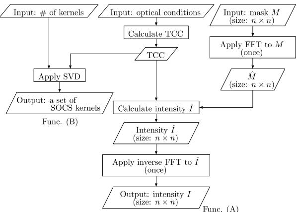

# Development of a Lithography Simulation Tool Set in Various Optical Conditions for Source Mask Optimization

MASAKI KURAMOCHI 1, YUKIHIDE KOHIRA 1, (Member, IEEE), HIROYOSHI TANABE2, TETSUAKI MATSUNAWA3, AND CHIKAAKI KODAMA 3, (Senior Member, IEEE)

1School of Computer Science, The University of Aizu, Aizuwakamatsu 965-8580, Japan   
2Tokyo Institute of Technology, Tokyo 152-8550, Japan   
3KIOXIA Corporation, Yokohama 247-8585, Japan

Corresponding author: Yukihide Kohira (kohira@u-aizu.ac.jp)

ABSTRACT Resolution Enhancement Techniques (RETs) in optical lithography have become essential for achieving the continuous shrinkage of technology nodes. The primary techniques in RETs include source mask optimization. Generally, lithography simulation, which estimates the image formed on wafers, is utilized in RETs. To optimize the light source and mask, optical conditions such as the light-source shape, numerical aperture, and exposure wavelength need to be adjusted in the lithography simulation. However, there is a shortage of open lithography simulation tools that cover various optical conditions. In academia, the study of source optimization in optical lithography is challenging. In this paper, we present the development of a lithography simulation tool set for source mask optimization. In our lithography simulation tool set, users can set optical conditions such as the light-source shape, mask shape, numerical aperture, and exposure wavelength. One function in our lithography simulation tool set calculates light intensity using the Transmission Cross Coefficient (TCC) model, while another function calculates it using the Sum of Coherent System (SOCS) for the specified optical conditions. In experiments, we verified the accuracy of our lithography simulation tool set and evaluated its execution time.

INDEX TERMS Optical lithography, lithography simulation, source mask optimization (SMO), transmission cross coefficient (TCC), sum of coherent system (SOCS).

# I. INTRODUCTION

Optical lithography is one of the semiconductor manufacturing processes. It involves creating a mask based on a designed circuit pattern and forming a circuit pattern on wafers by light exposure. To achieve high-density integration of semiconductor devices, it is essential to optimize the lithography process to obtain the desired wafer image from the designed circuit pattern. The half-pitch $H P$ of the lithography is determined by Rayleigh’s equation, and it is expressed by the following equation using the exposure wavelength and Numerical Aperture (NA) [1].

$$
H P = k _ { 1 } \frac { \lambda } { N A } ,
$$

where $k _ { 1 } , \lambda$ , and $N A$ are proportionality constant, exposure wavelength, and NA, respectively. So far, the lithography resolution has been improved by shortening $\lambda$ and increasing $N A$ . However, as technology nodes shrink, the impact of process variations such as exposure dose and depth of focus increases. The process variations may cause hotspots that degrade yield and performance. Therefore, Resolution Enhancement Techniques (RETs) that optimize the lithography process are required to enhance the pattern fidelity and tolerance to process variations.

The associate editor coordinating the review of this manuscript and D approving it for publication was Ludovico Minati

Major technologies in the RETs include mask and source optimizations. Optical Proximity Correction (OPC) is a mask optimization technique that corrects the mask shape for exposure. On the other hand, source optimization adjusts the luminance distribution of the light source. Additionally, as illustrated in Fig. 1, the method that optimizes the mask and source simultaneously to maximize the performance of the optical system is referred to as Source Mask Optimization (SMO). SMO serves as an effective optimization method in optical lithography [2].

  
FIGURE 1. Source mask optimization (SMO).

To implement these RETs, lithography simulation is employed. In lithography simulation, the imaging process in optical lithography is described by mathematical models. It is essential to construct an environment for lithography simulation that accurately calculates aerial images under specific optical conditions.

An open-source lithography simulation tool was provided by the ICCAD 2013 contest [3]. This simulator utilizes a model known as Sum of Coherent System (SOCS) kernels to estimate the wafer image transferred under specific optical conditions from the geometric shape data of the mask. The SOCS model enables a quick calculation of the aerial image from both the mask and a set of SOCS kernels representing optical conditions. Researchers have extensively studied mask optimization using the ICCAD tool [4], [5], [6], [7], [8], [9], [10]. However, the ICCAD tool does not allow changes in the optical conditions, such as the light-source shape, NA, and the amount of focus error (defocus). Additionally, the sizes of the mask and wafer images are fixed. In [3], the providers of the ICCAD tool mentioned that the light wavelength was $1 9 3 ~ \mathrm { n m }$ and the light-source shape was annular, but they did not describe details on other conditions. Therefore, many mask optimization studies have been evaluated under only partially known optical conditions.

Lithosim [11] also calculates the aerial image by the SOCS model under fixed optical conditions. LithographySimulation [12] analytically calculates the aerial image for the mask pattern with lines and spaces. In optolithium [13], the mask shape can be freely set, and a parametric source, such as an annular shape, can be utilized. However, open lithography simulation tools, including [11], [12], [13], lack the flexibility to adjust the source shape and optical conditions and cannot derive a set of SOCS kernels for specific source shapes and optical conditions. Although commercial lithography simulation tools are available, they are expensive to use and cannot be customized. Therefore, in academia, it is difficult to study source optimization in optical lithography.

In this paper, we develop a lithography simulation tool set K-Litho that derives aerial images under various optical conditions. K-Litho includes two tools: K-Litho-TCC and KLitho-SOCS. K-Litho-TCC enables users to set parameters, including the light-source shape, grid size of the light source, NA, light wavelength, defocus, dose, mask shape, and mask size. The aerial image is calculated by the Transmission Cross Coefficient (TCC) model. Additionally, K-Litho-TCC has the capability to derive a set of SOCS kernels for specified optical conditions, which can be input into the ICCAD tool [3]. In K-Litho-SOCS, the aerial image is calculated by the SOCS model for the specified SOCS kernels. K-Litho-SOCS is faster than the ICCAD tool due to applying Fourier interpolation. Of course, the SOCS kernels derived by K-Litho-TCC can be input into K-LithoSOCS. In experiments, the accuracy of our lithography simulation tool set was verified by comparison with another light-intensity calculation model, an analytical one, and existing open lithography simulation tools. Furthermore, we assessed the execution time by varying the mask size and source grid size in our experiments.

We have released K-Litho via GitHub1. We believe that K-Litho will contribute to the progress of source mask optimization research.

# II. PRELIMINARIES

In this section, based on [14] and [15], we present the optical system and introduce two light intensity calculation models, i.e., the TCC model and the SOCS model.

# A. OPTICAL SYSTEM

In optical lithography, a circuit pattern is formed on a wafer by light exposure using a mask based on a designed circuit pattern. A partially coherent optical system is widely employed in lithography simulation (Fig. 2). In this system, a finite-sized light source is utilized, but it is treated as a collection of infinitely small sources, with the assumption that the light emitted from different source points does not interfere with each other.

When the size of the mask pattern is smaller than wavelength, the light passing through the mask undergoes diffraction. The diffracted light is focused by a lens group to form a wafer image. However, during the condensation of the diffracted light by the lens group, not all of it is focused due to the limited size of the lens. It results in the removal of high-frequency components. In other words, the exposure apparatus can be viewed as a low-pass filter for the pattern formed on the mask.

  
FIGURE 2. Partially coherent optical system.

Additionally, within the lens group, there exists a region known as the pupil plane, where the light diffracted from the mask becomes parallel. The diffracted light distribution of the mask in the pupil plane corresponds to the Fourier transform of the mask pattern. The aerial image on the wafer can be calculated from the Fourier transform of the diffracted light distribution at the exit pupil.

The valid region of the light source is determined by the ratio $\sigma N A / \lambda$ , where $\sigma$ represents the coherence factor in the optical system. The size of the light source is normalized by $\sigma N A / \lambda$ , and the light-source region is defined by a circle with radius 1. The shape of the light source is discretized by a grid within the bounding box of the circle. The light source intensity distribution $s$ is configured within this grid. Each pixel in $s$ is assigned a value between 0 and 1. The mask $M$ is represented by an $n \times n$ matrix. Each element in $M$ takes on a value of 0 or 1 $( M \in \{ 0 , 1 \} ^ { n \times n } )$ . Pixel value $M ( x , y ) = 1$ $( M ( x , y ) = 0 )$ indicates the opening (shielding) part at the pixel with coordinates $( x , y )$ in the mask.

The image formed on the wafer is estimated based on the aerial image. For example, in a simplified model known as the constant threshold resist model adapted in the ICCAD tool [3], a pattern is formed on the wafer at pixels where light intensities surpass a predetermined threshold. Note that we do not discuss the resist model and the quality of the image formed on the wafer because we focus on only the calculation of the aerial image on the wafer in this paper.

# B. TRANSMISSION CROSS COEFFICIENT (TCC)

We introduce Abbe imaging and the TCC model to calculate the aerial image on the wafer.

An aerial image is acquired by squaring the amplitude of the light exposure on the wafer. The amplitude distribution $U ( x , y , s _ { x } , s _ { y } )$ on the wafer with coordinates $( x , y )$ generated by the light emitted from the source with coordinates $( s _ { x } , s _ { y } )$ is described by the following equation.

$$
\begin{array} { l }  { \displaystyle { U ( x , y , s _ { x } , s _ { y } ) = \int \int _ { - \infty } ^ { \infty } \hat { M } ( f _ { x } , f _ { y } ) P ( f _ { x } + s _ { x } , f _ { y } + s _ { y } ) } } \\ { { \displaystyle ~ \times ~ e ^ { i 2 \pi ( ( f _ { x } + s _ { x } ) x + ( f _ { y } + s _ { y } ) y ) } d f _ { x } d f _ { y } , } } \end{array}
$$

where $f _ { x }$ and $f _ { y }$ represent the spatial frequency coordinates on the pupil plane, $\hat { M } ( f _ { x } , f _ { y } )$ denotes the diffracted light of the mask obtained by the Fourier transformation of the mask pattern, and $P ( f _ { x } , f _ { y } )$ indicates the projection pupil. The light intensity exposed on the wafer is determined by integrating the light source intensity distribution $S ( s _ { x } , s _ { y } )$ and the squared optical amplitude distribution $| U ( x , y , s _ { x } , s _ { y } ) | ^ { 2 }$ in the partially coherent imaging model.

$$
I ( x , y ) = \int \int _ { - \infty } ^ { \infty } S ( s _ { x } , s _ { y } ) | U ( x , y , s _ { x } , s _ { y } ) | ^ { 2 } d s _ { x } d s _ { y } .
$$

This equation is known as Abbe imaging. Note that although $U ( x , y , s _ { x } , s _ { y } )$ depends on the source coordinates $( s _ { x } , s _ { y } )$ , it remains independent of the light source intensity distribution in the Abbe imaging. This implies that $U ( x , y , s _ { x } , s _ { y } )$ is not changed even if the light source intensity distribution $s$ is changed. When the light source is optimized for a fixed mask shape, the Abbe imaging reduces the calculation time for the aerial image.

Here, we introduce TCC, which describes the magnitude of the transmission of the interference fringes generated by the two spatial frequency components $( f _ { x } , f _ { y } )$ and $( f _ { x } ^ { \prime } , f _ { y } ^ { \prime } )$ .

$$
\begin{array} { l } { \displaystyle { T C C ( f _ { x } , f _ { y } , f _ { x } ^ { \prime } , f _ { y } ^ { \prime } ) = \int \int _ { - \infty } ^ { \infty } S ( s _ { x } , s _ { y } ) } } \\ { \displaystyle { \times P ( f _ { x } + s _ { x } , f _ { y } + s _ { y } ) } } \\ { \displaystyle { \times P ^ { * } ( f _ { x } ^ { \prime } + s _ { x } , f _ { y } ^ { \prime } + s _ { y } ) d s _ { x } d s _ { y } } , } \end{array}
$$

where symbol ∗ represents a complex conjugate. Equation (1) can be expressed by $T C C ( f _ { x } , f _ { y } , f _ { x } ^ { \prime } , f _ { y } ^ { \prime } )$ as follows:

$$
\begin{array} { l } { \displaystyle { I ( x , y ) = \int \int \int \int _ { - \infty } ^ { \infty } \hat { M } ( f _ { x } , f _ { y } ) \hat { M } ^ { * } ( f _ { x } ^ { \prime } , f _ { y } ^ { \prime } ) } } \\ { \displaystyle { \times \ : T C C ( f _ { x } , f _ { y } , f _ { x } ^ { \prime } , f _ { y } ^ { \prime } ) } } \\ { \displaystyle { \times \ : e ^ { i 2 \pi ( ( f _ { x } - f _ { x } ^ { \prime } ) x + ( f _ { y } - f _ { y } ^ { \prime } ) y ) } d f _ { x } d f _ { y } d f _ { x } ^ { \prime } d f _ { y } ^ { \prime } } . } \end{array}
$$

The TCC is derived from the light source intensity distribution $s$ and the projection pupil $P$ . $S ( s _ { x } , s _ { y } )$ is normalized within the valid region as follows:

$$
1 = \int \int _ { \sqrt { s _ { x } ^ { 2 } + s _ { y } ^ { 2 } } \leq \sigma N A / \lambda } S ( s _ { x } , s _ { y } ) d s _ { x } d s _ { y } .
$$

Next, the projection pupil $P ( f _ { x } , f _ { y } )$ is expressed by the following equation.

$$
P ( f _ { x } , f _ { y } ) = \left\{ \begin{array} { l l } { e ^ { i \frac { 2 \pi } { \lambda } W } , } & { \mathrm { i f } \sqrt { f _ { x } ^ { 2 } + f _ { y } ^ { 2 } } \leq N A / \lambda } \\ { 0 , } & { \mathrm { o t h e r w i s e } , } \end{array} \right.
$$

where $W$ represents aberration. The aberration caused by defocus is given by:

$$
W = \Delta z \sqrt { 1 - ( f _ { x } ^ { 2 } + f _ { y } ^ { 2 } ) \lambda ^ { 2 } } ,
$$

where $\Delta z$ represents the defocus. Various types of aberrations, including coma and spherical aberrations, can be represented using Zernike polynomials. However, in this paper, we omit a detailed discussion of these aberrations since our focus is on the basic lithography simulator for source mask optimization. We will enhance our lithography simulation tools in terms of the aberrations in our future work.

  
FIGURE 3. The flow of the ICCAD tool [3].

The TCC is independent of the mask. Therefore, the TCC is reusable when multiple masks are exposed in the same optical conditions. Omitting the TCC calculation in fixed optical conditions reduces the calculation time for the aerial image.

# C. SUM OF COHERENT SYSTEM (SOCS)

In general, the SOCS model is employed as an optical model, and the aerial image is quickly derived by this approximation [16]. In the SOCS model, information such as the light source and optical illumination system is decomposed into a set of kernels $K$ . The kernels utilized in the SOCS model are obtained by Singular Value Decomposition (SVD) of the TCC shown in Eq. (2), where each kernel $k _ { i } \in K$ has an eigenfunction $\phi _ { i }$ $\mathbf { \Psi } ( \in \mathbb { C } ^ { n \times n } )$ behaving like a filter, and an eigenvalue $\sigma _ { i } \left( \in \mathbb { R } \right)$ corresponding to its weight.

The aerial image $I ( x , y ) \ ( \in \mathbb R )$ is expressed by the convolution of each kernel and mask $M$ .

$$
I ( x , y ) = \sum _ { k _ { i } \in K } \sigma _ { i } | \phi _ { i } \otimes M ( x , y ) | ^ { 2 } ,
$$

where $\otimes$ indicates two-dimensional $n \times n$ convolution.

# D. FLOW OF ICCAD TOOL

The flow of aerial image calculation in the ICCAD tool [3] is depicted in Fig. 3. The aerial image in the SOCS model is calculated through the convolution of the SOCS kernels and a mask $M$ , as presented in Eq. (4). The convolution in the spatial domain is transformed into a product in the frequency domain. Consequently, the ICCAD tool applies Fast Fourier Transformation (FFT) to the mask to represent it in the frequency domain. Subsequently, the product of each SOCS kernel and the mask in the frequency domain is computed. The result of this product for each SOCS kernel is transformed back to the spatial domain by inverse

  
FIGURE 4. The flow of the proposed lithography simulation tool using the TCC model, K-Litho-TCC.

FFT to obtain the optical amplitude distribution in each kernel. Finally, the aerial image is derived by summing the squared optical amplitude distributions of all SOCS kernels, as presented in Eq. (4).

The time complexity of the ICCAD tool depends on the FFT and the inverse FFT. The time complexity of the FFT and inverse FFT with $n ^ { 2 }$ elements, which are the size of the mask $M$ , is $O ( n ^ { 2 } \log { n ^ { 2 } } )$ . In the ICCAD tool, although the FFT for the mask is performed only once, the inverse FFT for the product of each SOCS kernel and the mask is executed $| K |$ times. Consequently, the time complexity of the ICCAD tool is $O ( | K | \cdot n ^ { 2 } \log n ^ { 2 } )$ . As discussed in the experiments, the ICCAD tool is not efficient. Since the size of the output is the same as that of the input in the FFT and the inverse FFT, the optical amplitude distribution with $n \times n$ in the frequency domain for each kernel is input to the inverse FFT in the ICCAD tool. Consequently, the inverse FFT with $n \times n$ is applied $| K |$ times, and its execution time is long.

# III. PROPOSED METHOD

# A. OUR LITHOGRAPHY SIMULATION TOOL SET

In this paper, we develop a lithography simulation tool set named K-Litho. K-Litho encompasses three primary functions: (A) aerial image calculation by the TCC model under specified optical conditions, (B) derivation of a set of SOCS kernels under the specified optical conditions, and (C) aerial image calculation by the SOCS model with the given set of SOCS kernels. K-Litho comprises two distinct tools: K-Litho-TCC, which implements functions (A) and (B), and K-Litho-SOCS, which performs function (C).

# B. FLOW OF K-LITHO-TCC

In K-Litho-TCC, (A) the aerial image is calculated by the TCC model, and (B) a set of SOCS kernels for the specified optical conditions is derived. Figure 4 illustrates the flow of K-Litho-TCC.

In K-Litho-TCC, users can set parameters such as lightsource shape, grid size of the light source, NA, light wavelength, defocus, dose, mask shape, and mask size. The

TCC model calculates the light intensity in the frequency domain, and the aerial image is obtained through the inverse FFT. Section III-B1 describes the aerial image in the frequency domain using the TCC model. In Section III-B2, the derivation of the SOCS kernels from the TCC is explained.

# 1) CALCULATION OF LIGHT INTENSITY IN SPATIAL FREQUENCY DOMAIN USING TCC

In K-Litho-TCC, Eq. (3) is calculated in the spatial frequency domain. Hereafter, the calculation method is explained in detail.

First, it is necessary to discretize Eq. (3) so that the calculation is executed on a computer. Let $L _ { x }$ and $L _ { y }$ be the periods of the mask in $x$ - and $y .$ - directions, $n _ { x } , n _ { y } , n _ { x } ^ { \prime } , n _ { y } ^ { \prime } \in \mathbb { Z }$ and $\begin{array} { r } { f _ { x } = \frac { n _ { x } } { L _ { x } } , f _ { y } = \frac { n _ { y } } { L _ { y } } , f _ { x } ^ { \prime } = \frac { n _ { x } ^ { \prime } } { L _ { x } } , f _ { y } ^ { \prime } = \frac { n _ { y } ^ { \prime } } { L _ { y } } . } \end{array}$ . Equation (3) can be expressed as:

$$
\begin{array} { c l } { { { \displaystyle I ( x , y ) = \sum _ { n _ { x } } \sum _ { n _ { y } } \sum _ { n _ { x } ^ { \prime } } \sum _ { n _ { y } ^ { \prime } } \hat { M } ( \frac { n _ { x } } { L _ { x } } , \frac { n _ { y } } { L _ { y } } ) \hat { M } ^ { * } ( \frac { n _ { x } ^ { \prime } } { L _ { x } } , \frac { n _ { y } ^ { \prime } } { L _ { y } } ) } } } \\ { { { \mathrm { } } } } \\ { { { \mathrm { } \times T C C ( \frac { n _ { x } } { L _ { x } } , \frac { n _ { y } } { L _ { y } } , \frac { n _ { x } ^ { \prime } } { L _ { x } } , \frac { n _ { y } ^ { \prime } } { L _ { y } } ) } } } \\ { { { \mathrm { } } } } \\  { { \mathrm { } \times e ^ { i 2 \pi ( \frac { n _ { x } - n _ { x } ^ { \prime } } { L _ { x } } x + \frac { n _ { y } - n _ { y } ^ { \prime } } { L _ { y } } ) } { } . } } \end{array}
$$

The calculation of Eq. (5) in the range where the TCC is zero is redundant since the result of multiplication in the summation is zero. Therefore, Eq. (5) is calculated only in the range where the TCC is non-zero. In [17], the ranges of $n _ { x } , n _ { y } , n _ { x } ^ { \prime }$ , and $n _ { y } ^ { \prime }$ where the TCC is non-zero are derived as follows:

$$
\begin{array} { l } { { N _ { x } = \left\lfloor \frac { L _ { x } N A ( 1 + \sigma ) } { \lambda } \right\rfloor } } \\ { { N _ { y } = \left\lfloor \frac { L _ { y } N A ( 1 + \sigma ) } { \lambda } \right\rfloor , } } \end{array}
$$

where $N _ { x }$ is the maximum absolute value of $n _ { x }$ and $n _ { x } ^ { \prime }$ , and $N _ { y }$ is that of $n _ { y }$ and $n _ { y } ^ { \prime }$ . These results indicate that the ranges of $n _ { x }$ and $n _ { x } ^ { \prime }$ for the calculation of Eq. (5) are restricted from $- N _ { x }$ to $N _ { x }$ , and those of $n _ { y }$ and $n _ { y } ^ { \prime }$ are restricted from $- N _ { y }$ to $N _ { y }$ . The Fourier transform of Eq. (5) is then employed to calculate the aerial image in the frequency domain. Considering Eqs. (6) and (7), K-Litho-TCC finally computes the following equations.

$$
\begin{array} { c } { \hat { I } ( \frac { n _ { x } ^ { \prime \prime } } { L _ { x } } , \frac { n _ { y } ^ { \prime \prime } } { L _ { y } } ) = \displaystyle { \sum _ { n _ { x } ^ { \prime } = - N _ { x } } ^ { N _ { x } } \sum _ { n _ { y } ^ { \prime } = - N _ { y } } ^ { N _ { y } } \hat { M } ( \frac { n _ { x } ^ { \prime \prime } + n _ { x } ^ { \prime } } { L _ { x } } , \frac { n _ { y } ^ { \prime \prime } + n _ { y } ^ { \prime } } { L _ { y } } ) } } \\ { \times \hat { M } ^ { * } ( \frac { n _ { x } ^ { \prime } } { L _ { x } } , \frac { n _ { y } ^ { \prime } } { L _ { y } } ) } \\ { \times T C C ( \frac { n _ { x } ^ { \prime \prime } + n _ { x } ^ { \prime } } { L _ { x } } , \frac { n _ { y } ^ { \prime \prime } + n _ { y } ^ { \prime } } { L _ { y } } , \frac { n _ { x } ^ { \prime } } { L _ { x } } , \frac { n _ { y } ^ { \prime } } { L _ { y } } ) . } \end{array}
$$

Here, we discuss the time complexity of calculating the aerial image in the TCC model. Since the ranges of $n _ { x }$ and $n _ { x } ^ { \prime }$ $( n _ { y }$ and $n _ { y . } ^ { \prime }$ ) are restricted from $- N _ { x }$ to $N _ { x }$ (from $- N _ { y }$ to $N _ { y } )$ , the TCC has $( 2 { N _ { x } } + 1 ) ^ { 2 } \times ( 2 { N _ { y } } + 1 ) ^ { 2 } = O ( { N _ { x } } ^ { 2 } { N _ { y } } ^ { 2 } )$ elements. Each element of the TCC is calculated by Eq. (2), and its time complexity is $O ( N _ { s } )$ , where $N _ { s }$ is the number of pixels in the light source. Therefore, the time complexity of calculating the TCC is $O ( N _ { s } N _ { x } { } ^ { 2 } N _ { y } { } ^ { 2 } )$ . In Eq. (8), the range of $n _ { x } ^ { \prime \prime }$ and $n _ { y } ^ { \prime \prime }$ for which the aerial image in the frequency domain $\hat { I }$ is non-zero is from $- 2 N _ { x }$ to $2 N _ { x }$ and from $- 2 N _ { y }$ to $2 N _ { y }$ . Therefore, the time complexity of calculating $\hat { I }$ by Eq. (8) without calculating the TCC is $O ( N _ { x } ^ { 2 } N _ { y } ^ { 2 } )$ . Finally, the time complexity of the inverse FFT to $\hat { I }$ is ${ \dot { O } } ( n ^ { 2 } \log n ^ { 2 } )$ , similar to Section II-C. Consequently, the time complexity of calculating the aerial image in the TCC model significantly depends on calculating the TCC.

# 2) DERIVATION OF SOCS KERNEL

In the SOCS model, the light intensity is calculated by convolution of the SOCS kernels and mask, as shown in Eq. (4). These kernels are derived by the SVD of the TCC shown in Eq. (2) [15], [17].

Here, the TCC has the following property and can be represented by a Hermitian matrix.

$$
T C C ( f _ { x } , f _ { y } , f _ { x } ^ { \prime } , f _ { y } ^ { \prime } ) = T C C ^ { * } ( f _ { x } ^ { \prime } , f _ { y } ^ { \prime } , f _ { x } , f _ { y } )
$$

Therefore, the eigenvalues of the TCC are real and nonnegative, and the singular values and vectors coincide with the eigenvalues $\sigma _ { i }$ and eigenvectors $\hat { \phi } _ { i }$ .

$$
T C C ( f _ { x } , f _ { y } , f _ { x } ^ { \prime } , f _ { y } ^ { \prime } ) \approx \sum _ { i = 1 } ^ { | K | } \sigma _ { i } \hat { \phi } _ { i } ( f _ { x } , f _ { y } ) \hat { \phi } _ { i } ^ { * } ( f _ { x } ^ { \prime } , f _ { y } ^ { \prime } ) ,
$$

where $\hat { \phi } _ { i } ( f _ { x } , f _ { y } )$ is generally referred to as the SOCS kernel, and the SOCS kernel $\phi _ { i }$ in the spatial domain in Eq. (4) is the inverse Fourier series expansion of $\hat { \phi } _ { i }$ . By arbitrarily setting the number of SOCS kernels $| K |$ to achieve the required accuracy, the light intensity can be calculated in a short execution time.

In general, the time complexity of the SVD for an $N \times N$ Hermitian matrix is $O ( N ^ { 3 } )$ . As discussed in Section III-B1, the TCC matrix has $( 2 { N _ { x } } + 1 ) ^ { 2 } \times ( 2 { N _ { y } } + 1 ) ^ { 2 } = O ( { N _ { x } } ^ { 2 } { N _ { y } } ^ { 2 } )$ elements. Therefore, the time complexity of the SVD for the TCC matrix is $O ( N _ { x } { } ^ { 6 } N _ { y } { } ^ { 6 } )$ .

# C. FLOW OF K-LITHO-SOCS

In K-Litho-SOCS, the aerial image is calculated by the SOCS model for a given set of SOCS kernels for acceleration. Figure 5 illustrates the flow of K-Litho-SOCS. The primary idea behind the acceleration is to reduce the number of calculations of the FFT and inverse FFT with the size of the entire mask $( n \times n )$ by applying Fourier interpolation.

As discussed in Section III-B1, calculating the light intensity in the range where the TCC is zero is redundant. Each component of the TCC is restricted to the range from $- N _ { x }$ to $N _ { x }$ and from $- N _ { y }$ to $N _ { y }$ . Consequently, the effective range of the SOCS kernels obtained by Eq. (9) is also from $- N _ { x }$ to $N _ { x }$ and from $- N _ { y }$ to $N _ { y }$ . When each component of the TCC has an effective range from $- N _ { x }$ to $N _ { x }$ and from $- N _ { y }$ to $N _ { y }$ , the effective range of $n _ { x } ^ { \prime \prime }$ and $n _ { y } ^ { \prime \prime }$ in Eq. (8) is from $- 2 N _ { x }$ to $2 N _ { x }$ and from $- 2 N _ { y }$ to $2 N _ { y }$ . This implies that the effective size of the aerial image in the frequency domain is $( 4 N _ { x } + 1 ) \times$ $( 4 N _ { y } + 1 )$ . Therefore, K-Litho-SOCS initially calculates an aerial image with a size of $( 4 N _ { x } + 1 ) \times ( 4 N _ { y } + 1 )$ . The product of each SOCS kernel with the mask $\hat { \phi } _ { i } \cdot \hat { M }$ is calculated in the frequency domain with a size of $( 2 N _ { x } + 1 ) \times ( 2 N _ { y } + 1 )$ . Since the FFT and inverse FFT maintain the same size for input and output, 0-padding is applied to high-frequency components outside the range from $- N _ { x }$ to $N _ { x }$ and from $- N _ { y }$ to $N _ { y }$ for expanding the size of $\hat { \phi } _ { i } \cdot \hat { M }$ to $( 4 N _ { x } + 1 ) \times ( 4 N _ { y } + 1 )$ . The size of the aerial image in the spatial domain after applying the inverse FFT is $( 4 N _ { x } + 1 ) \times ( 4 N _ { y } + 1 )$ .

  
FIGURE 5. The flow of K-Litho-SOCS.

To resize the aerial image in the spatial domain from $( 4 N _ { x } +$ $1 ) \times ( 4 N _ { y } + 1 )$ to $n \times n$ , Fourier interpolation is employed. The aerial image is transformed to the frequency domain by the FFT. 0-padding is applied to high-frequency components outside the range from $- 2 N _ { x }$ to $2 N _ { x }$ and from $- 2 N _ { y }$ to $2 N _ { y }$ . Subsequently, an aerial image with a size of $n \times n$ is obtained by the inverse FFT. Since the inverse FFT with $n \times n$ is applied only once in K-Litho-SOCS, the execution time of K-LithoSOCS is shorter than that of the ICCAD tool [3].

The time complexity of K-Litho-SOCS is less than that of the ICCAD tool. The time complexity of the FFT of initial mask $M$ is $O ( n ^ { 2 } \log { n ^ { 2 } } )$ . The time complexity of the computation from $\hat { \phi } _ { i } \cdot \hat { M }$ to deriving the aerial image with the size of $( 4 N _ { x } + 1 ) \times ( 4 N _ { y } + 1 ) = { \cal O } ( N _ { x } N _ { y } )$ is $O ( | K | \cdot$ $N _ { x } N _ { y } \log ( N _ { x } N _ { y } ) )$ because it is dominated by the inverse FFT of $\hat { \phi } _ { i } \cdot \hat { M }$ . Since the time complexity for the Fourier interpolation significantly depends on the inverse FFT with the size of the mask $M$ , it is $\bar { O ( n ^ { 2 } \log { n ^ { 2 } } ) }$ . Therefore, the time complexity of K-Litho-SOCS is evaluated as $O ( n ^ { 2 } \log n ^ { 2 } +$ $| K | \cdot N _ { x } N _ { y } \log ( N _ { x } N _ { y } ) )$ . In practice, since $n \gg N _ { x } , N _ { y }$ , the term $O ( n ^ { 2 } \log ^ { 2 } n ^ { 2 } )$ is dominant, and the impact of the increase in the number of kernels on the total simulation time is relatively small.

# IV. EXPERIMENTS

# A. EXPERIMENTAL ENVIRONMENT

Our optical lithography tool set K-Litho was implemented in $\mathrm { C } + +$ and applied to mask patterns to validate its accuracy. K-Litho was executed on a Linux machine with an Intel Core i7-8700 3.2GHz CPU and 32GB of memory. In K-Litho, FFTW was employed as the library for FFT and inverse FFT [18]. The Zheevr function in LAPACK [19] was utilized for the SVD.

The following parameters were set as default if there is no explanation in the experiments. The exposure wavelength was fixed to $1 9 3 ~ \mathrm { { n m } }$ . The size of the pattern area formed on the wafer was set to $1 0 2 4 \ : \mathrm { n m } \times 1 0 2 4 \ : \mathrm { n m }$ , and the horizontal and vertical mask periods were set to $2 0 4 8 \mathrm { n m }$ . Note that these values can be adjusted in K-Litho. The mask was discretized with a pixel size of $1 \ \mathrm { n m } \times 1 \ \mathrm { n m }$ . These settings align with those of the ICCAD tool [3].

# B. EVALUATION OF K-LITHO-TCC

To assess the accuracy of K-Litho-TCC, we compared the light intensity obtained by K-Litho-TCC with those obtained by other models. In Section IV-B1, Abbe imaging for a point source was employed. In Section IV-B2, an aerial image was generated by an open lithography simulation tool, Lithography-Simulation [12]. In Section IV-B3, an aerial image for the mask pattern with lines and spaces was calculated analytically. Additionally, the accuracy of light intensities calculated by the SOCS model, where the kernels were obtained by K-Litho-TCC, was evaluated in Section IV-B4.

# 1) COMPARISON WITH ABBE IMAGING

We compared the light intensity obtained by K-Litho-TCC with that obtained by Abbe imaging in a point source. The simulation result for the point source is illustrated in Fig. 6. Figure 6 (a) depicts the shape of the light source with the grid size of $2 0 1 \times 2 0 1$ . As mentioned in Section II-A, the light-source region is defined as a circle with a radius of 1. The coordinate of the center of the light-source region is set to $( 0 , 0 )$ and the position of light source is represented by the coordinates. In this simulation, light was emitted from the point with coordinates (0.6, 0.2). NA was set to 0.83. The target pattern shown in Fig. 6 (b) is T1 provided in the ICCAD 2013 contest [3]. Figure 6 (c) displays the aerial image obtained by K-Litho-TCC. In the subsequent figures for aerial images, the light intensity of each pixel is indicated by color. Blue color is assigned to pixels with zero light intensity. The maximum intensity on the color map is set to 0.5. If the light intensity surpasses 0.5, the pixel color turns red.

  
FIGURE 6. Lithography simulation result of K-Litho-TCC. (a) Point light source. (b) Target pattern T1 provided in ICCAD 2013 contest. (c) Simulation result of K-Litho-TCC.

  
FIGURE 7. Comparison of the aerial images by Abbe imaging and K-Litho-TCC.

Figure 7 illustrates the comparison of the aerial images by Abbe imaging and K-Litho-TCC for T1. Figure 7 (a), (b), and (c) show the aerial images by Abbe imaging, that by KLitho-TCC, and the difference between the aerial images of Fig. 7 (a) and (b), respectively. Since the differences at any points in Fig. 7 (c) are close to 0, the error of K-Litho-TCC is small. Let $I _ { T C C } ( x , y )$ be the light intensity at coordinates $( x , y )$ on the wafer by K-Litho-TCC, and $I _ { A b b e } ( x , y )$ be that by Abbe imaging. Figure 8 presents the error of $I _ { T C C } ( x , y )$ compared to $I _ { A b b e } ( x , y )$ to analyze errors of the simulation in detail. In Fig. 8, $x$ -axis represents $I _ { A b b e } ( x , y )$ shown in Fig. 7 (a) and $y .$ -axis represents $I _ { T C C } ( x , y ) - I _ { A b b e } ( x , y )$ shown in Fig. 7 (c). Each plot corresponds to a comparison of the error shown in Fig. 7 (c) with the exact light intensity shown in Fig. 7 (a) at a point on the wafer. The distance from the $\mathbf { X }$ -axis corresponds to the absolute error, and the absolute value of the slope of the line from the origin to a point represents the relative error for each plot in Fig. 8. The maximum absolute error was 1.01e6, and the minimum absolute error was 0. The maximum relative error was $4 . 1 4 \mathrm { e } { \cdot } 4$ , and the minimum relative error was 0. The Root Mean Square Error (RMSE) was $5 . 9 8 \mathrm { e } { - 8 }$ .

  
FIGURE 8. Error of ITCC compared to IAbbe.

  
FIGURE 9. Comparison of $\pmb { I } _ { L - S i m }$ and $\scriptstyle { I _ { T C C } }$ for a one-dimensional periodic pattern with a line width of 250 nm and a space width of $1 7 5 0 \ \mathrm { n m }$ .

The accuracy of K-Litho-TCC was very high because the errors were very small. These errors may occur due to floating point calculations.

# 2) COMPARISON WITH OPEN LITHOGRAPHY SIMULATION TOOL

K-Litho-TCC was compared with an open lithography simulation tool, Lithography-Simulation [12]. LithographySimulation did not take the $y .$ -direction into consideration. The mask shape was an infinite continuation of a line/space pattern with a linewidth of $2 5 0 \mathrm { n m }$ and a space of $1 7 5 0 \mathrm { n m }$ in the $x$ -direction. The light-source shape was also represented as a one-dimensional line segment, and its length was the half of the valid light-source region. The parameters in K-LithoTCC were set identical to those in Lithography-Simulation. The size of the pattern area formed on the wafer was set to $2 0 0 0 \ \mathrm { n m } \times 2 0 0 0 \ \mathrm { n m }$ . Both the horizontal and vertical mask periods were also set to $2 0 0 0 \mathrm { n m }$ . The mask had a line pattern with a size of $2 5 0 \mathrm { n m } \times 2 0 0 0 \mathrm { n m }$ . This configuration implies an infinite continuation of the line/space pattern with a linewidth of $2 5 0 \ \mathrm { n m }$ and a space of $1 7 5 0 \ \mathrm { n m }$ in the $x$ -direction. The grid size of the light source was set to $9 \times 1$ , and the light was emitted from five pixels in the middle of the light-source region. NA was fixed at 0.4. In this experiment, since a one-dimensional pattern mask is used, the light intensity is independent of the y-coordinate. Let $I _ { T C C } ( x , y )$ denote the light intensity at coordinates $( x , y )$ on the wafer by K-Litho-TCC, and $I _ { L - S i m } ( x )$ represent the light intensity at coordinates $x$ on the wafer by LithographySimulation.

  
FIGURE 10. Error of ITCC compared to IL−Sim.

Figure 9 (a) illustrates $I _ { L - S i m } ( x )$ , Fig. 9 (b) depicts $I _ { T C C } ( x , 0 )$ , and Fig. 9 (c) illustrates the difference between $I _ { L - S i m } ( x )$ and $I _ { T C C } ( x , 0 )$ . Each image in Fig. 9 represents a region spanning one period of $2 0 0 0 \ \mathrm { n m }$ , covering the range from $- 1 0 0 0 \mathrm { n m }$ to $1 0 0 0 \mathrm { n m }$ .

Figure 10 presents the error of $I _ { T C C } ( x , y )$ compared to $I _ { L - S i m } ( x )$ . In this experiment, the maximum absolute error was 5.00e-7, the minimum absolute error was 0, the maximum relative error was 3.45e-6, the minimum relative error was 0, and the RMSE was $1 . 2 3 \mathrm { e } \mathrm { - } 7$ . The accuracy of the light intensity calculated by K-Litho-TCC is evident, as indicated by the small error values.

  
FIGURE 11. TCC (TCC (0, 0), TCC (f , 0), and TCC (f , −f )).

# 3) ANALYTICAL EVALUATION USING LINE/SPACE PATTERN

We employed a line/space pattern as the mask pattern to evaluate the accuracy of the light intensity calculated by K-Litho-TCC in comparison with the analytical calculation. In this experiment, the size of the pattern area formed on the wafer was also set to $2 0 4 8 \ \mathrm { n m } \times 2 0 4 8 \ \mathrm { n m }$ . Both the horizontal and vertical mask periods were set to $2 0 4 8 ~ \mathrm { n m }$ . As mentioned in Section IV-B2, this configuration implies an infinite continuation of the line/space pattern. It also enables the analytical derivation of the light intensity [20]. The linewidth-to-space ratio was set at 1:1, and the mask function was defined as follows:

$$
M ( x , y ) = \left\{ { 1 , \quad \mathrm { i f } ( 2 n - 1 / 2 ) w \leq x \leq ( 2 n + 1 / 2 ) w , } \right. 
$$

In this case, the light intensity depends solely on $x$ -coordinate. The light intensity for the mask with lines and

spaces $I _ { L S }$ is expressed by the following equation [20].

$$
\begin{array} { c } { { I _ { L S } ( x ) = \displaystyle \frac { 1 } { 4 } T C C ( { \bf 0 } , { \bf 0 } ) + \displaystyle \frac { 2 } { \pi ^ { 2 } } T C C ( { \bf f } , { \bf f } ) } } \\ { { \displaystyle ~ + \frac { 2 } { \pi } { \mathrm { R e } T C C } ( { \bf f } , { \bf 0 } ) \cos ( 2 \pi f x ) } } \\ { { \displaystyle ~ + \frac { 2 } { \pi ^ { 2 } } T C C ( { \bf f } , - { \bf f } ) \cos ( 4 \pi f x ) , } } \end{array}
$$

where $I _ { L S } ( x )$ represent the light intensity at coordinates $x$ ReTCC is the real part of the TCC, $\boldsymbol { \textbf { \textit { f } } } = \left( \boldsymbol { \mathscr { f } } , 0 \right)$ , and $f$ is the fundamental frequency component, as defined by the following equation.

$$
f = { \frac { 1 } { 2 w } } .
$$

For example, $T C C ( \pmb { f } , \mathbf { 0 } )$ is equivalent to $T C C ( f , 0 , 0 , 0 )$ As illustrated in Eq. (10), the light intensity is derived from four types of the TCC. The TCC is obtained by integrating the intersection of the effective light source $s$ and the pupil $P$ . In particular, when $d e f o c u s = 0$ , the TCC can be easily obtained from the area of the intersection of the three circles. Examples of the integration range of $T C C ( { \bf 0 } , { \bf 0 } ) , T C C ( f , { \bf 0 } )$ and $T C C ( \pmb { f } , - \pmb { f } )$ are depicted in Fig. 11.

The simulation result for the mask pattern with lines and spaces is presented in Fig. 12. Figure 12 (a) illustrates the light-source shape, which is circular, and the radius was set to 0.5. Figure 12 (b) displays the mask pattern with lines and spaces, where the linewidth $w$ was set to $1 2 8 ~ \mathrm { n m }$ , and NA was defined as $\lambda / ( 2 w \cdot 0 . 9 )$ under optical conditions. Figure 12 (c) presents the aerial image obtained by K-LithoTCC. Let $I _ { T C C } ( x , y )$ present the light intensity at coordinates $( x , y )$ on the wafer by K-Litho-TCC, and $I _ { L S } ( x )$ represent that calculated by Eq. (10). In this experiment, since a one-dimensional pattern mask is used, the light intensity is independent of the y-coordinate. Figure 13 (a) illustrates $I _ { L S } ( x )$ , Fig. 13 (b) depicts $I _ { T C C } ( x , 0 )$ , and Fig. 13 (c) presents the difference between $I _ { L S } ( x )$ and $I _ { T C C } ( x , 0 )$ . Each image in Fig. 13 represents a region spanning one period of $2 5 6 ~ \mathrm { n m }$ , covering the range from $- 1 2 8 \mathrm { n m }$ to $1 2 8 \mathrm { n m }$ .

Figure 14 displays the error of $I _ { T C C } ( x , y )$ compared to $I _ { L S } ( x )$ . In this experiment, the maximum absolute error was $9 . 9 3 \mathrm { e } { - 5 }$ , the minimum absolute error was $1 . 0 0 \mathrm { e } { - 6 }$ , the maximum relative error was 3.11e-3, the minimum relative error was 7.13e-6, and the RMSE was 6.31e-5. K-Litho-TCC accurately calculated the aerial image, as evidenced by the small error values.

  
FIGURE 12. Lithography simulation result of K-Litho-TCC. (a) Circular light source. (b) Target pattern with lines and spaces. (c) Simulation result of K-Litho-TCC.

  
FIGURE 13. Comparison of $\pmb { I } _ { \pmb { L } \pmb { S } }$ and $\scriptstyle { \pmb { I } } _ { { \pmb { T } } C C }$ for a one-dimensional periodic pattern with a line width of 128 nm and a space width of $1 2 8 \ \mathsf { n m }$ .

  
FIGURE 14. Error of $\scriptstyle { I _ { T C C } }$ compared to $\pmb { I } _ { \pmb { L } \pmb { S } }$ .

# 4) SOCS KERNELS

Here, we assessed the accuracy of the set of SOCS kernels obtained by K-Litho-TCC. The mask shape and optical conditions were configured as described in Section IV-B3. Let $I _ { S O C S } ( x , y )$ represent the light intensity obtained by KLitho-SOCS using the set of the SOCS kernels derived by K-Litho-TCC. In this experiment, since a one-dimensional pattern mask was employed, the light intensity is independent of the y-coordinate. Figure 15 (a) illustrates $I _ { L S } ( x )$ , Fig. 15 (b) depicts $I _ { S O C S } ( x , 0 )$ , and Fig. 15 (c) presents the difference between $I _ { L S } ( x )$ and $I _ { S O C S } ( x , 0 )$ . Each image in Fig. 15 represents a region spanning one period of $2 5 6 \mathrm { n m }$ , covering the range from $- 1 2 8 ~ \mathrm { n m }$ to $1 2 8 ~ \mathrm { n m }$ . Figure 16 displays the error of $I _ { S O C S } ( x , 0 )$ compared to $I _ { L S } ( x )$ . Experiments were conducted by varying the number of SOCS kernels $| K |$ to 10, 20, 30, 40, 50, 100, 200, and 400. According to Eq. (4), $I _ { S O C S } ( x , y )$ increases as the number of kernels increases. Table 1 presents errors of ISOCS compared to $I _ { L S }$ . As the number of kernels increases, all the metrics including the maximum absolute error, minimum absolute error, maximum relative error, minimum relative error, and RMSE decrease.

  
FIGURE 15. Comparison of $\pmb { I } _ { \pmb { L } \pmb { S } }$ and $\pmb { I _ { S O C S } }$ for a one-dimensional periodic pattern with a line width of 128 nm and a space width of $1 2 8 \ \mathbf { n m }$ .

  
FIGURE 16. Error of ISOCS compared to $\pmb { I } _ { \pmb { L } \pmb { S } }$

# C. EVALUATION OF K-LITHO-SOCS

In this evaluation, we assessed the accuracy and execution time of K-Litho-SOCS by comparing it with the ICCAD tool [3]. The set of SOCS kernels was configured to match those provided by the ICCAD tool [3], consisting of 24 SOCS kernels. The target pattern was set to T1 provided in the ICCAD 2013 contest [3]. Let $I _ { S O C S } ( x , y )$ $( I _ { I C C A D } ( x , y ) )$ represent the light intensity obtained by K-Litho-SOCS (the ICCAD tool). Figure 17 illustrates the error of $I _ { S O C S } ( x , y )$ compared to $I _ { I C C A D } ( x , y )$ . In this experiment, the maximum absolute error was 3.28e-7, the minimum absolute error was 0, the maximum relative error was 1.86e-6, the minimum relative error was 0, and the RMSE was 2.94e-8. Moreover, the execution time of K-Litho-SOCS was 0.077 [s] and that of the ICCAD tool was 7.675 [s]. Consequently, K-LithoSOCS demonstrated significantly faster performance than the ICCAD tool without compromising accuracy.

TABLE 1. Errors of ISOCS compared to ILS .   

<table><tr><td>Number of kernels (K )</td><td>10</td><td>20</td><td>30</td><td>40</td><td>50</td><td>100</td><td>200</td><td>400</td></tr><tr><td>Max. absolute error</td><td>9.35e-3</td><td>5.68e-3</td><td>3.70e-3</td><td>3.67e-3</td><td>2.56e-3</td><td>2.07e-3</td><td>6.67e-4</td><td>1.20e-4</td></tr><tr><td>Min. absolute error</td><td>6.65e-3</td><td>4.65e-3</td><td>3.54e-3</td><td>2.45e-3</td><td>2.38e-3</td><td>1.58e-3</td><td>4.60e-4</td><td>1.00e-6</td></tr><tr><td>Max. relative error</td><td>2.75e-1</td><td>1.77e-1</td><td>1.15e-1</td><td>1.14e-1</td><td>8.00e-2</td><td>6.48e-2</td><td>2.08e-2</td><td>3.76e-3</td></tr><tr><td>Min. relative error</td><td>1.23e-2</td><td>7.06e-3</td><td>4.65e-3</td><td>4.64e-3</td><td>3.13e-3</td><td>2.49e-3</td><td>6.97e-4</td><td>2.63e-6</td></tr><tr><td>RMSE</td><td>7.92e-3</td><td>5.10e-3</td><td>3.64e-3</td><td>3.05e-3</td><td>2.45e-3</td><td>1.79e-3</td><td>5.38e-4</td><td>5.84e-5</td></tr></table>

  
FIGURE 17. Error of ISOCS compared to IICCAD.

  
FIGURE 18. Sources with a grid of $\mathbf { 2 0 1 } \times \mathbf { 2 0 1 }$ pixels. (a) Annular (Inner Radius $\mathbf { \eta } = \mathbf { 0 . 6 } ,$ , Outer Radius $\mathbf { \eta } = \mathbf { 0 . 9 } 1$ ). (b) Cross-quadrupole (Radius $\mathbf { \tau } = \mathbf { 0 . 1 }$ , Offset ${ \bf \sigma } = { \bf 0 . 5 } { \bf \sigma } .$ ).

# D. EXECUTION TIME OF SIMULATION

Here, we evaluated the scalability of K-Litho-TCC and KLitho-SOCS. The light-source shape was configured as the annular source shown in Fig. 18 (a). In the annular source, the inner radius, outer radius, and NA were set to 0.6, 0.9, and 0.83, respectively. The target pattern was set to T1 provided in the ICCAD 2013 contest [3]. We monitored the execution time by varying the grid size of the light source to $5 1 \times 5 1$ , $1 0 1 \times 1 0 1$ , and $2 0 1 \times 2 0 1$ and the size of the mask to $2 0 4 8 \times$ 2048, $4 0 9 6 \times 4 0 9 6$ , and $8 1 9 2 \times 8 1 9 2$ . In K-Litho-SOCS, the number of SOCS kernels was set to 50. Table 2 summarizes the execution times of K-Litho-TCC and K-Litho-SOCS.

The execution time in the SOCS model was significantly faster than that in the TCC model. The execution time of ‘‘FFT to $M ^ { \prime \prime }$ with the size $n \times n$ in common was slightly longer than that of ‘‘IFFT to $\hat { I } ^ { \dag }$ with the size $n \times n$ in Func. (A). This discrepancy is due to the FFT from real values to complex values, which involves additional post-processing in FFTW [18]. Moreover, ‘‘Fourier interpolation’’ in Func. (C) took almost the same amount of time as ‘‘IFFT to $\hat { I } ^ { \dag }$ in Func. (A), and ‘‘Calc. $I$ by SOCS’’ in Func. (C) was much faster than it. This indicates that the FFT with the size of $( 4 N _ { x } + 1 ) \times ( 4 N _ { y } + 1 )$ and 0-padding in Fourier interpolation is much faster than that with the size of $n \times n$ . In the experiment, $n$ was set to 2048, 4096, and 8192. In contrast, $N _ { x }$ and $N _ { y }$ were several tens.

# E. EXAMPLES OF SIMULATION

Finally, we applied K-Litho-TCC in annular and crossquadrupole sources to demonstrate the changes of the aerial image under different optical conditions. The light-source shapes are depicted in Fig. 18. The grid size of the light source was set to $2 0 1 \times 2 0 1$ . In the annular source, the inner radius, outer radius, and NA were set to the same values as those in the previous experiment. In the cross-quadrupole source, the radius, offset, and NA were set to 0.1, 0.5, and 0.9, respectively. We employed ten testbenches provided in the ICCAD 2013 contest [3] as the mask patterns (Fig. 19). The simulation results in annular and cross-quadrupole sources are presented in Figs. 20 and 21, respectively. It can be observed that the obtained aerial images change according to the optical conditions.

Note that we do not discuss the quality of the pattern formed on the wafer because the resist model and evaluation criteria are out of scope in this paper. However, our developed lithography simulation tool set can provide an environment for source mask optimization research. The optical conditions and mask shape are optimized with analysis of the aerial images obtained by the lithography simulation such as Figs. 20 and 21. For example, the tolerance of process variation depends on the contrasts of the light intensities, which are the differences of the light intensities between the inside and outside of the edges of the target pattern. Since the contrasts in Fig. 21 are larger than those in Fig. 20, the cross-quadrupole source may be more suitable than the annular source for the testbenches provided in the ICCAD 2013 contest. Source mask optimization will be attempted based on the assumption that the cross-quadrupole source is utilized.

TABLE 2. Execution time [s] of K-Litho-TCC and K-Litho-SOCS. ‘‘FFT to $M ^ { \prime \prime }$ corresponds to ‘‘Apply FFT to $M ^ { \prime \prime }$ in Figs. 4 and 5. ‘‘Calc. TCC’’, ‘‘Calc. ˆI by TCC’’, and ‘‘IFFT to $\hat { \pmb { I } } ^ { \prime \prime }$ in Func. (A) correspond to ‘‘Calculate TCC’’, ‘‘Calculate intensity $\hat { \pmb { I ^ { \prime } } } ,$ and ‘‘Apply inverse FFT to $\hat { \pmb { I } } ^ { \prime \prime }$ in Fig. 4, respectively. ‘‘Derive SOCS’’ in Func. (B) corresponds to ‘‘Apply SVD’’ in Fig. 4. ‘‘Calc. I by SOCS’’ in Func. (C) corresponds to the procedures before the Fourier interpolation excluding ‘‘Apply FFT to $M ^ { \prime \prime }$ in Fig. 5. ‘‘Fourier interpolation’’ in Func. (C) corresponds to ‘‘Apply Fourier interpolation’’ in Fig. 5.   

<table><tr><td>Mask size</td><td></td><td colspan="3">2048×2048</td><td colspan="3">4096×4096</td><td colspan="3">8192×8192</td></tr><tr><td></td><td>Source grid size</td><td>51 ×51</td><td>101×101</td><td>201 × 201</td><td>51×51</td><td>101×101</td><td>201 × 201</td><td>51×51</td><td>101×101</td><td>201×201</td></tr><tr><td>Common</td><td>FFT to M</td><td>0.108</td><td>0.095</td><td>0.087</td><td>0.410</td><td>0.401</td><td>0.410</td><td>1.645</td><td>1.707</td><td>1.686</td></tr><tr><td rowspan="4">Func. (A)</td><td>Calc. TCC</td><td>0.137</td><td>0.540</td><td>2.147</td><td>3.246</td><td>12.415</td><td>49.056</td><td>53.081</td><td>214.508</td><td>850.588</td></tr><tr><td>Calc. I by TCC</td><td>0.016</td><td>0.016</td><td>0.016</td><td>0.252</td><td>0.256</td><td>0.252</td><td>3.963</td><td>3.862</td><td>3.910</td></tr><tr><td>1FFT to i</td><td>0.062</td><td>0.062</td><td>0.063</td><td>0.330</td><td>0.338</td><td>0.328</td><td>1.439</td><td>1.449</td><td>1.443</td></tr><tr><td>Total of TCC</td><td>0.216</td><td>0.617</td><td>2.226</td><td>3.828</td><td>13.009</td><td>49.635</td><td>58.484</td><td>219.819</td><td>855.940</td></tr><tr><td rowspan="4">Func. (B) Func. (C)</td><td>Derive SOCS</td><td>0.917</td><td>0.919</td><td>0.956</td><td>58.288</td><td>58.259</td><td>58.024</td><td>3608.870</td><td>3640.120</td><td>3654.650</td></tr><tr><td>Calc. I by SOCS</td><td>0.013</td><td>0.013</td><td>0.013</td><td>0.059</td><td>0.059</td><td>0.059</td><td>0.288</td><td>0.287</td><td>0.287</td></tr><tr><td>Fourier interpolation</td><td>0.068</td><td>0.061</td><td>0.064</td><td>0.339</td><td>0.338</td><td>0.336</td><td>1.465</td><td>1.456</td><td>1.456</td></tr><tr><td>Total of SOCS</td><td>0.081</td><td>0.074</td><td>0.077</td><td>0.397</td><td>0.397</td><td>0.394</td><td>1.753</td><td>1.743</td><td>1.744</td></tr></table>

  
FIGURE 19. Mask patterns of ten testbenches provided in the ICCAD 2013 contest [3].

  
FIGURE 20. Aerial image in annular source.

  
FIGURE 21. Aerial image in cross-quadrupole source.

# V. CONCLUSION AND FUTURE WORKS

In this paper, we developed a lithography simulation tool set K-Litho for source mask optimization. In K-Litho, optical conditions can be adjusted, and aerial images can be obtained by the Transmission Cross Coefficient (TCC) model and the Sum of Coherent System (SOCS) model. In the experiments, we compared the accuracy of K-Litho with an analytical model and other open lithography simulation tools. The experiments demonstrated that K-Litho is accurate and fast. We believe that K-Litho will contribute to the advancement of the source mask optimization research. In our future work, we will focus on source optimization using K-Litho.

# REFERENCES

[1] M. Born and E. Wolf, Principles of Optics, 6th ed. Oxford, U.K.: Pergamon, 1980.   
[2] R. Socha, X. Shi, and D. LeHoty, ‘‘Simultaneous source mask optimization (SMO),’’ Proc. SPIE, vol. 5853, pp. 180–193, Jun. 2005.   
[3] S. Banerjee, Z. Li, and S. R. Nassif, ‘‘ICCAD-2013 CAD contest in mask optimization and benchmark suite,’’ in Proc. IEEE/ACM Int. Conf. Computer-Aided Design (ICCAD), Nov. 2013, pp. 271–274.   
[4] A. Awad, A. Takahashi, S. Tanaka, and C. Kodama, ‘‘A fast processvariation-aware mask optimization algorithm with a novel intensity modeling,’’ IEEE Trans. Very Large Scale Integr. (VLSI) Syst., vol. 25, no. 3, pp. 998–1011, Mar. 2017.   
[5] H. Yang, S. Li, Y. Ma, B. Yu, and E. F. Y. Young, ‘‘GAN-OPC: Mask optimization with lithography-guided generative adversarial nets,’’ in Proc. 55th ACM/ESDA/IEEE Design Autom. Conf. (DAC), Jun. 2018, pp. 1–6.   
[6] R. Azuma, Y. Kohira, T. Matsui, A. Takahashi, and C. Kodama, ‘‘Process variation-aware mask optimization with iterative improvement by subgradient method and boundary flipping,’’ Proc. SPIE, vol. 11328, Mar. 2020, Art. no. 113280O.   
[7] H. Yang, S. Li, Z. Deng, Y. Ma, B. Yu, and E. F. Y. Young, ‘‘GAN-OPC: Mask optimization with lithography-guided generative adversarial nets,’’ IEEE Trans. Comput.-Aided Design Integr. Circuits Syst., vol. 39, no. 10, pp. 2822–2834, Oct. 2020.   
[8] B. Jiang, L. Liu, Y. Ma, H. Zhang, B. Yu, and E. F. Y. Young, ‘‘Neural-ILT: Migrating ILT to neural networks for mask printability and complexity cooptimization,’’ in Proc. 39th Int. Conf. Computer-Aided Design, Nov. 2020, pp. 1–9.   
[9] G. Chen, Z. Yu, H. Liu, Y. Ma, and B. Yu, ‘‘DevelSet: Deep neural level set for instant mask optimization,’’ in Proc. IEEE/ACM Int. Conf. Comput. Aided Design (ICCAD), Nov. 2021, pp. 1–9.   
[10] B. Jiang, L. Liu, Y. Ma, B. Yu, and E. F. Y. Young, ‘‘Neural-ILT 2.0: Migrating ILT to domain-specific and multitask-enabled neural network,’’ IEEE Trans. Comput.-Aided Design Integr. Circuits Syst., vol. 41, no. 8, pp. 2671–2684, Aug. 2022.   
[11] lithosim. VLSI Design & Automation Group. Accessed: Mar. 24, 2024. [Online]. Available: https://github.com/VLSIDA/lithosim   
[12] C. Pierre. Lithography-Simulation. Accessed: Mar. 24, 2024. [Online]. Available: https://github.com/pierremifasol/Lithography-Simulation   
[13] A. Gladkikh. Optolithium. Accessed: Mar. 24, 2024. [Online]. Available: https://github.com/xthebat/optolithium   
[14] C. Mack, Fundamental Principles of Optical Lithography: The Science of Microfabrication. Hoboken, NJ, USA: Wiley, 2007.   
[15] T. Kimura, ‘‘Study on formulation of resist model into linear equations and its solution in semiconductor lithography,’’ Ph.D. dissertation, Degree Programs Syst. Inf. Eng., Univ. Tsukuba, Tsukuba, Japan, 2021.   
[16] Y. C. Pati and T. Kailath, ‘‘Phase-shifting masks for microlithography: Automated design and mask requirements,’’ J. Opt. Soc. Amer. A, Opt. Image Sci., vol. 11, no. 9, p. 2438, 1994.   
[17] N. B. Cobb, ‘‘Fast optical and process proximity correction algorithms for integrated circuit manufacturing,’’ Ph.D. dissertation, Dept. Elect. Eng. Comput. Sci., Univ. California, Berkeley, CA, USA, 1998.   
[18] FFTW. FFTW User’s Manual. Accessed: Mar. 24, 2024. [Online]. Available: https://www.fftw.org/fftw3_doc/   
[19] LAPACK. LAPACK Users’ Guide. Accessed: Mar. 24, 2024. [Online]. Available: https://www.netlib.org/lapack/lug/   
[20] H. Tanabe, ‘‘Comparison of super-resolution techniques in the optical system of steppers,’’ Jpn. J. Opt., Publication Opt. Soc. Jpn., vol. 21, no. 6, pp. 415–423, 1992.

HIROYOSHI TANABE received the Ph.D. degree in physics from The University of Tokyo, in 1986. He is currently a Researcher with Tokyo Institute of Technology. He has more than 30 years of experience in optical and EUV lithography. He is the author of more than 30 articles. His current research interests include EUV masks and lithography simulation. He is a member of SPIE. He was the Program Committee Chair of Photomask Japan, in 2003 and 2004.

TETSUAKI MATSUNAWA received the Ph.D. degree in computer science from the University of Tsukuba, Tsukuba, Japan, in 2008. He joined Toshiba Corporation, Yokohama, Japan, in 2008, where he has been researching in the area of optical lithography. He visited The University of Texas at Austin, Austin, TX, USA, as a Visiting Scholar, from 2013 to 2015. He is currently with KIOXIA Corporation, Yokohama. His current research interests include design for manufacturability and machine learning algorithms with applications in computational lithography.

MASAKI KURAMOCHI received the B.E. degree from The University of Aizu, in 2023, where he is currently pursuing the M.E. degree. His research interests include source mask optimization and combinational algorithms.

YUKIHIDE KOHIRA (Member, IEEE) received the B.E., M.E., and D.E. degrees from Tokyo Institute of Technology, Tokyo, Japan, in 2003, 2005, and 2007, respectively. He was a Researcher with Tokyo Institute of Technology, from 2007 to 2009. In 2009, he joined The University of Aizu. He is currently a Senior Associate Professor with The University of Aizu. His research interests include VLSI design automation and combinational algorithms. He is a Senior Member of IEICE and a member of IPSJ.

CHIKAAKI KODAMA (Senior Member, IEEE) received the B.E., M.E., and D.E. degrees in electronic and information engineering from Tokyo University of Agriculture and Technology, Tokyo, Japan, in 1999, 2001, and 2006, respectively. He was with the Development of Custom Computer-Aided Design for SPARC64 Processor, Fujitsu Ltd., Kawasaki, Japan, from 2001 to 2003. He joined Toshiba Microelectronics Corporation, in 2006, and was transferred to Toshiba Corporation, in 2011. He is currently with KIOXIA Corporation, Yokohama, Japan. He has published more than 40 technical papers in international conference proceedings and journals. He holds more than 30 Japan and U.S. patents. His current research interests include design for manufacturability, especially mask optimization for optical lithography, and very large scale integration layout design. He is a Senior Member of IEICE.