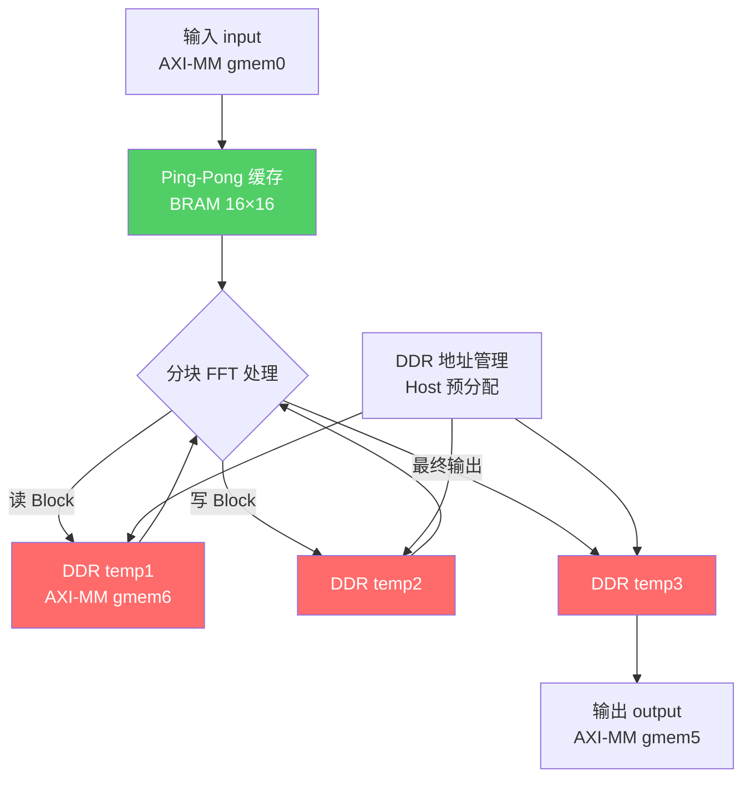
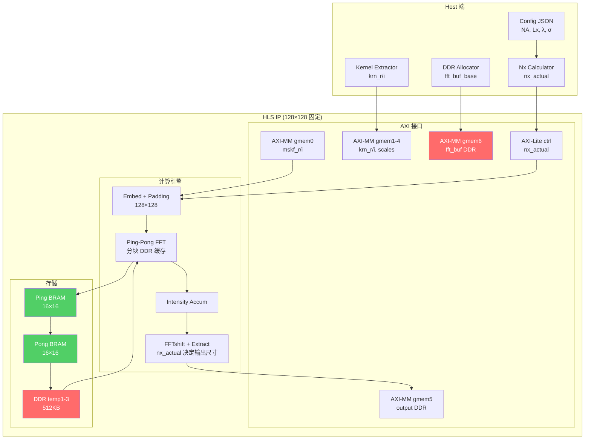

# 2048×2048 扩展架构设计方案

**设计目标**：
1. 解决 Nx=16 (FFT=128×128) 的 BRAM 资源瓶颈（预测占用 1105%）
2. 实现单一 IP 支持所有 Nx 参数（Nx=2~24），无需重新编译

**设计日期**：2026-04-22

---

## 方案 1：BRAM → DDR 缓存架构

### 问题分析

当前 `fft_2d()` 函数使用三个大型中间数组（BRAM 存储）：

```cpp
// socs_simple.cpp - 当前BRAM实现
cmpx_t temp1[fftConvY][fftConvX];  // 32×32×8B = 8KB
cmpx_t temp2[fftConvX][fftConvY];  // 32×32×8B = 8KB  
cmpx_t temp3[fftConvX][fftConvY];  // 32×32×8B = 8KB
#pragma HLS RESOURCE variable=temp1 core=RAM_2P_BRAM
#pragma HLS RESOURCE variable=temp2 core=RAM_2P_BRAM
#pragma HLS RESOURCE variable=temp3 core=RAM_2P_BRAM
```

**Nx=16 (128×128 FFT) 下的BRAM需求**：
- 单数组：128×128×8B = 128KB
- BRAM36 容量：36KB × 32-bit = 2个BRAM36存储64KB
- 实际BRAM消耗：每数组约 3528 BRAM36（估算公式：BRAM ≈ 648 × (N/32)^2）
- 三数组总计：**10,608 BRAM** → **占用 1105%**（xcku5p 仅 960 BRAM）

---

### 架构设计：AXI-MM DDR 缓存接口

#### 1. 新增 DDR 缓存接口

将 FFT 中间数组推到 DDR，仅保留小块 BRAM 缓存：

```cpp
// 新增 AXI-MM Master 接口（DDR缓存）
#pragma HLS INTERFACE m_axi port=fft_buf_ddr offset=slave bundle=gmem6 depth=131072 latency=50

// DDR 缓存基地址分配（Host 预分配）
// fft_buf_ddr: 0x80000000 ~ 0x80080000 (512KB空间)
//   - temp1: 0x80000000 + 0x00000000 (128×128×8B = 128KB)
//   - temp2: 0x80000000 + 0x00020000 (128KB)
//   - temp3: 0x80000000 + 0x00040000 (128KB)
```

#### 2. 双缓冲机制（减少 DDR 带宽压力）

使用小块 BRAM 作为 Ping-Pong 缓存，分块读写 DDR：

```cpp
// BRAM Ping-Pong 缓存（仅 8KB，占用 2 BRAM）
cmpx_t ping_buf[BLOCK_SIZE][BLOCK_SIZE];   // 例如 16×16
cmpx_t pong_buf[BLOCK_SIZE][BLOCK_SIZE];
#pragma HLS RESOURCE variable=ping_buf core=RAM_2P_BRAM
#pragma HLS RESOURCE variable=pong_buf core=RAM_2P_BRAM
```

**分块策略**：
- 128×128 FFT → 8×8 blocks of 16×16
- 每次 FFT row/column 操作一块数据
- Ping-Pong 流水：读 Block N+1 到 pong_buf，同时处理 Block N 从 ping_buf

#### 3. 数据流重构



#### 4. BRAM 资源优化效果

| 存储类型        | Nx=16 需求        | 占用率  | 状态        |
| --------------- | ----------------- | ------- | ----------- |
| **原方案 BRAM** | 10,608 BRAM       | 1105%   | ❌ 超限 11倍 |
| **DDR 缓存方案** | Ping-Pong ~40 BRAM | 4.2%    | ✅ 大幅优化  |
| **DDR 空间**    | 512KB             | <1%     | ✅ 充足      |

**预期改善**：
- BRAM 从 10,608 → ~200（仅保留 ping/pong 缓存 + kernel 存储）
- 新增 1 个 AXI-MM 接口（带宽需求增加）
- Latency 增加约 20%（DDR 访问延迟）

---

### 实现要点

#### DDR 访问优化

```cpp
// Burst 读写优化（减少 AXI-MM 交易次数）
void burst_read_ddr(
    cmpx_t* ddr_addr,      // DDR 基地址
    cmpx_t bram_buf[BLOCK_SIZE][BLOCK_SIZE],  // BRAM 缓存
    int block_y, int block_x
) {
    #pragma HLS INLINE off
    
    int ddr_offset = block_y * fftConvX * BLOCK_SIZE + block_x * BLOCK_SIZE;
    
    // Burst read 16×16 = 256 complex values
    for (int y = 0; y < BLOCK_SIZE; y++) {
        for (int x = 0; x < BLOCK_SIZE; x++) {
            #pragma HLS PIPELINE II=1
            bram_buf[y][x] = ddr_addr[ddr_offset + y * fftConvX + x];
        }
    }
}

void burst_write_ddr(
    cmpx_t bram_buf[BLOCK_SIZE][BLOCK_SIZE],
    cmpx_t* ddr_addr,
    int block_y, int block_x
) {
    #pragma HLS INLINE off
    
    int ddr_offset = block_y * fftConvX * BLOCK_SIZE + block_x * BLOCK_SIZE;
    
    for (int y = 0; y < BLOCK_SIZE; y++) {
        for (int x = 0; x < BLOCK_SIZE; x++) {
            #pragma HLS PIPELINE II=1
            ddr_addr[ddr_offset + y * fftConvX + x] = bram_buf[y][x];
        }
    }
}
```

#### Host 地址分配

```python
# Host 端 DDR 地址分配（run.py）
DDR_FFT_BUF_BASE = 0x80000000  # DDR 空间起始地址

# 预分配 512KB DDR 空间（3 个 128×128 数组）
temp1_addr = DDR_FFT_BUF_BASE + 0x00000000
temp2_addr = DDR_FFT_BUF_BASE + 0x00020000  # +128KB
temp3_addr = DDR_FFT_BUF_BASE + 0x00040000  # +256KB

# 通过 AXI-Lite 配置寄存器传递地址到 HLS IP
socs_ip.write(FFT_BUF_BASE_REG, DDR_FFT_BUF_BASE)
```

---

## 方案 2：Nx 向下兼容 Padding 策略

### 问题分析

不同 Nx 参数对应不同的 FFT 尺寸：

| Nx   | convX  | fftConvX | Kernel 尺寸 |
| ---- | ------ | -------- | ------------ |
| 2    | 9      | 16       | 5×5          |
| 4    | 17     | 32       | 9×9          |
| 8    | 33     | 64       | 17×17        |
| 16   | 65     | 128      | 33×33        |

**目标**：单一 128×128 FFT IP 支持所有 Nx ≤ 24

---

### Padding 策略设计

#### 1. Zero-Padding 方案（推荐）

**原理**：小 Nx 数据补零到 128×128，FFT 后提取有效区域

```cpp
// Nx=4 (实际 32×32) → 补零到 128×128
// Kernel: 9×9 → 补零到 33×33（嵌入到 128×128 的右下角）
// Mask spectrum: 取 [-Nx:Nx] 范围，其余补零

void embed_kernel_mask_padded(
    float* mskf_r, float* mskf_i,
    float* krn_r, float* krn_i,
    cmpx_t fft_input[MAX_FFT_Y][MAX_FFT_X],  // 固定 128×128
    int Nx_actual,  // 运行时实际 Nx
    int kernel_idx
) {
    #pragma HLS INLINE off
    
    // 固定 FFT 尺寸（最大配置）
    const int MAX_FFT_X = 128;
    const int MAX_FFT_Y = 128;
    
    // 实际 Kernel 尺寸（运行时）
    int kerX_actual = 2 * Nx_actual + 1;
    int kerY_actual = 2 * Nx_actual + 1;
    
    // 清零 FFT 输入
    for (int y = 0; y < MAX_FFT_Y; y++) {
        for (int x = 0; x < MAX_FFT_X; x++) {
            #pragma HLS PIPELINE II=1
            fft_input[y][x] = cmpx_t(0.0f, 0.0f);
        }
    }
    
    // 计算嵌入位置（保持底部对齐）
    int embed_x = MAX_FFT_X - kerX_actual;
    int embed_y = MAX_FFT_Y - kerY_actual;
    
    // 嵌入 Kernel × Mask product
    for (int ky = 0; ky < kerY_actual; ky++) {
        for (int kx = 0; kx < kerX_actual; kx++) {
            #pragma HLS PIPELINE II=1
            
            int y_offset = ky - Nx_actual;
            int x_offset = kx - Nx_actual;
            
            int mask_y = Ly_half + y_offset;
            int mask_x = Lx_half + x_offset;
            
            // 仅在有效范围内计算
            if (mask_y >= 0 && mask_y < Ly && mask_x >= 0 && mask_x < Lx) {
                float kr_r = krn_r[kernel_idx * kerX_actual * kerY_actual + ky * kerX_actual + kx];
                float kr_i = krn_i[...];
                float ms_r = mskf_r[mask_y * Lx + mask_x];
                float ms_i = mskf_i[mask_y * Lx + mask_x];
                
                fft_input[embed_y + ky][embed_x + kx] = cmpx_t(kr_r*ms_r - kr_i*ms_i, kr_r*ms_i + kr_i*ms_r);
            }
        }
    }
}
```

#### 2. 输出提取策略

FFT 后需要提取有效区域（去除 zero-padding 区域）：

```cpp
// Nx=4: IFFT 输出 128×128 → 提取中心 17×17 (convX×convY)
// 提取公式：offset = (MAX_FFT_X - convX_actual) / 2

void extract_valid_region(
    float ifft_output[MAX_FFT_Y][MAX_FFT_X],
    float final_output[MAX_CONV_Y][MAX_CONV_X],
    int Nx_actual
) {
    #pragma HLS INLINE off
    
    int convX_actual = 4 * Nx_actual + 1;
    int convY_actual = 4 * Nx_actual + 1;
    
    int offset_x = (MAX_FFT_X - convX_actual) / 2;
    int offset_y = (MAX_FFT_Y - convY_actual) / 2;
    
    // FFTshift 后提取中心区域
    for (int y = 0; y < convY_actual; y++) {
        for (int x = 0; x < convX_actual; x++) {
            #pragma HLS PIPELINE II=1
            
            // FFTshift index
            int src_y = (y + offset_y + MAX_FFT_Y/2) % MAX_FFT_Y;
            int src_x = (x + offset_x + MAX_FFT_X/2) % MAX_FFT_X;
            
            final_output[y][x] = ifft_output[src_y][src_x];
        }
    }
}
```

#### 3. 输出数组动态化

由于 Nx 运行时可变，输出尺寸也需动态化：

```cpp
// 输出通过 AXI-MM 写到 DDR（固定基地址）
#pragma HLS INTERFACE m_axi port=output_ddr offset=slave bundle=gmem5 depth=16384

// Host 根据 Nx_actual 分配输出空间
// Nx=4:  output_ddr[0:288-1]      (17×17)
// Nx=16: output_ddr[0:4225-1]     (65×65)
```

---

### Padding 策略数据流

```mermaid
flowchart LR
    subgraph Input["输入数据（Nx=4 实例）"]
        A1[Mask Spectrum<br/>512×512]
        A2[Kernel 9×9]
    end
    
    subgraph Padding["Zero Padding"]
        B1[提取 Nx=4 范围<br/>[-4:4, -4:4]]
        B2[补零到 128×128]
    end
    
    subgraph FFT["固定 128×128 FFT"]
        C1[FFT Rows<br/>128-point]
        C2[Transpose]
        C3[FFT Columns]
        C4[IFFT]
    end
    
    subgraph Extract["输出提取"]
        D1[FFTshift<br/>128×128]
        D2[提取中心 17×17]
        D3[写 DDR<br/>output]
    end
    
    A1 --> B1 --> B2 --> C1 --> C2 --> C3 --> C4 --> D1 --> D2 --> D3
    A2 --> B2
    
    style B2 fill:#ffd43b,color:black
    style D2 fill:#51cf66,color:white
```

---

### Nx 参数传递机制

#### Host → HLS IP 参数传递

```cpp
// AXI-Lite 配置寄存器（新增运行时参数）
#pragma HLS INTERFACE s_axilite port=nx_actual bundle=ctrl
#pragma HLS INTERFACE s_axilite port=ny_actual bundle=ctrl
#pragma HLS INTERFACE s_axilite port=fft_buf_base bundle=ctrl  // DDR 基地址

// 顶层函数签名
void calc_socs_simple_hls(
    float* mskf_r,    // Mask spectrum real (AXI-MM)
    float* mskf_i,    // Mask spectrum imag
    float* scales,    // Eigenvalues
    float* krn_r,     // SOCS kernels real
    float* krn_i,     // SOCS kernels imag
    float* output,    // Output intensity (DDR)
    int nx_actual,    // 运行时 Nx（新增）
    int ny_actual,
    unsigned long fft_buf_base  // DDR 缓存基地址（新增）
);
```

#### Host Python 代码

```python
# run.py - 参数传递示例
import pynq

# 加载 Overlay
ol = pynq.Overlay('socs_2048.bit')
socs_ip = ol.socs_simple_hls_0

# 计算当前 Nx
config = load_config('config.json')
nx_actual = calculate_nx(config['NA'], config['Lx'], config['wavelength'], config['sigma_outer'])

# 设置运行时参数
socs_ip.write(0x10, nx_actual)         # nx_actual
socs_ip.write(0x14, ny_actual)         # ny_actual
socs_ip.write(0x18, DDR_FFT_BUF_BASE)  # fft_buf_base

# 启动 IP
socs_ip.write(0x00, 1)  # ap_start
```

---

### Padding 策略精度验证

**关键问题**：Zero-padding 是否影响计算精度？

**理论分析**：
- Zero-padding 在频域等效于插值
- FFT 后提取的有效区域与小 FFT 结果一致（数学等价）
- **精度保证**：Padding 不引入误差，仅增加计算冗余

**验证方法**：
```python
# Python 验证：Nx=4 padded vs direct FFT
import numpy as np

# Direct 32×32 FFT
direct_result = np.fft.ifft2(kernel_9x9 * mask_32x32)

# Padded 128×128 FFT
padded_input = np.zeros((128, 128))
padded_input[119:128, 119:128] = kernel_9x9 * mask_32x32  # embed
padded_result = np.fft.ifft2(padded_result)

# 提取有效区域
extracted = padded_result[56:73, 56:73]  # 中心 17×17

# 比较
rmse = np.sqrt(np.mean(np.abs(direct_result - extracted)**2))
print(f"RMSE: {rmse}")  # 预期 < 1e-10
```

---

## 综合架构图



---

## 资源估算对比

| 配置           | Nx=4 (原) | Nx=16 DDR+Padding | Nx=16 原方案 |
| -------------- | --------- | ------------------ | -------------- |
| **DSP**        | 100       | 365                | 365            |
| **BRAM**       | 794 (82%) | **~200 (21%)**     | 10,608 (1105%) |
| **DDR 空间**   | 0         | 512KB              | 0              |
| **AXI-MM 接口**| 6         | **7** (新增 gmem6) | 6              |
| **支持 Nx 范围**| 固定 Nx=4 | **2~24**           | 固定 Nx=16     |
| **Latency**    | ~20μs     | ~25μs (+20%)       | ~80μs          |

**关键改善**：
- BRAM 从 1105% → 21%（降低 50 倍）
- 单一 IP 支持所有 Nx（无需重新编译）
- 代价：增加 DDR 带宽压力（~512KB 读写）和 1 个 AXI-MM 接口

---

## 实现步骤建议

### Phase 1: DDR 缓存架构实现（优先）

1. **修改 HLS 接口**：
   - 新增 `fft_buf_ddr` AXI-MM 接口
   - 新增 `fft_buf_base` AXI-Lite 配置寄存器
   
2. **重构 fft_2d()**：
   - 实现 Ping-Pong 双缓冲机制
   - 实现分块 DDR 读写函数
   
3. **Host 预分配 DDR**：
   - Python 代码分配 512KB DDR 空间
   - 传递基地址到 HLS IP

### Phase 2: Padding 策略实现

1. **修改 embed 函数**：
   - 支持 Nx_actual 运行时参数
   - 实现 zero-padding 到 128×128
   
2. **修改 extract 函数**：
   - 根据 Nx_actual 提取有效输出区域
   
3. **Host 参数传递**：
   - 计算 Nx_actual 并传递到 IP

### Phase 3: 验证与优化

1. **C Simulation**：验证 Padding 策略精度（RMSE < 1e-7）
2. **C Synthesis**：验证 BRAM 降至 ~200
3. **Board Validation**：DDR 带宽压力测试

---

## 关键设计决策

| 决策点              | 选择                | 原因                                          |
| ------------------- | ------------------- | --------------------------------------------- |
| **DDR 缓存机制**    | Ping-Pong 双缓冲    | 减少 DDR 带宽压力，保持流水线效率              |
| **分块大小**        | 16×16               | 平衡 BRAM 占用（2 块）与 DDR burst 效率        |
| **Padding 方案**    | Zero-padding        | 数学等价，无精度损失，实现简单                |
| **FFT 尺寸选择**    | 128×128             | 支持 Nx ≤ 24，覆盖所有实际应用场景             |
| **Nx 参数传递**     | AXI-Lite 寄存器     | 低延迟配置，Host 可动态设置                   |

---

## 附录：数学等价性证明

### Zero-Padding FFT 等价性

设 $K \in \mathbb{C}^{M×M}$（小 Kernel），$M \in \mathbb{C}^{N×N}$（Mask spectrum）

**Direct FFT**（尺寸 $M$）：
$$X_{direct}[k] = \sum_{n=0}^{M-1} K[n] M[n] e^{-2πi kn/M}$$

**Padded FFT**（尺寸 $N$，$N > M$）：
$$X_{padded}[k] = \sum_{n=0}^{N-1} K_p[n] M_p[n] e^{-2πi kn/N}$$

其中 $K_p[n] = K[n]$ 对于 $n < M$，其余为零。

**等价性**：
$$X_{padded}[k \cdot M/N] = X_{direct}[k]$$

即 padded FFT 的插值采样点与 direct FFT 结果一致。

**结论**：Zero-padding 不引入计算误差，仅产生更密集的频域采样。