  # 在多种光学条件下用于光源掩模协同优化的光刻仿真工具集开发

MASAKI KURAMOCHI 1，YUKIHIDE KOHIRA 1，（IEEE 会员），HIROYOSHI TANABE2，TETSUAKI MATSUNAWA3，以及 CHIKAAKI KODAMA 3，（IEEE 高级会员）

1会津大学 计算机科学学院，日本 会津若松 965-8580
2东京工业大学，日本 东京 152-8550
3铠侠株式会社，日本 横滨 247-8585

通讯作者：Yukihide Kohira（kohira@u-aizu.ac.jp）

摘要 光刻中的分辨率增强技术（RETs）已成为实现技术节点持续缩小的关键。RET 的主要技术包括光源—掩模协同优化。通常，在 RET 中使用光刻仿真来估计晶圆上的成像。为了优化光源和掩模，需要在光刻仿真中调整光源形状、数值孔径和曝光波长等光学条件。然而，能够覆盖多种光学条件的开源光刻仿真工具仍然短缺。在学术界，研究光学光刻中的光源优化具有挑战性。本文提出了一个用于光源—掩模协同优化的光刻仿真工具集的开发。在我们的工具集中，用户可以设置光源形状、掩模形状、数值孔径、曝光波长等光学条件。工具集中的一个功能使用传递交叉系数（TCC）模型计算光强，另一个功能在指定光学条件下使用相干系统和（SOCS）计算光强。在实验中，我们验证了工具集的精度并评估了其运行时间。

索引词 光学光刻，光刻仿真，光源—掩模协同优化（SMO），传递交叉系数（TCC），相干系统和（SOCS）。

# I. 引言

光学光刻是半导体制造工艺之一。它通过根据设计的电路图形制作掩模，并通过光曝光在晶圆上形成电路图形。为了实现半导体器件的高密度集成，必须优化光刻工艺，以从设计的电路图形获得所需的晶圆图形。光刻的半间距 HP 由瑞利公式决定，可用曝光波长与数值孔径（NA）表示如下 [1]。

$$
H P = k _ { 1 } \frac { \lambda } { N A } ,
$$

其中 $k _ { 1 } , \lambda , N A$ 分别为比例常数、曝光波长和 NA。迄今为止，通过缩短 $\lambda$ 和提高 $N A$ 来提高光刻分辨率。然而，随着技术节点缩小，曝光剂量和焦深等工艺变化的影响增加。这些工艺变化可能导致降低良率与性能的热点。因此，需要通过优化光刻工艺的分辨率增强技术（RETs）来提升图形保真度与对工艺变化的容忍度。

本稿件的副编辑协调审稿并批准其发表的是 Ludovico Minati

RET 的主要技术包括掩模与光源优化。光学临近效应校正（OPC）是一种针对曝光调整掩模形状的掩模优化技术；而光源优化则调整光源的亮度分布。此外，如图 1 所示，同时优化掩模与光源以最大化光学系统性能的方法称为光源—掩模协同优化（SMO）。SMO 是光学光刻中的一种有效优化方法 [2]。

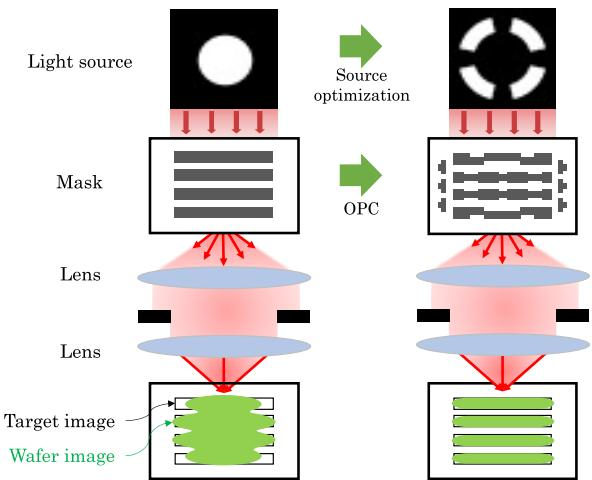
图1. 光源—掩模协同优化（SMO）。

为实现这些 RET，需要进行光刻仿真。在光刻仿真中，光学光刻中的成像过程由数学模型描述。构建一个能在特定光学条件下准确计算空中像的仿真环境至关重要。

ICCAD 2013 竞赛提供了一个开源光刻仿真工具 [3]。该仿真器使用称为相干系统和（SOCS）核的模型，从掩模的几何形状数据估计在特定光学条件下转移至晶圆的图像。SOCS 模型可快速从掩模与表征光学条件的一组 SOCS 核计算空中像。研究者已广泛使用该 ICCAD 工具进行掩模优化研究 [4]–[10]。然而，该工具不允许更改光学条件，如光源形状、NA 与焦差（离焦）大小；且掩模与晶圆图像尺寸固定。[3] 中提供者提到波长为 193 nm、光源为环形，但未描述其他条件细节。因此，许多掩模优化研究仅在部分已知的光学条件下进行评估。

Lithosim [11] 也以 SOCS 模型在固定光学条件下计算空中像。Lithography-Simulation [12] 可对线-空栅格掩模图形解析计算空中像。Optolithium [13] 可自由设置掩模形状并使用参数化光源（如环形）。然而，包括 [11]、[12]、[13] 在内的开源工具缺乏对光源形状与光学条件的灵活调节，且不能为特定光源形状与光学条件导出 SOCS 核集合。商业光刻仿真工具虽可用但成本高且不可定制。因此，在学术界研究光学光刻的光源优化较为困难。

本文开发了一个名为 K-Litho 的光刻仿真工具集，可在多种光学条件下导出空中像。K-Litho 包含两款工具：K-Litho-TCC 与 K-Litho-SOCS。K-Litho-TCC 允许设置光源形状、光源网格尺寸、NA、波长、离焦、剂量、掩模形状与尺寸。空中像由传递交叉系数（TCC）模型计算。此外，K-Litho-TCC 可为指定光学条件导出一组 SOCS 核，可作为 ICCAD 工具 [3] 的输入。在 K-Litho-SOCS 中，针对给定 SOCS 核由 SOCS 模型计算空中像。由于采用傅里叶插值，K-Litho-SOCS 比 ICCAD 工具更快。当然，由 K-Litho-TCC 导出的 SOCS 核亦可用于 K-Litho-SOCS。实验中，我们与另一种光强计算模型、解析模型以及现有开源工具对比验证了工具集的精度，并通过改变掩模与光源网格尺寸评估了运行时间。

我们已通过 GitHub1 发布 K-Litho。我们相信 K-Litho 将促进光源—掩模协同优化研究的发展。

# II. 预备知识

本节基于 [14] 与 [15] 介绍光学系统，并引入两种光强计算模型：TCC 模型与 SOCS 模型。

# A. 光学系统

在光学光刻中，通过使用基于设计电路图形的掩模进行光曝光，在晶圆上形成电路图形。部分相干光学系统广泛用于光刻仿真（图 2）。在该系统中，有限尺寸的光源被视为无限小光源的集合，且假设来自不同光源点的光彼此不相干。

当掩模图形尺寸小于波长时，透过掩模的光会发生衍射。衍射光通过透镜组聚焦形成晶圆图像。然而，由于透镜尺寸有限，衍射光在透镜组汇聚时并非全部被聚焦，高频分量被滤除。换言之，曝光设备可被视为对掩模图形的低通滤波器。

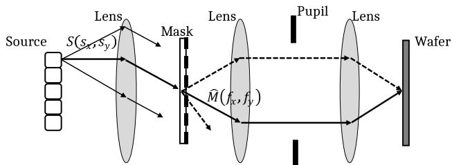
图2. 部分相干光学系统。

此外，在透镜组内存在称为瞳面（孔径面）的区域，掩模的衍射光在该处变为平行。掩模在瞳面中的衍射光分布对应于掩模图形的傅里叶变换。晶圆上的空中像可由出射瞳处衍射光分布的傅里叶变换计算得到。

光源的有效区域由比值 $\sigma N A / \lambda$ 决定，其中 $\sigma$ 表示光学系统中的相干因子。光源尺寸按 $\sigma N A / \lambda$ 归一化，光源区域定义为半径为 1 的圆。光源形状由该圆的外接框内的网格离散。光源强度分布 $s$ 在该网格内配置。$s$ 的每个像素取值在 0 到 1 之间。掩模 $M$ 用 $n \times n$ 矩阵表示。$M$ 中每个元素取 0 或 1（$M \in \{0,1\}^{n\times n}$）。像素值 $M(x,y)=1$（$M(x,y)=0$）表示掩模中坐标 $(x,y)$ 处的开口（遮挡）部分。

晶圆上形成的图形基于空中像进行估计。例如，在 ICCAD 工具 [3] 采用的简化常阈值光刻胶模型中，空中像强度超过预定阈值的像素上形成图形。注意，本文仅关注晶圆空中像的计算，不讨论光刻胶模型与最终晶圆图形质量。

# B. 传递交叉系数（TCC）

我们引入阿贝成像与 TCC 模型以计算晶圆空中像。

空中像由晶圆上的曝光光振幅的平方获得。由坐标为 $(s_x,s_y)$ 的光源发出的光在晶圆坐标 $(x,y)$ 处的振幅分布 $U(x,y,s_x,s_y)$ 为：

$$
\begin{array}{l}
{\displaystyle U(x,y,s_x,s_y)=\int\!\!\int_{-\infty}^{\infty}\hat M(f_x,f_y)\,P(f_x+s_x,f_y+s_y)}\\
{\displaystyle ~\times~ e^{i2\pi((f_x+s_x)x+(f_y+s_y)y)}\,df_x\,df_y,}
\end{array}
$$

其中 $f_x,f_y$ 为瞳面空间频率坐标，$\hat M(f_x,f_y)$ 为掩模图形的傅里叶变换（掩模衍射光），$P(f_x,f_y)$ 为投影瞳函数。部分相干成像模型中，晶圆曝光光强由光源强度分布 $S(s_x,s_y)$ 与光学振幅分布平方 $|U(x,y,s_x,s_y)|^2$ 的积分给出：

$$
I(x,y)=\int\!\!\int_{-\infty}^{\infty} S(s_x,s_y)\,|U(x,y,s_x,s_y)|^2\,ds_x\,ds_y.
$$

此式称为阿贝成像。注意，尽管 $U(x,y,s_x,s_y)$ 依赖于光源坐标 $(s_x,s_y)$，但其不依赖光源强度分布。在光源针对固定掩模形状被优化的情形下，阿贝成像可减少空中像的计算时间。

现在引入 TCC，它描述由两个空间频率分量 $(f_x,f_y)$ 与 $(f_x',f_y')$ 产生的干涉条纹的透过程度：

$$
\begin{array}{l}
{\displaystyle TCC(f_x,f_y,f_x',f_y')=\int\!\!\int_{-\infty}^{\infty} S(s_x,s_y)}\\
{\displaystyle \times P(f_x+s_x,f_y+s_y)}\\
{\displaystyle \times P^{*}(f_x'+s_x,f_y'+s_y)\,ds_x\,ds_y,}
\end{array}
$$

其中 ∗ 表示复共轭。式（1）可用 $TCC(f_x,f_y,f_x',f_y')$ 表示为：

$$
\begin{array}{l}
{\displaystyle I(x,y)=\int\!\!\int\!\!\int\!\!\int_{-\infty}^{\infty}\hat M(f_x,f_y)\,\hat M^{*}(f_x',f_y')}\\
{\displaystyle \times~TCC(f_x,f_y,f_x',f_y')}\\
{\displaystyle \times~e^{i2\pi((f_x-f_x')x+(f_y-f_y')y)}\,df_x\,df_y\,df_x'\,df_y'.}
\end{array}
$$

TCC 由光源强度分布 $s$ 与投影瞳 $P$ 决定。$S(s_x,s_y)$ 在有效区域内归一化如下：

$$
1=\iint_{\sqrt{s_x^2+s_y^2}\le \sigma NA/\lambda} S(s_x,s_y)\,ds_x\,ds_y.
$$

投影瞳 $P(f_x,f_y)$ 表示为：

$$
P(f_x,f_y)=\left\{\begin{array}{ll}
e^{i\frac{2\pi}{\lambda}W}, & \mathrm{if}\ \sqrt{f_x^2+f_y^2}\le NA/\lambda\\
0, & \mathrm{otherwise},
\end{array}\right.
$$

其中 $W$ 表示像差。由离焦导致的像差为：

$$
W=\Delta z \sqrt{1-(f_x^2+f_y^2)\lambda^2},
$$

$\Delta z$ 为离焦量。包括彗差与球差在内的多种像差可用 Zernike 多项式表示。但本文聚焦于用于光源—掩模协同优化的基础仿真器，故不展开详述。未来将增强工具对像差的支持。

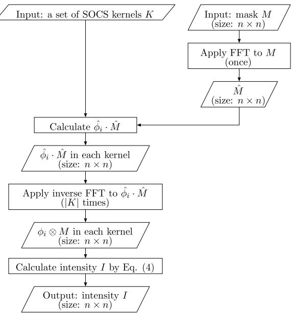
图3. ICCAD 工具 [3] 的流程。

TCC 与掩模无关。因此，在相同光学条件下曝光多个掩模时，TCC 可复用。固定光学条件下省去 TCC 重复计算可缩短空中像计算时间。

# C. 相干系统和（SOCS）

通常采用 SOCS 模型作为光学模型，可通过该近似快速得到空中像 [16]。在 SOCS 模型中，光源与光照系统等信息被分解为一组核 $K$。SOCS 核由式（2）的 TCC 进行奇异值分解（SVD）获得，其中每个核 $k_i\in K$ 具有类似滤波器的特征函数 $\phi_i$（$\mathbf{\Psi}\in\mathbb{C}^{n\times n}$），以及对应权重的特征值 $\sigma_i\ (\in\mathbb{R})$。

空中像 $I(x,y)\ (\in\mathbb{R})$ 由每个核与掩模 $M$ 的卷积给出：

$$
I(x,y)=\sum_{k_i\in K}\sigma_i\,|\phi_i\otimes M(x,y)|^2,
$$

其中 $\otimes$ 表示二维 $n\times n$ 卷积。

# D. ICCAD 工具流程

ICCAD 工具 [3] 中的空中像计算流程见图 3。SOCS 模型中的空中像由 SOCS 核与掩模 $M$ 卷积得到（式（4））。空间域卷积在频域转为乘积。因此，ICCAD 工具先对掩模做快速傅里叶变换（FFT）进入频域，然后逐核计算核与掩模的频域乘积。每个核的结果再经逆 FFT 回到空间域得到光学振幅分布。最后，对所有核的光学振幅分布平方求和得到空中像（式（4））。

ICCAD 工具的时间复杂度取决于 FFT 与逆 FFT。对掩模大小为 $n^2$ 的 FFT/逆 FFT，其复杂度为 $O(n^2\log n^2)$。工具对掩模的 FFT 仅一次，但对每个核的频域乘积都需做一次逆 FFT，共 $|K|$ 次。因此总复杂度为 $O(|K|\cdot n^2\log n^2)$。正如实验所示，ICCAD 工具效率不高。由于 FFT/逆 FFT 的输出与输入尺寸相同，工具对每个核都要对 $n\times n$ 的频域振幅做逆 FFT，导致较长的执行时间。

# III. 提出的方法

# A. 我们的光刻仿真工具集

我们开发了名为 K-Litho 的光刻仿真工具集。K-Litho 包含三大功能：（A）在指定光学条件下以 TCC 模型计算空中像；（B）在指定光学条件下导出 SOCS 核集合；（C）用给定 SOCS 核集合按 SOCS 模型计算空中像。K-Litho 由两款工具构成：实现（A）（B）的 K-Litho-TCC 与实现（C）的 K-Litho-SOCS。

# B. K-Litho-TCC 流程

在 K-Litho-TCC 中，（A）按 TCC 模型计算空中像，（B）为指定光学条件导出 SOCS 核集合。图 4 展示流程。

K-Litho-TCC 中，用户可设置光源形状、光源网格尺寸、NA、波长、离焦、剂量、掩模形状与尺寸。TCC 模型在频域计算光强，空中像由逆 FFT 得到。III-B1 节给出 TCC 模型下的频域空中像；III-B2 解释从 TCC 导出 SOCS 核。

## 1) 用 TCC 在空间频率域计算光强

K-Litho-TCC 在频域计算式（3）。如下详述计算方法。

首先需将式（3）离散化以便计算机执行。令 $L_x,L_y$ 分别为掩模在 $x$、$y$ 方向的周期，$n_x,n_y,n_x',n_y'\in\mathbb{Z}$，且
$f_x=\frac{n_x}{L_x},\ f_y=\frac{n_y}{L_y},\ f_x'=\frac{n_x'}{L_x},\ f_y'=\frac{n_y'}{L_y}$。则式（3）可写为：

$$
\begin{array}{cl}
{\displaystyle I(x,y)=\sum_{n_x}\sum_{n_y}\sum_{n_x'}\sum_{n_y'} \hat M\!\left(\frac{n_x}{L_x},\frac{n_y}{L_y}\right)\hat M^{*}\!\left(\frac{n_x'}{L_x},\frac{n_y'}{L_y}\right)}\\
{}\\
{\displaystyle \times TCC\!\left(\frac{n_x}{L_x},\frac{n_y}{L_y},\frac{n_x'}{L_x},\frac{n_y'}{L_y}\right)}\\
{}\\
{\displaystyle \times e^{i2\pi\left(\frac{n_x-n_x'}{L_x}x+\frac{n_y-n_y'}{L_y}\right)}.}
\end{array}
$$

在 TCC 为 0 的区域计算式（5）是冗余的，因为求和中的乘积结果为 0。因此只在 TCC 非零的范围计算式（5）。文献 [17] 推导了 TCC 非零时 $n_x,n_y,n_x',n_y'$ 的范围：

$$
\begin{array}{l}
N_x=\left\lfloor \frac{L_x NA(1+\sigma)}{\lambda}\right\rfloor\\
N_y=\left\lfloor \frac{L_y NA(1+\sigma)}{\lambda}\right\rfloor,
\end{array}
$$

其中 $N_x$ 为 $n_x$ 与 $n_x'$ 的最大绝对值，$N_y$ 为 $n_y$ 与 $n_y'$ 的最大绝对值。于是计算式（5）时 $n_x,n_x'$ 的范围为 $[-N_x,N_x]$，$n_y,n_y'$ 的范围为 $[-N_y,N_y]$。对式（5）做傅里叶变换后在频域计算空中像。结合式（6）（7），K-Litho-TCC 最终计算：

$$
\begin{array}{c}
\hat I\!\left(\frac{n_x''}{L_x},\frac{n_y''}{L_y}\right)=\displaystyle \sum_{n_x'=-N_x}^{N_x}\sum_{n_y'=-N_y}^{N_y}\hat M\!\left(\frac{n_x''+n_x'}{L_x},\frac{n_y''+n_y'}{L_y}\right)\\
\times \hat M^{*}\!\left(\frac{n_x'}{L_x},\frac{n_y'}{L_y}\right)\\
\times TCC\!\left(\frac{n_x''+n_x'}{L_x},\frac{n_y''+n_y'}{L_y},\frac{n_x'}{L_x},\frac{n_y'}{L_y}\right).
\end{array}
$$

讨论 TCC 模型下空中像计算的时间复杂度。由于 $n_x,n_x'$（$n_y,n_y'$）范围为 $[-N_x,N_x]$（$[-N_y,N_y]$），TCC 具有 $(2N_x+1)^2\times(2N_y+1)^2=O(N_x^2N_y^2)$ 个元素。TCC 的每个元素由式（2）计算，复杂度为 $O(N_s)$，其中 $N_s$ 为光源像素个数。因此计算 TCC 的复杂度为 $O(N_s N_x^2 N_y^2)$。在式（8）中，频域空中像 $\hat I$ 非零的 $n_x''$、$n_y''$ 范围分别为 $[-2N_x,2N_x]$ 与 $[-2N_y,2N_y]$。故不计 TCC 计算，按式（8）计算 $\hat I$ 的复杂度为 $O(N_x^2 N_y^2)$。最后，对 $\hat I$ 的逆 FFT 的复杂度与 II-C 节相同为 $O(n^2\log n^2)$。因此，TCC 模型中空中像计算的复杂度显著取决于 TCC 的计算。

## 2) SOCS 核的导出

SOCS 模型中，光强由 SOCS 核与掩模的卷积计算（式（4））。这些核由式（2）的 TCC 做 SVD 获得 [15]，[17]。

TCC 具有如下性质，可表示为厄米矩阵：

$$
TCC(f_x,f_y,f_x',f_y')=TCC^{*}(f_x',f_y',f_x,f_y)
$$

因此 TCC 的特征值为实且非负，奇异值与向量与特征值 $\sigma_i$、特征向量 $\hat\phi_i$ 一致：

$$
TCC(f_x,f_y,f_x',f_y')\approx \sum_{i=1}^{|K|}\sigma_i\,\hat\phi_i(f_x,f_y)\,\hat\phi_i^{*}(f_x',f_y').
$$

其中 $\hat\phi_i(f_x,f_y)$ 通常称为 SOCS 核；式（4）空间域的 SOCS 核 $\phi_i$ 为 $\hat\phi_i$ 的傅里叶级数逆变换。可按所需精度任意设置 SOCS 核数目 $|K|$，以在较短时间内计算光强。

一般地，$N\times N$ 厄米矩阵的 SVD 时间复杂度为 $O(N^3)$。如 III-B1 节所述，TCC 矩阵有 $(2N_x+1)^2\times(2N_y+1)^2=O(N_x^2N_y^2)$ 个元素。因此对该 TCC 矩阵做 SVD 的复杂度为 $O(N_x^6 N_y^6)$。

# C. K-Litho-SOCS 流程

K-Litho-SOCS 为加速目的，用给定 SOCS 核集合按 SOCS 模型计算空中像。图 5 展示流程。加速的核心思想是通过傅里叶插值减少对整幅掩模尺寸（$n\times n$）的 FFT 与逆 FFT 次数。

如 III-B1 节所述，在 TCC 为 0 的范围内计算光强是冗余的。TCC 的每个分量限制在 $[-N_x,N_x]$ 与 $[-N_y,N_y]$ 范围内。因此，由式（9）得到的每个 SOCS 核的有效范围亦如此。当 TCC 的每个分量有效范围为 $[-N_x,N_x]$ 与 $[-N_y,N_y]$ 时，式（8）中 $n_x''$、$n_y''$ 的有效范围为 $[-2N_x,2N_x]$、$[-2N_y,2N_y]$。这意味着频域空中像的有效尺寸为 $(4N_x+1)\times(4N_y+1)$。因此，K-Litho-SOCS 首先计算尺寸为 $(4N_x+1)\times(4N_y+1)$ 的空中像。每个 SOCS 核与掩模的频域乘积 $\hat\phi_i\cdot\hat M$ 在 $(2N_x+1)\times(2N_y+1)$ 的频域内计算。由于 FFT/逆 FFT 的输入输出尺寸相同，需对 $[-N_x,N_x]$、$[-N_y,N_y]$ 外的高频分量做 0 填充，将 $\hat\phi_i\cdot\hat M$ 扩展到 $(4N_x+1)\times(4N_y+1)$。逆 FFT 后空间域空中像的尺寸为 $(4N_x+1)\times(4N_y+1)$。

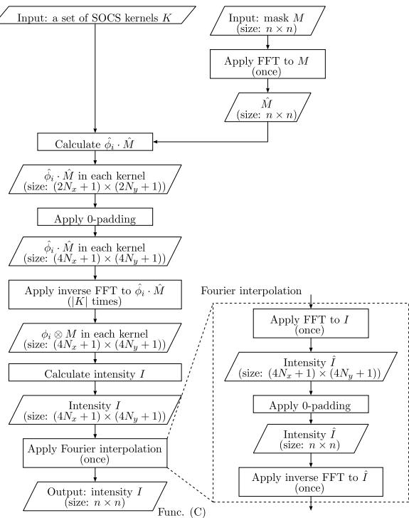
图5. K-Litho-SOCS 的流程。

为将空间域空中像由 $(4N_x+1)\times(4N_y+1)$ 重采样到 $n\times n$，采用傅里叶插值。先对空间域空中像做 FFT 至频域，对 $[-2N_x,2N_x]$、$[-2N_y,2N_y]$ 外高频分量做 0 填充，随后做逆 FFT 得到 $n\times n$ 的空中像。由于在 K-Litho-SOCS 中，$n\times n$ 的逆 FFT 仅执行一次，其运行时间短于 ICCAD 工具 [3]。

K-Litho-SOCS 的时间复杂度低于 ICCAD 工具。初始掩模 $M$ 的 FFT 为 $O(n^2\log n^2)$。从 $\hat\phi_i\cdot\hat M$ 到得到尺寸为 $(4N_x+1)\times(4N_y+1)=\mathcal{O}(N_xN_y)$ 的空中像的计算，由于主要由对 $\hat\phi_i\cdot\hat M$ 的逆 FFT 主导，其复杂度为 $O(|K|\cdot N_xN_y\log(N_xN_y))$。傅里叶插值的复杂度主要由掩模尺寸的逆 FFT 决定，为 $O(n^2\log n^2)$。因此 K-Litho-SOCS 的复杂度评估为 $O(n^2\log n^2 + |K|\cdot N_xN_y\log(N_xN_y))$。实际中 $n\gg N_x,N_y$，故 $O(n^2\log n^2)$ 为主导项，核数量增加对总仿真时间影响较小。

# IV. 实验

# A. 实验环境

我们的光学光刻工具集 K-Litho 用 C++ 实现，并应用于掩模图形以验证精度。K-Litho 在一台 Linux 机器（Intel Core i7-8700 3.2GHz CPU、32GB 内存）上运行。K-Litho 中 FFT 与逆 FFT 使用 FFTW 库 [18]。SVD 使用 LAPACK [19] 的 Zheevr 函数。

如无特别说明，默认参数如下。曝光波长固定为 193 nm。晶圆上形成图形的区域大小为 1024 nm × 1024 nm，掩模水平与垂直周期为 2048 nm。注意这些值在 K-Litho 中可调。掩模以 1 nm × 1 nm 的像素离散。这些设置与 ICCAD 工具 [3] 一致。

# B. K-Litho-TCC 的评估

为评估 K-Litho-TCC 的精度，我们将其得到的光强与其他模型的结果对比。IV-B1 使用点光源的阿贝成像；IV-B2 用开源工具 Lithography-Simulation [12] 生成空中像；IV-B3 对线-空栅格掩模图形解析计算空中像。另外，IV-B4 评估了用 K-Litho-TCC 导出的 SOCS 核在 SOCS 模型下计算的光强精度。

## 1) 与阿贝成像比较

我们将 K-Litho-TCC 与点光源的阿贝成像结果对比。点光源的仿真结果如图 6。图 6(a) 为光源形状，网格尺寸为 201×201。如 II-A 节所述，光源区域定义为半径为 1 的圆，中心坐标为 (0,0)。本次仿真光从坐标 (0.6, 0.2) 的点发出。NA=0.83。目标图形为 ICCAD 2013 竞赛提供的 T1（图 6(b)）。图 6(c) 为 K-Litho-TCC 得到的空中像。后续空中像图中，像素光强以颜色表示；蓝色表示 0 强度；色谱最大强度设为 0.5，超过即显示为红色。

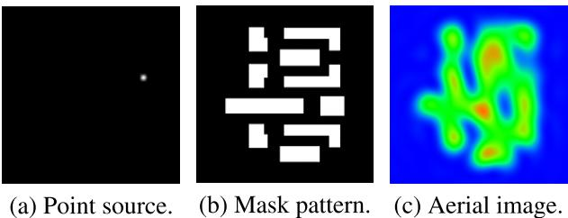
图6. K-Litho-TCC 的光刻仿真结果。（a）点光源。（b）ICCAD 2013 竞赛的目标图形 T1。（c）K-Litho-TCC 仿真结果。

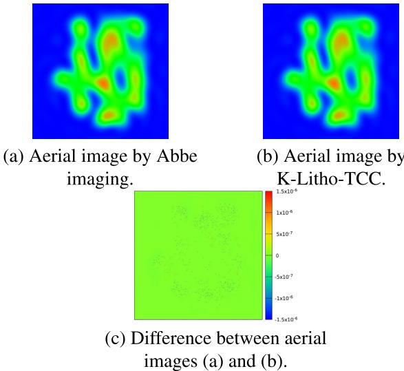
图7. 阿贝成像与 K-Litho-TCC 的空中像比较。

图 7 对比了 T1 的阿贝成像与 K-Litho-TCC 的空中像。图 7(a) 为阿贝成像；图 7(b) 为 K-Litho-TCC；图 7(c) 为两者差分。图 7(c) 中各点差值接近 0，说明 K-Litho-TCC 误差很小。令 $I_{TCC}(x,y)$ 为 K-Litho-TCC 的晶圆光强，$I_{Abbe}(x,y)$ 为阿贝成像光强。图 8 展示了 $I_{TCC}(x,y)$ 相对 $I_{Abbe}(x,y)$ 的误差。横轴为 $I_{Abbe}(x,y)$（图 7(a)），纵轴为 $I_{TCC}(x,y)-I_{Abbe}(x,y)$（图 7(c)）。每个点对应晶圆上一点的误差与真实光强的对比。到 X 轴的距离为绝对误差；从原点到该点连线的斜率绝对值为相对误差。本实验最大绝对误差 1.01e6，最小绝对误差 0；最大相对误差 $4.14\mathrm{e}{-}4$，最小相对误差 0；均方根误差（RMSE）$5.98\mathrm{e}{-}8$。

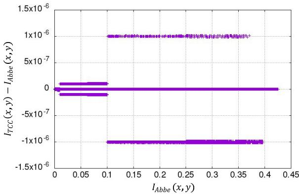
图8. ITCC 相对 IAbbe 的误差。

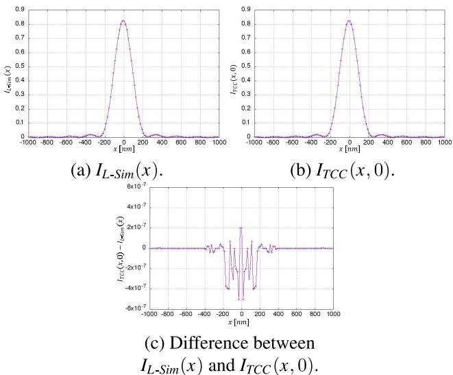
图9. 一维周期图形（线宽 250 nm、空 1750 nm）下 $I_{L-Sim}$ 与 $I_{TCC}$ 比较。

K-Litho-TCC 的精度非常高，误差极小。这些误差可能来源于浮点计算。

## 2) 与开源光刻仿真工具比较

将 K-Litho-TCC 与开源工具 Lithography-Simulation [12] 对比。Lithography-Simulation 不考虑 y 方向。掩模为在 x 方向无限延拓的线/空栅格图形，线宽 250 nm、空 1750 nm。光源形状为一维线段，长度为有效光源区域的一半。K-Litho-TCC 的参数与其一致。晶圆图形区域设为 2000 nm × 2000 nm，掩模水平与垂直周期均为 2000 nm。掩模包含 250 nm × 2000 nm 的线条，这意味着在 x 方向上无限延拓的 250 nm 线宽、1750 nm 空的线/空栅格。光源网格尺寸 9×1，从光源区域中央的 5 个像素发光。NA=0.4。本实验使用一维掩模，光强与 y 坐标无关。令 $I_{TCC}(x,y)$ 为 K-Litho-TCC 的晶圆光强，$I_{L-Sim}(x)$ 为 Lithography-Simulation 的晶圆光强。

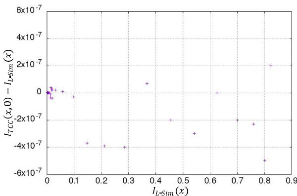
图10. ITCC 相对 IL−Sim 的误差。

图 9(a) 为 $I_{L-Sim}(x)$，图 9(b) 为 $I_{TCC}(x,0)$，图 9(c) 为两者差分。图 9 中每幅图覆盖一个 2000 nm 周期，范围为 -1000 nm 到 1000 nm。

图 10 展示了 $I_{TCC}(x,y)$ 相对 $I_{L-Sim}(x)$ 的误差。本实验最大绝对误差 5.00e-7，最小绝对误差 0；最大相对误差 3.45e-6，最小相对误差 0；RMSE 为 $1.23\mathrm{e}{-}7$。结果表明 K-Litho-TCC 计算的光强精度很高。

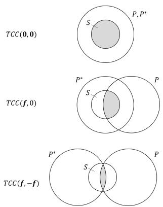
图11. TCC（TCC(0,0)、TCC(f,0)、TCC(f,−f)）。

## 3) 用线/空栅格的解析评估

我们使用线/空栅格作为掩模图形，将 K-Litho-TCC 的光强与解析计算结果对比。晶圆图形区域设为 2048 nm × 2048 nm，掩模水平与垂直周期为 2048 nm。如 IV-B2 节所述，该配置表示无限延拓的线/空栅格，也便于解析推导光强 [20]。线宽与空宽比为 1:1，掩模函数定义为：

$$
M(x, y) = 
\begin{cases} 
1, & \text{if } (2n - 1/2)w \leq x \leq (2n + 1/2)w, \\
0, & \text{otherwise.}
\end{cases}
$$

此时光强仅依赖 x 坐标。线/空掩模的光强 $I_{LS}$ 表达式为 [20]：

$$
\begin{array}{c}
I_{LS}(x)=\displaystyle \frac{1}{4}TCC(\mathbf{0},\mathbf{0})+\displaystyle \frac{2}{\pi^2}TCC(\mathbf{f},\mathbf{f})\\
{\displaystyle ~+\frac{2}{\pi}\mathrm{Re}\,TCC(\mathbf{f},\mathbf{0})\cos(2\pi f x)}\\
{\displaystyle ~+\frac{2}{\pi^2}TCC(\mathbf{f},-\mathbf{f})\cos(4\pi f x),}
\end{array}
$$

其中 $I_{LS}(x)$ 为 x 处的光强，ReTCC 为 TCC 的实部，$\mathbf{f}=(\mathscr{f},0)$，$f$ 为基频：

$$
f=\frac{1}{2w}.
$$

例如，$TCC(\mathbf f,\mathbf 0)$ 等价于 $TCC(f,0,0,0)$。如式（10）所示，光强由四类 TCC 导出。TCC 由有效光源 $s$ 与瞳 $P$ 的交叠积分而来。特别地，当 defocus=0 时，TCC 可由三圆相交区域面积方便地得到。$TCC(\mathbf 0,\mathbf 0)$、$TCC(\mathbf f,\mathbf 0)$ 与 $TCC(\mathbf f,-\mathbf f)$ 的积分范围示例如图 11。

线/空栅格的仿真结果如图 12。图 12(a) 为圆形光源，半径 0.5。图 12(b) 为线/空栅格掩模，线宽 $w=128$ nm，在光学条件下 NA 定义为 $\lambda/(2w\cdot 0.9)$。图 12(c) 为 K-Litho-TCC 得到的空中像。令 $I_{TCC}(x,y)$ 为 K-Litho-TCC 的晶圆光强，$I_{LS}(x)$ 为式（10）计算的光强。本实验为一维掩模，光强与 y 坐标无关。图 13(a) 为 $I_{LS}(x)$，图 13(b) 为 $I_{TCC}(x,0)$，图 13(c) 为两者差分。每幅图覆盖一个 256 nm 周期，范围 -128 nm 至 128 nm。

图 14 展示了 $I_{TCC}(x,y)$ 相对 $I_{LS}(x)$ 的误差。本实验最大绝对误差 $9.93\mathrm{e}{-}5$，最小绝对误差 $1.00\mathrm{e}{-}6$；最大相对误差 3.11e-3，最小相对误差 7.13e-6；RMSE 为 $6.31\mathrm{e}{-}5$。由小误差可见 K-Litho-TCC 能准确计算空中像。

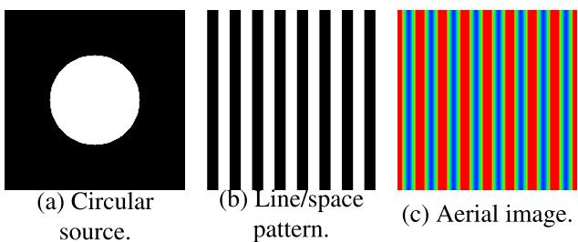
图12. K-Litho-TCC 的光刻仿真结果。（a）圆形光源。（b）线/空栅格目标图形。（c）K-Litho-TCC 仿真结果。

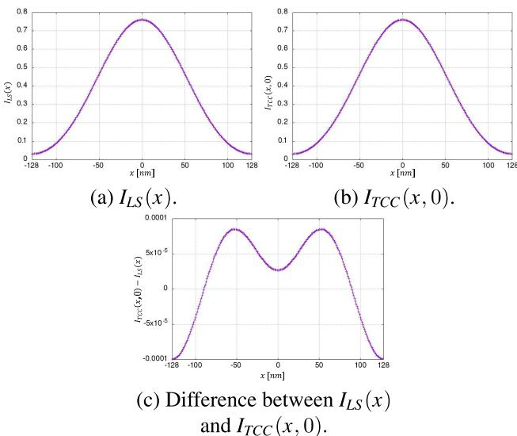
图13. 一维周期图形（线宽 128 nm、空 128 nm）下 $I_{LS}$ 与 $I_{TCC}$ 比较。

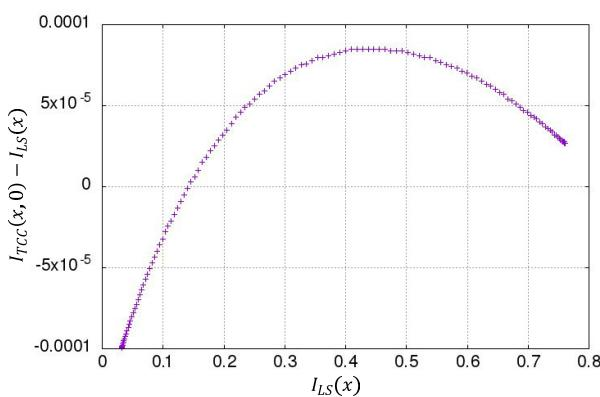
图14. ITCC 相对 ILS 的误差。

## 4) SOCS 核

评估由 K-Litho-TCC 得到的 SOCS 核集合的精度。掩模与光学条件同 IV-B3。令 $I_{SOCS}(x,y)$ 为 K-Litho-SOCS 使用该 SOCS 核集合得到的光强。本实验为一维掩模，光强与 y 坐标无关。图 15(a) 为 $I_{LS}(x)$，图 15(b) 为 $I_{SOCS}(x,0)$，图 15(c) 为两者差分。每幅图覆盖一个 256 nm 周期，范围 -128 nm 至 128 nm。图 16 展示 $I_{SOCS}(x,0)$ 相对 $I_{LS}(x)$ 的误差。实验改变 SOCS 核数量 $|K|$ 为 10、20、30、40、50、100、200、400。根据式（4），$I_{SOCS}(x,y)$ 随核数增加而增大。表 1 给出了 $I_{SOCS}$ 相对 $I_{LS}$ 的误差。随着核数增加，最大/最小绝对误差、最大/最小相对误差以及 RMSE 均下降。

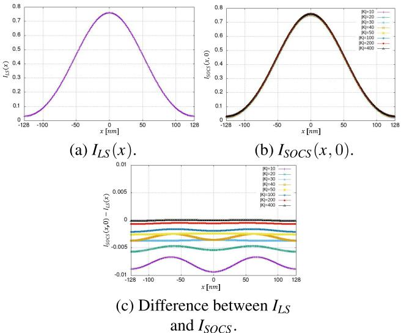
图15. 一维周期图形（线宽 128 nm、空 128 nm）下 $I_{LS}$ 与 $I_{SOCS}$ 比较。

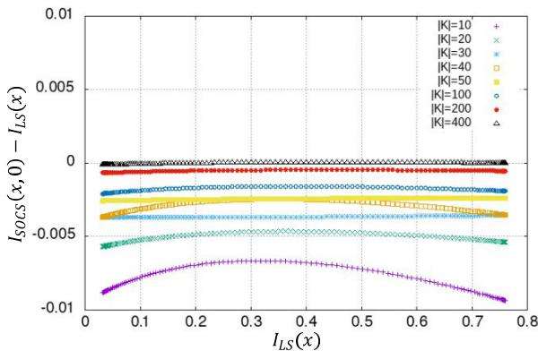
图16. ISOCS 相对 ILS 的误差。

# C. K-Litho-SOCS 的评估

我们将 K-Litho-SOCS 的精度与运行时间与 ICCAD 工具 [3] 比较。SOCS 核集合设置为与 ICCAD 工具提供的 24 个核一致。目标图形为 ICCAD 2013 竞赛提供的 T1。令 $I_{SOCS}(x,y)$（$I_{ICCAD}(x,y)$）分别为 K-Litho-SOCS（ICCAD 工具）得到的光强。图 17 给出了 $I_{SOCS}(x,y)$ 相对 $I_{ICCAD}(x,y)$ 的误差。本实验最大绝对误差 3.28e-7，最小绝对误差 0；最大相对误差 1.86e-6，最小相对误差 0；RMSE 为 $2.94\mathrm{e}{-}8$。此外，K-Litho-SOCS 的运行时间为 0.077 s，而 ICCAD 工具为 7.675 s。由此可见，K-Litho-SOCS 在不牺牲精度的情况下显著更快。

表 1. ISOCS 相对 ILS 的误差。

<table><tr><td>核数量 (K)</td><td>10</td><td>20</td><td>30</td><td>40</td><td>50</td><td>100</td><td>200</td><td>400</td></tr><tr><td>最大绝对误差</td><td>9.35e-3</td><td>5.68e-3</td><td>3.70e-3</td><td>3.67e-3</td><td>2.56e-3</td><td>2.07e-3</td><td>6.67e-4</td><td>1.20e-4</td></tr><tr><td>最小绝对误差</td><td>6.65e-3</td><td>4.65e-3</td><td>3.54e-3</td><td>2.45e-3</td><td>2.38e-3</td><td>1.58e-3</td><td>4.60e-4</td><td>1.00e-6</td></tr><tr><td>最大相对误差</td><td>2.75e-1</td><td>1.77e-1</td><td>1.15e-1</td><td>1.14e-1</td><td>8.00e-2</td><td>6.48e-2</td><td>2.08e-2</td><td>3.76e-3</td></tr><tr><td>最小相对误差</td><td>1.23e-2</td><td>7.06e-3</td><td>4.65e-3</td><td>4.64e-3</td><td>3.13e-3</td><td>2.49e-3</td><td>6.97e-4</td><td>2.63e-6</td></tr><tr><td>RMSE</td><td>7.92e-3</td><td>5.10e-3</td><td>3.64e-3</td><td>3.05e-3</td><td>2.45e-3</td><td>1.79e-3</td><td>5.38e-4</td><td>5.84e-5</td></tr></table>

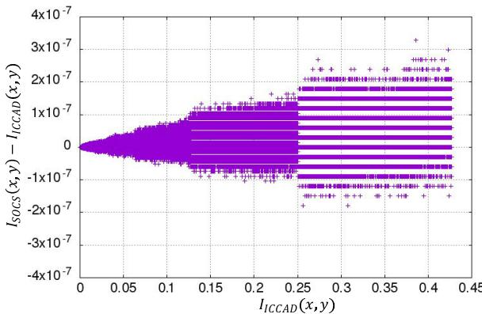
图17. ISOCS 相对 IICCAD 的误差。

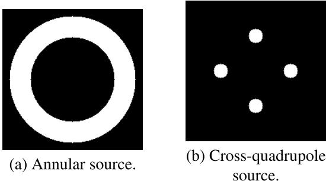
图18. 201×201 网格的光源。（a）环形（内半径 η=0.6，外半径 η=0.91）。（b）十字四象限（半径 τ=0.1，偏移 σ=0.5σ）。

# D. 仿真运行时间

评估 K-Litho-TCC 与 K-Litho-SOCS 的可扩展性。光源形状设为图 18(a) 的环形光源。环形的内半径、外半径与 NA 分别为 0.6、0.9、0.83。目标图形为 ICCAD 2013 的 T1 [3]。我们改变光源网格为 51×51、101×101、201×201，掩模大小为 2048×2048、4096×4096、8192×8192，记录运行时间。K-Litho-SOCS 中 SOCS 核数设为 50。表 2 总结了两工具的运行时间。

SOCS 模型的运行时间显著快于 TCC 模型。公共步骤中，对 $n\times n$ 的“FFT to M”略长于函数（A）中对 $n\times n$ 的“IFFT to Ĩ”。差异源于 FFTW [18] 中实到复的额外后处理。此外，函数（C）中的“傅里叶插值”耗时与函数（A）中的“IFFT to Ĩ”几乎相同，而函数（C）中的“Calc. I by SOCS”则远快于它。这表明傅里叶插值中 $(4N_x+1)\times(4N_y+1)$ 尺寸的 FFT 与 0 填充远快于 $n\times n$ 的 FFT。本实验中 $n$ 为 2048、4096、8192；相比之下 $N_x,N_y$ 仅为几十。

# E. 仿真示例

最后，我们在环形与十字四象限光源下运行 K-Litho-TCC，以展示不同光学条件下空中像的变化。光源如图 18 所示，网格 201×201。环形光源的内半径、外半径、NA 与前一实验相同。十字四象限光源的半径、偏移与 NA 分别为 0.1、0.5、0.9。我们使用 ICCAD 2013 提供的十个测试平台作为掩模（图 19）。环形与十字四象限下的仿真结果分别见图 20、图 21。可观察到得到的空中像随光学条件变化而改变。

需要注意，本文不讨论晶圆上最终图形的质量，因为光刻胶模型与评价指标超出本文范围。然而，我们开发的仿真工具可为光源—掩模协同优化研究提供环境。可通过分析如图 20、图 21 的空中像来优化光学条件与掩模形状。例如，工艺变化容忍度取决于光强对比度，即目标图形边缘内外光强差异。图 21 的对比度大于图 20，因此对于 ICCAD 2013 的测试平台，十字四象限光源可能优于环形光源。后续将基于十字四象限光源开展协同优化。

表 2. K-Litho-TCC 与 K-Litho-SOCS 的运行时间（秒）。
“FFT to M”对应图 4、图 5 中的“Apply FFT to M”。函数（A）中的“Calc. TCC”、“Calc. Ĩ by TCC”、“IFFT to Ĩ”分别对应图 4 中的“Calculate TCC”、“Calculate intensity Ĩ”、“Apply inverse FFT to Ĩ”。函数（B）中的“Derive SOCS”对应图 4 的“Apply SVD”。函数（C）中的“Calc. I by SOCS”对应图 5 中“Apply FFT to M”之前的步骤（不包括该步）。函数（C）的“Fourier interpolation”对应图 5 的“Apply Fourier interpolation”。

<table><tr><td>掩模尺寸</td><td></td><td colspan="3">2048×2048</td><td colspan="3">4096×4096</td><td colspan="3">8192×8192</td></tr><tr><td></td><td>光源网格</td><td>51×51</td><td>101×101</td><td>201×201</td><td>51×51</td><td>101×101</td><td>201×201</td><td>51×51</td><td>101×101</td><td>201×201</td></tr><tr><td>公共</td><td>FFT to M</td><td>0.108</td><td>0.095</td><td>0.087</td><td>0.410</td><td>0.401</td><td>0.410</td><td>1.645</td><td>1.707</td><td>1.686</td></tr><tr><td rowspan="4">函数（A）</td><td>Calc. TCC</td><td>0.137</td><td>0.540</td><td>2.147</td><td>3.246</td><td>12.415</td><td>49.056</td><td>53.081</td><td>214.508</td><td>850.588</td></tr><tr><td>Calc. I by TCC</td><td>0.016</td><td>0.016</td><td>0.016</td><td>0.252</td><td>0.256</td><td>0.252</td><td>3.963</td><td>3.862</td><td>3.910</td></tr><tr><td>IFFT to ĩ</td><td>0.062</td><td>0.062</td><td>0.063</td><td>0.330</td><td>0.338</td><td>0.328</td><td>1.439</td><td>1.449</td><td>1.443</td></tr><tr><td>TCC 合计</td><td>0.216</td><td>0.617</td><td>2.226</td><td>3.828</td><td>13.009</td><td>49.635</td><td>58.484</td><td>219.819</td><td>855.940</td></tr><tr><td rowspan="4">函数（B）（C）</td><td>Derive SOCS</td><td>0.917</td><td>0.919</td><td>0.956</td><td>58.288</td><td>58.259</td><td>58.024</td><td>3608.870</td><td>3640.120</td><td>3654.650</td></tr><tr><td>Calc. I by SOCS</td><td>0.013</td><td>0.013</td><td>0.013</td><td>0.059</td><td>0.059</td><td>0.059</td><td>0.288</td><td>0.287</td><td>0.287</td></tr><tr><td>Fourier interpolation</td><td>0.068</td><td>0.061</td><td>0.064</td><td>0.339</td><td>0.338</td><td>0.336</td><td>1.465</td><td>1.456</td><td>1.456</td></tr><tr><td>SOCS 合计</td><td>0.081</td><td>0.074</td><td>0.077</td><td>0.397</td><td>0.397</td><td>0.394</td><td>1.753</td><td>1.743</td><td>1.744</td></tr></table>

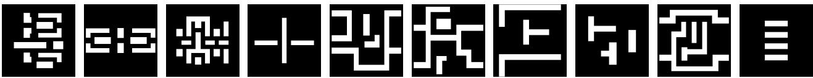
图19. ICCAD 2013 竞赛提供的十个测试平台的掩模图形 [3]。

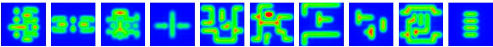
图20. 环形光源下的空中像。

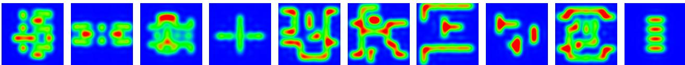
图21. 十字四象限光源下的空中像。

# V. 结论与未来工作

本文开发了用于光源—掩模协同优化的光刻仿真工具集 K-Litho。K-Litho 中可调光学条件，并可分别通过传递交叉系数（TCC）模型与相干系统和（SOCS）模型得到空中像。实验中，我们将 K-Litho 的精度与解析模型及其他开源工具对比，结果表明 K-Litho 既准确又快速。我们相信 K-Litho 将推动光源—掩模协同优化研究。未来工作将基于 K-Litho 开展光源优化。

# 参考文献

[1] M. Born and E. Wolf, Principles of Optics, 6th ed. Oxford, U.K.: Pergamon, 1980.
[2] R. Socha, X. Shi, and D. LeHoty, “Simultaneous source mask optimization (SMO),” Proc. SPIE, vol. 5853, pp. 180–193, Jun. 2005.
[3] S. Banerjee, Z. Li, and S. R. Nassif, “ICCAD-2013 CAD contest in mask optimization and benchmark suite,” in Proc. IEEE/ACM Int. Conf. Computer-Aided Design (ICCAD), Nov. 2013, pp. 271–274.
[4] A. Awad, A. Takahashi, S. Tanaka, and C. Kodama, “A fast processvariation-aware mask optimization algorithm with a novel intensity modeling,” IEEE Trans. Very Large Scale Integr. (VLSI) Syst., vol. 25, no. 3, pp. 998–1011, Mar. 2017.
[5] H. Yang, S. Li, Y. Ma, B. Yu, and E. F. Y. Young, “GAN-OPC: Mask optimization with lithography-guided generative adversarial nets,” in Proc. 55th ACM/ESDA/IEEE Design Autom. Conf. (DAC), Jun. 2018, pp. 1–6.
[6] R. Azuma, Y. Kohira, T. Matsui, A. Takahashi, and C. Kodama, “Process variation-aware mask optimization with iterative improvement by subgradient method and boundary flipping,” Proc. SPIE, vol. 11328, Mar. 2020, Art. no. 113280O.
[7] H. Yang, S. Li, Z. Deng, Y. Ma, B. Yu, and E. F. Y. Young, “GAN-OPC: Mask optimization with lithography-guided generative adversarial nets,” IEEE Trans. Comput.-Aided Design Integr. Circuits Syst., vol. 39, no. 10, pp. 2822–2834, Oct. 2020.
[8] B. Jiang, L. Liu, Y. Ma, H. Zhang, B. Yu, and E. F. Y. Young, “Neural-ILT: Migrating ILT to neural networks for mask printability and complexity cooptimization,” in Proc. 39th Int. Conf. Computer-Aided Design, Nov. 2020, pp. 1–9.
[9] G. Chen, Z. Yu, H. Liu, Y. Ma, and B. Yu, “DevelSet: Deep neural level set for instant mask optimization,” in Proc. IEEE/ACM Int. Conf. Comput. Aided Design (ICCAD), Nov. 2021, pp. 1–9.
[10] B. Jiang, L. Liu, Y. Ma, B. Yu, and E. F. Y. Young, “Neural-ILT 2.0: Migrating ILT to domain-specific and multitask-enabled neural network,” IEEE Trans. Comput.-Aided Design Integr. Circuits Syst., vol. 41, no. 8, pp. 2671–2684, Aug. 2022.
[11] lithosim. VLSI Design & Automation Group. Accessed: Mar. 24, 2024. [Online]. Available: https://github.com/VLSIDA/lithosim
[12] C. Pierre. Lithography-Simulation. Accessed: Mar. 24, 2024. [Online]. Available: https://github.com/pierremifasol/Lithography-Simulation
[13] A. Gladkikh. Optolithium. Accessed: Mar. 24, 2024. [Online]. Available: https://github.com/xthebat/optolithium
[14] C. Mack, Fundamental Principles of Optical Lithography: The Science of Microfabrication. Hoboken, NJ, USA: Wiley, 2007.
[15] T. Kimura, “Study on formulation of resist model into linear equations and its solution in semiconductor lithography,” Ph.D. dissertation, Degree Programs Syst. Inf. Eng., Univ. Tsukuba, Tsukuba, Japan, 2021.
[16] Y. C. Pati and T. Kailath, “Phase-shifting masks for microlithography: Automated design and mask requirements,” J. Opt. Soc. Amer. A, Opt. Image Sci., vol. 11, no. 9, p. 2438, 1994.
[17] N. B. Cobb, “Fast optical and process proximity correction algorithms for integrated circuit manufacturing,” Ph.D. dissertation, Dept. Elect. Eng. Comput. Sci., Univ. California, Berkeley, CA, USA, 1998.
[18] FFTW. FFTW User’s Manual. Accessed: Mar. 24, 2024. [Online]. Available: https://www.fftw.org/fftw3_doc/
[19] LAPACK. LAPACK Users’ Guide. Accessed: Mar. 24, 2024. [Online]. Available: https://www.netlib.org/lapack/lug/
[20] H. Tanabe, “Comparison of super-resolution techniques in the optical system of steppers,” Jpn. J. Opt., Publication Opt. Soc. Jpn., vol. 21, no. 6, pp. 415–423, 1992.

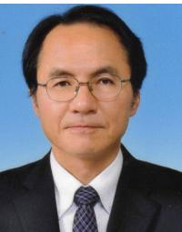

HIROYOSHI TANABE 于 1986 年获东京大学物理学博士学位。现为东京工业大学研究员。其在光学与 EUV 光刻领域拥有 30 余年经验，发表论文 30 余篇。目前研究方向包括 EUV 掩模与光刻仿真。SPIE 会员。曾于 2003、2004 年担任 Photomask Japan 组委会主席。

TETSUAKI MATSUNAWA 于 2008 年获筑波大学计算机科学博士学位。2008 年加入日本横滨东芝公司，从事光学光刻研究。2013–2015 年为德州大学奥斯汀分校访问学者。现于铠侠株式会社（横滨）。研究兴趣包括面向制造设计与用于计算光刻的机器学习算法。

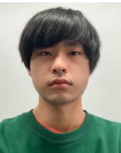

MASAKI KURAMOCHI 于 2023 年获会津大学工学学士学位，现攻读工学硕士。研究兴趣包括光源—掩模协同优化与组合算法。

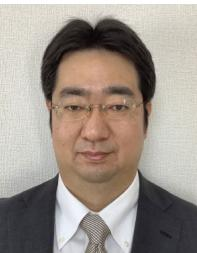

YUKIHIDE KOHIRA（IEEE 会员）分别于 2003、2005、2007 年获东京工业大学工学学士、硕士、博士学位。2007–2009 年为东京工业大学研究员。2009 年加入会津大学，现为副教授。研究兴趣包括超大规模集成电路设计自动化与组合算法。IEICE 高级会员、IPSJ 会员。

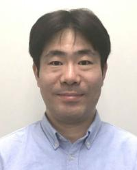

CHIKAAKI KODAMA（IEEE 高级会员）分别于 1999、2001、2006 年获东京农工大学电子信息工程学士、硕士、博士学位。2001–2003 年在富士通株式会社从事 SPARC64 处理器定制 CAD 开发。2006 年加入东芝微电子，2011 年转至东芝公司。现于铠侠株式会社（横滨）。在国际会议与期刊发表论文 40 余篇，拥有日本与美国专利 30 余项。研究方向为面向制造设计，尤其是光学光刻的掩模优化与超大规模集成电路版图设计。IEICE 高级会员。