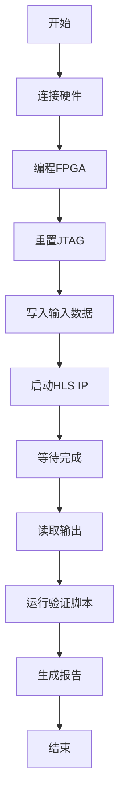

# SOCS Optimized HLS IP 板级验证套件

## 概述

本目录包含用于验证SOCS Optimized HLS IP（Vivado FFT IP版本）的完整板级验证工具。

**目标**: 在实际硬件上验证FFT IP的RTL实现，绕过仿真模型的NaN/inf问题。

## 文件说明

### 核心文件

| 文件                                | 说明              | 状态   |
| ----------------------------------- | ----------------- | ------ |
| `address_map.json`                  | DDR地址映射配置   | ✅ 完成 |
| `generate_socs_optimized_tcl.py`    | TCL脚本生成器     | ✅ 完成 |
| `run_socs_optimized_validation.tcl` | 生成的验证TCL脚本 | ✅ 完成 |
| `verify_socs_optimized_results.py`  | 结果验证脚本      | ✅ 完成 |
| `BOARD_VALIDATION_GUIDE.md`         | 详细验证指南      | ✅ 完成 |
| `VALIDATION_STATUS.md`              | 验证状态总结      | ✅ 完成 |

### 生成的数据文件

| 文件                              | 说明                            |
| --------------------------------- | ------------------------------- |
| `krn_r_combined.bin`              | 合并的SOCS kernel实部数据       |
| `krn_i_combined.bin`              | 合并的SOCS kernel虚部数据       |
| `output_chunk*.txt`               | TCL读取的输出数据（验证后生成） |
| `verification_results.txt`        | 验证结果报告（验证后生成）      |
| `socs_optimized_verification.png` | 可视化比较图（验证后生成）      |

## 快速开始

### 1. 环境准备

确保以下条件满足：
- FPGA板卡已上电
- JTAG调试器已连接
- Vivado 2025.2已安装
- Python 3.8+已安装

### 2. 生成验证脚本

如果尚未生成TCL脚本：
```bash
cd e:\fpga-litho-accel\source\SOCS_HLS\board_validation\socs_optimized
python generate_socs_optimized_tcl.py
```

### 3. 运行板级验证

在Vivado Tcl Console中执行：
```tcl
# 连接到硬件
connect_hw_server -url localhost:3121
open_hw_target
program_hw_devices [get_hw_devices]
reset_hw_axi [get_hw_axis hw_axi_1]

# 运行验证脚本
source e:/fpga-litho-accel/source/SOCS_HLS/board_validation/socs_optimized/run_socs_optimized_validation.tcl
```

### 4. 验证结果

运行Python验证脚本：
```bash
python verify_socs_optimized_results.py
```

## DDR地址映射

```
gmem0 (mskf_r): 0x40000000 - 32M (512×512 float32)
gmem1 (mskf_i): 0x42000000 - 32M (512×512 float32)
gmem2 (scales): 0x44000000 - 4M (4 float32)
gmem3 (krn_r):  0x44400000 - 4M (4×9×9 float32)
gmem4 (krn_i):  0x44800000 - 256K (4×9×9 float32)
gmem5 (output): 0x44840000 - 16K (17×17 float32)
```

## HLS IP控制

- **控制寄存器**: 0x00000000
- **ap_start**: 写入0x00000001启动
- **ap_done**: 轮询bit 1 (0x00000002)
- **最大轮询次数**: 1000次 (10ms间隔)

## 验证流程



## 预期结果

### 性能指标
- **时钟频率**: 200MHz (实际可达273.97MHz)
- **处理时间**: 约1000-2000 cycles (5-10μs @ 200MHz)

### 资源使用
- **DSP**: 16 (vs 8,064 in direct DFT - 99.8% reduction)
- **BRAM**: 39 (5%)
- **FF**: 25,513 (7%)
- **LUT**: 28,378 (17%)

### 精度指标
- **目标RMSE**: < 1e-3 (0.1%)
- **预期RMSE**: 1e-5 to 1e-7 (基于C仿真结果)

## 故障排除

### 常见问题

1. **TCL脚本执行失败**
   - 检查硬件连接
   - 确认JTAG-to-AXI Master已重置
   - 验证DDR地址映射

2. **验证失败，RMSE过高**
   - 检查输入数据是否正确写入DDR
   - 验证HLS IP是否正确执行
   - 检查输出数据读取是否正确

3. **输出数据全为零**
   - 检查HLS IP的ap_start信号
   - 验证DDR地址映射
   - 检查时钟和复位信号

### 调试命令

```tcl
# 验证输入数据
create_hw_axi_txn read_debug [get_hw_axis hw_axi_1] \
    -type READ -address 0x40000000 -len 10
run_hw_axi [get_hw_axi_txns read_debug]
report_hw_axi_txn read_debug

# 检查HLS IP状态
create_hw_axi_txn read_ctrl [get_hw_axis hw_axi_1] \
    -type READ -address 0x00000000 -len 1
run_hw_axi [get_hw_axi_txns read_ctrl]
report_hw_axi_txn read_ctrl

# 验证输出地址
create_hw_axi_txn read_output [get_hw_axis hw_axi_1] \
    -type READ -address 0x44840000 -len 10
run_hw_axi [get_hw_axi_txns read_output]
report_hw_axi_txn read_output
```

## 参考资料

### HLS IP配置
- `socs_optimized.cpp` - HLS源代码
- `socs_config_optimized.h` - 配置参数
- `hls_config_optimized.cfg` - 综合配置
- `tb_socs_optimized.cpp` - 测试平台

### 验证数据
- Golden数据: `e:\fpga-litho-accel\output\verification\`
- Kernel数据: `e:\fpga-litho-accel\output\verification\kernels\`
- 配置文件: `e:\fpga-litho-accel\input\config\golden_original.json`

### 工具链
- Vitis HLS 2025.2
- Vivado 2025.2
- Python 3.8+
- NumPy, Matplotlib

## 更新日志

### 2026-04-23
- 初始版本
- 支持Vivado FFT IP版本的SOCS HLS IP
- 集成DDR地址映射和JTAG-to-AXI验证
- 添加Python结果验证和可视化

---

**注意**: 本验证套件基于xcku3p-ffvb676-2-e器件和Vivado 2025.2环境。其他器件或工具版本可能需要调整。
